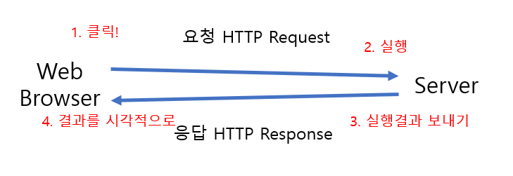
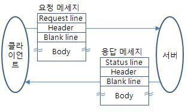
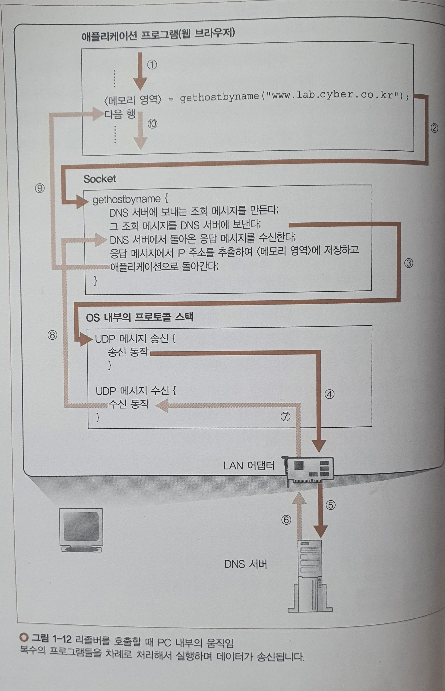

# Chapter 01. 웹 브라우저가 메세지를 만든다

[toc]

## 1. HTTP 리퀘스트 메시지를 작성한다

> 사용자가 브라우저에 URL을 입력하면, URL을 해독한 뒤, URL의 의미에 따라 리퀘스트 메세지를 만든다.

- ### **브라우저:**

  - URL을 해독하거나 HTTP 메시지를 만들지만,
  - 메시지를 네트워크에 송출하는 기능은 없으므로 OS에 의하여 송신


- ### **URL(Uniform Request Locator):** 

  - 맨 앞의 프로토콜에 따라 뒤에 쓰는 방법이 달라짐

  

  ```python
  # 예시
  http://edu.ssafy.com/edu/main/index.do
  
   http: -> 데이터 출처에 엑세스 하는 방법. 즉, 프로토콜
      
   //: -> 나중에 이어지는 문자열이 서버의 이름임을 나타냄
      
   edu.ssafy.com: -> 웹 서버명
      
   /edu/main/: -> 디렉토리 경로
      
   index.do: -> 파일
  ```

  - 디렉토리는 뒤에 `/`가 붙으며 파일은 뒤에 `/`가 붙지 않는다.


- ### **프로토콜: 동작의 규칙을 정한 것을 '프로토콜'이라고 부름**


- ### **HTTP(Hyper Text Transfer Protocol):**

  > HTTP 프로토콜은 클라이언트와 서버가 주고받는 메시지의 내용이나 순서를 정한 것

  

  - 클라이언트와 서버가 주고받는 메시지의 내용이나 순서를 정한 것

  - HTTP 메시지를 만들면 이것을 OS에 의뢰하여 엑세스 대상의 웹 서버에게 송신


- ### **HTTP 프로토콜 작동 순서**

- 클라이언트

  서버로 리퀘스트 메세지를 보낸다.

- 리퀘스트 메세지?

  '무엇을(`URI`)' + '어떻게 해서(`method`)' 하겠다는 내용이 적혀있다.

  - URI
    - 다양한 액세스 대상을 쓸 수 있으며, 이러한 액세스 대상을 통칭한다.
    - 보통 페이지 데이터를 저장한 파일의 이름이나, **CGI 프로그램의 파일명**을 URI로 쓴다.
    - URL을 그대로 쓸 수도 있다.
  - 메소드
    - 웹 서버에게 어떤 동작을 하고 싶은지 전달
  - 헤더 파일이나, 데이터 등도 들어간다. 추후 설명.

- 서버

  URI와 메세지를 조사해서 '무엇을', '어떻게 하는지' 판단한 후 동작하고, 결과 데이터를 응답 메세지에 저장한 후 클라이언트에 반송

  

- ### **request message:**

  > 무엇 + 어떻게 해서 => 서버에 요구를 함

  - 무엇: 데이터를 저장한 파일 이름 or CGI 프로그램의 파일명
  - 어떻게 해서: 매서드(우리가 배운 GET, POST ...)

  

  ```python
  # request message의 구조
  - `Request Line`
    - 리퀘스트 메시지의 첫 번째 행에 쓴다.
    - `메소드`<공백> `URI`<공백>`HTTP 버전`
  - `메시지 헤더`
    - <헤더필드명>:<필드값>
    - <공백 행>
  - `메시지 본문`
  - 클라이언트에서 서버에 송신하는 데이터, `폼`페이지에 입력한 데이터를 `POST`메소드로 웹 서버에 보낼 때 등의 데이터가 들어간다.
  ```

  

  

- ### **response message:**

> 응답 메시지 = 스테이터스 코드 + 헤더 파일 + 페이지의 데이터

  - reqeust message를 서버가 해독 -> 응답 메시지를 클라이언트에 전송
  - 맨 앞부분에는 스테이터스 코드가 있음(200, 404, 405, 504 etc...) -> '404 Not Found'

```python
# response message의 구조
- `Status Line`
- `HTTP 버전`<공백>`Status Code`<공백>`응답 문구`

- `메시지 헤더`

  - <헤더필드명>:<필드값>
  - <공백 행>

- `메시지 본문`

  - 서버에서 클라이언트에 송신하는 데이터, URI가 가리키는 파일에서 읽은 데이터, CGI어플리케이션이 출력한 데이터가 들어간다.
```


- ### **스테이터스 코드:**

  | 코드값 | 설명                      | ex                                                           |
  | ------ | ------------------------- | ------------------------------------------------------------ |
  | 1xx    | 처리의 경과 상황등을 통지 | `100 Continue`: 지금까지의 상태가 괜찮으며 클라이언트가 계속해서 요청을 하거나 이미 요청을 완료한 경우에는 무시해도 됨 |
  | 2xx    | 정상 종료                 | `200 OK`: 요청이 성공적으로 되었음                           |
  | 3xx    | 무언가 다른 조치가 필요함 | `302 Found`: 요청한 리소스의 URI가 일시적으로 변경되었음을 의미 |
  | 4xx    | 클라이언트측의 오류       | `403 Forbidden`: 클라이언트가 콘텐츠에 접근할 권리를 가지고 있지 않음 |
  | 5xx    | 서버측의 오류             | '502 Bad Gateway': 서버가 요청을 처리하는 데 필요한 응답을 얻기 위해 게이트웨이로 작업하는 동안 잘못된 응답을 수신했음 |





## 2. 웹 서버의 IP주소를 DNS 서버에 조회한다

- **도메인**: 인터넷창에 치는 주소


- ### TCP/IP의 기본 개념

  - 작은 서브넷을 라우터로 접속하여 전체 네트워크를 완성한다.


- ### **IP 주소:**

  > 네트워크 번호(서브넷 번호) + 호스트 번호

  - OS에서는 송신할때 도메인명이 아니라 IP주소로 메시지를 받을 상대를 지정

  - 서버까지 메시지를 운반할 때는 이 IP 주소에 따라 운반

  - 데이터는 패킷 형태로 운반됨

  - 오늘날 주로 사용되고 있는 IP 주소는 IP 버전 4([IPv4](https://ko.wikipedia.org/wiki/IPv4)) 주소이나 이 주소가 부족해짐에 따라 길이를 늘린 IP 버전 6([IPv6](https://ko.wikipedia.org/wiki/IPv6)) 주소가 점점 널리 사용되는 추세이다.

  - IPV4 = 32bit, 각 비트를 `.`으로 구분하여 사용

  - IPV6 = 128 bit, 각 비트를 `:`으로 구분하여 사용

  - IPV4에서...

    - 8bit씩 점으로 구분하여 10진수로 표기 => `192.168.0.5`

  - 넷마스크: 네트워크 번호와 호스트 번호를 구분해주기 위해 덧붙히는 값 => `255.255.255.0`

    - 1인 부분은 네트워크 번호, 0인 부분은 호스트 번호 => 1인부분인 `192.168.0`은 네트워크 번호, 0인 `5`는 호스트 번호


- ### 도메인명과 IP주소를 구분하여 사용하는 이유

  1. IP주소는 **숫자** 이므로 기억하기 어려워서 편의상 도메인명을 사용한다.
  2. 그렇다면 애초에 IP주소 말고 이름으로 상대를 특정하여 통신하자는 의견 역시 있었다.
     - IP주소는 32비트(4바이트)지만 도메인명은 최대 **255바이트** 까지 있으므로 라우터에 과부하, 데이터 운반에 걸리는 시간 증가, 네트워크 속도 감소.
  3. 따라서 사람은 도메인, 라우터는 IP를 사용한다.
  4. 도메인 <> IP 를 대응시켜주는 것이 **DNS** 이다.


- ### 브라우저는 어떤 원리로 DNS 서버를 조회하는 것일까?

  #### 리졸버(DNS 리졸버)

  - socket 라이브러리에 들어있는 부품화한 프로그램
  - DNS 서버에 대한 DNS 클라이언트의 역할을 한다.
  - IP 주소를 조사하는 네임 리졸루션을 실행하는 것이 **리졸버**이다.

  - **Socket 라이브러리**

    OS에 포함되어 있는 **네트워크의 기능을 애플리케이션에서 호출하기 위한 부품을 모아놓은 것.**

    - 라이브러리 : 프로그램의 부품집. 다양한 애플리케이션에서 이용할 수 있도록 부품화한 여러 개의 프로그램을 모아놓은 것.

  

- ### 리졸버의 작동 원리

  1. 애플리케이션 프로그램(웹 브라우저)
    2. Socket 리졸버를 호출하여 도메인 명을 넘겨줌
    3. 리졸버가 DNS서버로 조회 요청을 보냄
    4. DNS서버에서 조회 후 IP주소를 응답으로 보냄
    5. 리졸버가 응답 내용을 해독하고 IP주소를 추출 및 어플리케이션에게 전달
    6. 어플리케이션 프로그램은 메모리 영역에 해당 IP주소를 저장




## 3. 전 세계의 DNS 서버가 연대한다

- ### 1. DNS 서버의 기본 동작

클라이언트에서 조회 메시지를 받고, 서버에 등록된 도메인 명과 IP 주소의 대응표인 **리소스 레코드** 를 조사하여 회답한다.

**조회 메시지**

이름 + 클래스 + 타입

1. **이름**

   서버나 메일 배송 목적지와 같은 이름.

   - 웹 서버에는 www로 시작되는 이름을 붙인 것이 많지만, 이건 관습상 굳어진 것일 뿐이다. A타입으로 저장하면 다른 형식으로 붙여도 이름이 된다.

2. **클래스**

   처음 DNS가 고안될 때 인터넷 이외에 네트워크에서의 이용까지 고려되었기 때문에 식별을 위해 클래스를 준비했다. 하지만 지금 인터넷 이외의 네트워크는 소멸했으므로 클래스는 항상 인터넷을 뜻하는 `IN` 을 사용한다.

3. **타입**

   이름에 어떤 타입의 정보가 지원되는지 나타냄. 타입에 따라 클라이언트에 회답하는 정보가 달라진다. (EX: 타입 A - 이름에 IP 주소가 지원, MA - 이름에 메일 배송 목적지가 지원됨)

- ## 2. 도메인의 계층

한 대의 DNS 서버에 모든 정보를 등록할 수 없으므로 분산시켜 다수의 DNS에 저장, 연대한다.

- DNS 서버에 등록한 정보에는 모든 

  도메인명

  이라는 계층적 구조를 가진 이름이 붙여져 있다. 

  `.` 이 계층을 구분하며, 오른쪽에 있을수록 상위 계층이다.

  - **도메인** : 하나의 부서라고 생각하면 쉽다.


- ### 3.담당 DNS 서버를 찾아 IP 주소를 가져온다

## 4. 프로토콜 스택에 메세지 송신을 의뢰한다

- ### **데이터 송 수신 과정:**

- #### 1. 서버측에서 소켓을 만들고, 소켓에 클라이언트가 연결하기를 기다림

- #### 2. 클라이언트 측에서도 소켓을 만들고

  1. DNS서버에 IP주소 조회를 보낼때 처럼, Socket 라이브러리의 프로그램 부품을 호출함

  2. 소켓 라이브러리의 socket이라는 프로그램을 호출

  3. socket 프로그램으로 제어가 넘어가서 소켓을 만듬

  4. 소켓이 생기면 디스크립터가 생기며 애플리케이션은 이것을 받아서 메모리에 기록해 둠

- #### 3. 서버측의 소켓에 연결

  1. Socket 라이브러리의 connect라는 프로그램 부품을 호출하여 서버측의 소켓에 접속

  2. connect를 호출할 때 지정하는 값은 디스크립터, 서버의 IP주소, 포트 번호

  3. 디스크립터로 어느 소켓을 서버측의 소켓에 접속할 것인지, 서버 IP주소로 접속하려는 서버는 어떤것인지, 포트 번호로 서버의 어느 소켓에 접속할 것인지를 지정할 수 있음

     -> 즉 디스크립터로 내 소켓중 어느 소켓이 ip주소 + 포트 번호로 어느 서버의 어느 소켓에 접속할것인지 지정

- 연결이 되었으니 메시지를 주고

  1. Socket 라이브러리의 wirte라는 프로그램을 사용 -> write를 호출할 때 디스크립터와 송신데이터를 지정
  2. 사용자가 입력한 URL을 바탕으로 HTTP 리퀘스트(송신 데이터)를 생성
  3. write의 디스크립터로 데이터를 보내서 서버로 데이터를 보냄

- 응답을 받음

  1. Socket의 read라는 프로그램을 사용
  2. 수신할 응답 메시지를 저장하기 위한 메모리 영역인 `수신 버퍼`에 read 프로그램이 응답을 받아서 저장
  3. 수신버퍼에 저장된 메시지를 어플리케이션에 전달

- 통신이 끝나면 서버 혹은 클라이언트 어느쪽에서라도 연결을 끊으면 됨

  1. Socket 라이브러리의 close라는 프로그램 부품을 호출하여 연결 끊기 단계로 들어감
  2. 소켓 사이의 연결이 말소되고 소켓도 말소

- 연결이 끊기면 소켓이 말소하며 통신이 종료