# TCP/IP의 데이터를 전기 신호로 만들어 보낸다

[TOC]

## -1. 들어가기 전에

 인터넷 계층은 물리적으로 나뉘었다기 보다는 관념적으로 나뉜 부분이 있습니다. 때문에 OSI 7계층, OSI 5계층, TCP/IP 4계층 등으로 불리고 있습니다.

#### OSI 7계층

- **1. 물리 계층** 은 상위 계층에서 전송된 데이터를 물리매체를 통해 다른 시스템에 전기적 신호로 전송합니다.
- **2. 데이터링크 계층** 은 네트워크 계층에서 받은 데이터를 프레임 단위로 구성하여 물리 계층으로 전송합니다. 포인트 투 포인트(Point to Point) 간 신뢰성있는 전송을 보장하기 위한 계층으로 CRC 기반의 오류 제어와 흐름 제어가 필요합니다. 주소 값은 물리적으로 할당 받는데, 이는 네트워크 카드가 만들어질 때부터 맥 주소(MAC address)가 정해져 있다는 뜻입니다.
- **3. 네트워크 계층** 은 라우팅 프로토콜을 이용해서 최적의 경로 선택합니다. 라우팅, 흐름 제어, 오류 제어 등을 수행합니다. 논리적인 주소 구조(IP), 곧 네트워크 관리자가 직접 주소를 할당하는 구조를 가지며, 계층적(hierarchical)입니다.
- **4. 전송 계층** 은 균일한 데이터 전송 서비스를 제공하는 계층입니다. 양 끝단(End to end)의 사용자들이 신뢰성있는 데이터를 주고 받을 수 있도록 해 주어 상위 계층들이 데이터 전달의 유효성이나 효율성을 생각하지 않도록 해줍니다. 시퀀스 넘버 기반의 오류 제어 방식을 사용합니다.
- **5. 세션 계층** 은 송 수신 간의 관련성을 유지하고 대화 제어를 담당합니다. 양 끝단의 응용 프로세스가 통신을 관리하기 위한 방법을 제공합니다. 동시 송수신 방식(duplex), 반이중 방식(half-duplex), 전이중 방식(Full Duplex)의 통신과 함께, 체크 포인팅과 유휴, 종료, 다시 시작 과정 등을 수행합니다. 이 계층은 TCP/IP 세션을 만들고 없애는 책임을 가집니다.
- **6. 표현 계층** 은 서로 다른 환경의 Application들이 데이터를 이해할 수 있도록 도와주는 계층입니다. 코드 간의 번역을 담당하여 사용자 시스템에서 데이터의 형식상 차이를 다루는 부담을 응용 계층으로부터 덜어 줍니다. MIME 인코딩, JPEG 및 GIF 포맷, 암호화 등의 동작이 이 계층에서 이루어집니다.
- **7. 응용 계층** 은 사용자가 OSI 환경에 접근할 수 있도록 서비스를 제공합니다.

#### TCP / IP 4계층

- OSI 7계층 기반하여 실무적으로 이용될 수 있도록 단순화된 모형
  - TCP : 전송 제어 프로토콜로 전송 계층에 위치하며 네트워크 정보 전달을 통제하는 핵심 프로토콜
  - IP : 패킷 교환 네트워크에서 정보를 주고받는데 사용하는 정보 위주의 규약이며 네트워크 계층에서 호스트의 주소지정과 패킷 분할 및 조립 기능을 담당

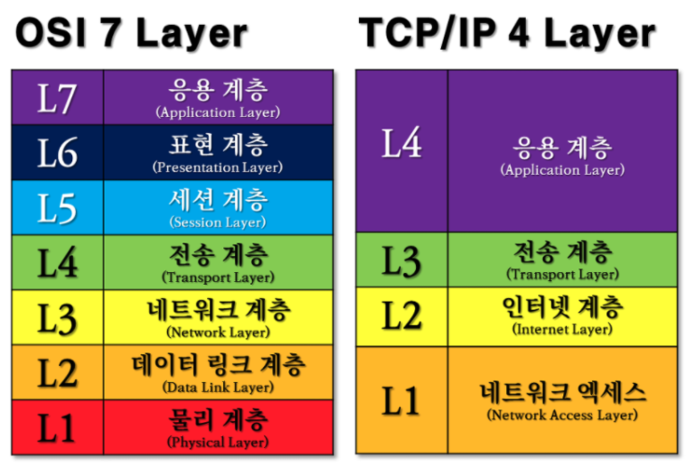

- 네트워크 계층(Network Layer)
  - MAC 주소를 참조해 장비 간 데이터 송수신
  - 브리지, 스위치
- 인터넷 계층(Internet Layer)
  - 데이터 전송을 위한 IP 주소 지정 및 경로 지정
  - 라우터
- 전송 계층(Transport Layer)
  - Port 번호로 호스트 간의 연결 제어 및 자료 송수신
  - 게이트 웨이
- 응용 계층(Application Layer)
  - 응용프로그램 간의 데이터 송수신
  - 사용자 응용 프로그램 인터페이스

#### OSI 5계층

|  Application  | 어플리케이션 레이어는 주로 호스트에서 사용하는 응용 프로그램에 관한 규약으로 어떠한 프로그램을 주로 보내느냐에 따라 나뉜다. FTP(파일을 전송할 때 주로 사용), SMTP(Mail에서 주로 사용되는 프로토콜), HTTP(Web에서 주로 사용되는 프로토콜) |
| :-----------: | ------------------------------------------------------------ |
| **Transport** | **프로세스와 프로세스간의 데이터를 전송하는 계층이다. TCP, UDP 등이 있다. ** |
|  **Network**  | **주로 라우팅을 하는 계층이다. IP, routing protocols 등이 있다.** |
|   **Link**    | **가까운 네트워크 요소들간의 데이터를 전송하기 위한 계층이다. Ethernet, 802.111(WiFi), PPP 등이 있다.** |
| **Physical**  | **데이터를 비트로 바꿔 선에 실어 주는 계층이다.**            |

## 0. Intro

💡 **주요 흐름 ; 프로토콜 스택, LAN 어댑터**

> 2장에서는 데이터를 운반하는 구조에 들어간다. 네트워크 제어용 소프트웨어인 `프로토컬 스택`이 등장한다. 이는 브라우저에서 받은 메시지를 `패킷` 속에 저장하고, 수신처 주소와 같은 제어 정보를 덧붙인다. 다음에 프로토콜 스택은 패킷을 `LAN 어댑터`에 넘긴다. 그리고 LAN 어댑터가 이것을 전기신호로 변환하고 LAN의 케이블에 송출하는 과정을 통해 패킷이 네트워크 속으로 들어간다.

💡 **주요 용어**

- **TCP/IP** : 패킷 통신 방식의 인터넷 프로토콜인 [IP](https://ko.wikipedia.org/wiki/인터넷_프로토콜) (인터넷 프로토콜)와 전송 조절 프로토콜인 [TCP](https://ko.wikipedia.org/wiki/전송_제어_프로토콜) (전송 제어 프로토콜)로 이루어져 있다. IP는 패킷 전달 여부를 보증하지 않고, 패킷을 보낸 순서와 받는 순서가 다를 수 있다.(unreliable datagram service) TCP는 IP 위에서 동작하는 프로토콜로, 데이터의 전달을 보증하고 보낸 순서대로 받게 해준다.
- **소켓** : 통신동작을 제어하기 위한 제어정보, 프로토콜 스택이 다음에 무엇을 해야하는지를 판단하는 지표
- **프로토콜 스택** : 네트워크 제어용 소프트웨어로, 데이터를 송수신하기 위한 제어정보를 저장, 생성한다.
- **IP 주소** :  컴퓨터 네트워크에서 장치들이 서로를 인식하고 통신을 하기 위해서 사용하는 특수한 번호이다.
- **포트 번호** : [운영 체제](https://ko.wikipedia.org/wiki/운영_체제) 통신의 종단점이다. 소프트웨어에서는 [네트워크 서비스](https://ko.wikipedia.org/wiki/네트워크_서비스)나 특정 [프로세스](https://ko.wikipedia.org/wiki/프로세스)를 식별하는 논리 단위이다.
- **패킷** : [정보 기술](https://ko.wikipedia.org/wiki/정보_기술)에서 [패킷 방식](https://ko.wikipedia.org/wiki/패킷_모드)의 [컴퓨터 네트워크](https://ko.wikipedia.org/wiki/컴퓨터_네트워크)가 전달하는 [데이터](https://ko.wikipedia.org/wiki/데이터)의 형식화된 블록이다. 패킷은 제어 정보와 사용자 데이터로 이루어진다.
- **헤더** : 데이터 전송시 데이터를 송수신하기 위한 정보가 담겨있는 곳으로 IP주소, 포트번호, 통신 상태 등등이 기록된다.
- LAN 드라이버
- MAC 주소
- 이더넷 컨트롤러
- ICMP
- UDP

> 1~4장에서 브라우저에서 보낸 리퀘스트를 전기신호로 변환하여 서버가 받고, 그 응답을 돌려준 후 연결을 끊는 경로를 설명한다. 5~6장은 이 과정 중에서 등장하는 주요한 개념인 패킷과 그 송수신 동작, TCP와 UDP 의 차이를 좀 더 상세하게 설명한다.
>
> 1~4장에서는 각 단계의 상세한 동작과정을 기술하므로, 전체 과정은 4장 ③번에 간략히 설명되어 있다.

## 1. 소켓을 작성한다

> 어플리케이션에서 의뢰를 받은 프로토콜 스택이 TCP 프로토콜을 이용하여 메시지를 송신하는 동작을 기술한다. 소켓을 만드는 동작, 프로토콜 스택의 내부 구성. 소켓의 실체등을 확인한다.

### ① 프로토콜 스택의 내부 구성

프로토콜 스택(네트워크 제어용 소프트웨어) 내부는 아래 그림과 같이 역할이 다른 서로 다른 몇부분으로 나누어져있다. 

가장 맨 위에 있는 것은 네트워크 애플리케이션이다. 브라우저, 메일러, 웹서버, 메일 서버들의 프로그램이 여기에 해당한다. 여기부터 아래쪽을 향하여 송수진등의 일을 의뢰한다. 

애플리케이션의 아랫부분에는 `Sockect 라이브러리` 가 있으며, 그 안에는 `리졸버`가 내장 되어있다.

그 아래가 OS의 내부를 나타내며 여기에 `프로토콜 스택`이 있다. `TCP`, `UDP` 프로토콜을 사용하여 송수신을 담당하는 부분이 있다. 일반적인 애플리케이션은 TCP를 사용하고, DNS 서버에 대한 조회등에서 짧은 제어용 데이터를 송수신하는 경우에는 UDP를 사용한다. 자세한 내용은 뒤쪽에서 다룬다.

그 아래에는 `IP 프로토콜`을 사용하여 `패킷` 송수신 동작을 제어하는 부분이 있다. 인터넷에서 데이터를 운반할 때 데이터를 작게 분할하여 `패킷`이라는 형태로 운반하는데, 이 패킷을 통신상대까지 운반하는 것이 IP의 주 역할이다. 

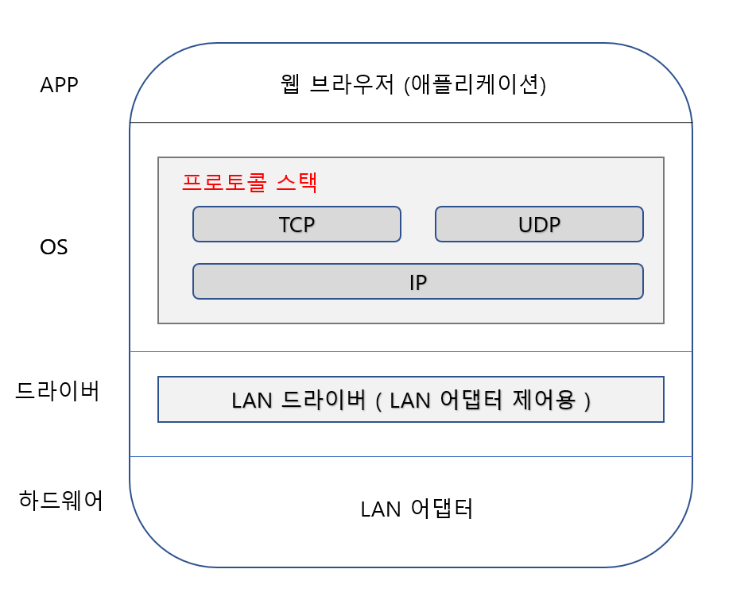

### ② 소켓이란?

프로토콜 스택은 내부에 제어정보를 기록하는 메모리 영역을 가지며, 여기에 통신동작을 제어하기 위한 제어정보를 기록한다. 대표적인 제어 정보로는 1. 통신상대의 IP 주소, 2. 포트 번호, 3.통신동작의 진행 상태 등등이 있고, 이러한 제어정보들 혹은 제어 정보를 기록한 메모리 영역을 `소켓`이라고 한다. 

소켓에는 통신 동작을 제어하기 위한 여러가지 정보가 기록되어 있다. 프로토콜 스택은 이것을 참조하여 다음에 무엇을 해야하는지를 판단하는데, 이것이 소켓의 역할이다.

윈도우의 경우 `netstat` 라는 명령어로 소켓에 제어정보들이 어떻게 저장되어 있는지를 확인 할 수 있다. 아래 그림에서 붉은색 박스로 표현된 것이 제어 정보의 주된 내용이다.

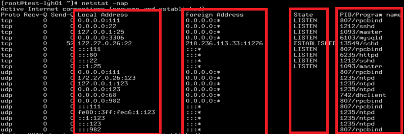

- Proto : 사용하는 프로토콜의 종류
- Local Adress : 로컬(클라이언트) IP주소와 포트번호; 0.0.0.0 은 미연결 상태를 나타낸다.
- Forigen Adress : 원격(서버)측 IP주소와 포트번호
- state : 통신 상태를 나타낸다.
- 소켓을 사용하고 있는 프로그램의 식별번호 (pk, id 역할)

위 이미지의 한 행이 하나의 소켓에 해당한다. 즉 소켓을 만드는 동작은 여기에 한 행의 제어정보를 추가하고 상태를 기록하거나, 송수신 데이터를 일시적으로 저장하는 버퍼 메모리를 준비하는 등 통신을 준비하는 작업이다.

### ③ Socket 호출

브라우저가 socket(Socket 라이브러리안에 있는 프로그램)을 사용하여 소켓을 생성하는 과정을 보자.

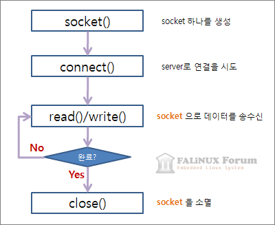

1. 어플리케이션이 socket을 호출하여 소켓을 만들 것을 의뢰하면 프로토콜 스택은 의뢰에 따라 한 개의 소켓을 만든다. 이때 프로토콜 스택은 소켓 한개 분량의 메모리를 할당하고, 초기상태로 제어 정보를 메모리에 기록한다.
2. 소켓이 만들어지면 소켓을 나타내는 `디스크립터` 를 애플리케이션에 알려준다. 이는 어떤 소켓을 가리키는지에 대한 번호표 같은 정보이다.

### ④ 헤더의 구조

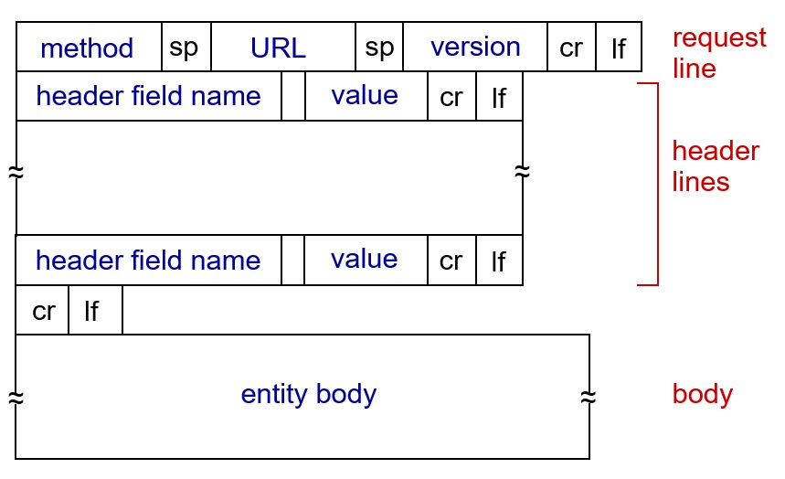

## 2. 서버에 접속한다

> 클라이언트측 소켓을 서버측의 소켓에 `접속` 하는 단계이다. 

### ① `접속`의 의미

소켓을 만들면 애플리케이션(브라우저)은 `connect`를 호출한다. 그러면 프로토콜 스택은 자기쪽의 소켓을 서버측 소켓에 `접속` 한다.

소켓이 생성된 이후에는 통신을 하기 위한 모든 제어정보가 준비된 상태는 아니다. 서버측 IP주소나, 포트번호등을 아직 모르는 상태이기 때문이다. 그러므로 이러한 정보를 프로토콜 스택에 알리는 동작이 필요한데, 이것이 `접속` 동작의 한 가지 역할이다. 마찬가지로 서버측 소켓도 클라이언트에 대한 정보가 없다. 통신을 요청하려는 클라이언트가 있다는 것을 서버에 먼저 알리는 동작으로 나의(클라이언트)의 존재를 알려야하고, 이와 같은 통신 동작의 `개시`를 전달하는 것도 접속의 하나이다.

접속동작의 첫번째는 통신상대와의 사이에 제어정보를 주고 받아 소켓에 필요한 정보를 기록하고, 데이터 송수신이 가능한 상태로 만드는 것이다.

데이터 송수신 동작을 싱행할 때는 데이터를 일시적으로 저장하는 메모리 영역이 필요한데, 이를 `버퍼 메모리` 라고 한다. 버퍼 메모리를 확보하는 것도 접속 동작을 할 때 실행하는데, 이것이 `접속`한다는 동작의 의미이다.

### ② 헤더 배치

![TCP Header [정보통신기술용어해설]](Chapter 2 요약.assets/n0ASOVG1PojpL8OgiTyTgxhmqXP4LptUX8VqryVb-sdqH24CgfM31iLoaOWvhy-FfJP99g3YuXsl7dAmftikhvCCTA)

제어정보는 헤더와 data로 나뉘는데, 헤더에는 클라이언트-서버 사이의 연결을 위한 제어정보가 담긴다. 이는 TCP 프로토콜 사양으로 규정되어 있다. 위 이미지와 같이 제어정보가 규정되어 있다. 헤더의 항목들은 고정되어 있기 때문에 접속, 송수신, 연결 끊기의 각 단계에서 클라이언트와 서버가 대화할 때마다 거기에 이 제어정보를 부가한다. 접속 단계에서는 아직 데이터 송수신이 이루어지지 않으므로 데이터가 없고, 제어정보로만 이루어져있다.

통신동작에서 이용하는 제어정보는 헤더에 기입되는 정보, 소켓에 기록되는 정보로 두 종류이다.

### ③ 접속 동작의 실체

접속은 Socket 라이브러리의 connect를 호출하는 것부터 시작된다.

여기에 서버측 IP주소와 포트 번호를 쓰면 명령이 프로토콜 스택의 `TCP` 담당부분에 전달된다. TCP 담당부분은 IP 주소로 표시된 상대(서버)의 TCP 담당 부분과 제어정보를 주고 받는다. 그 대화는 다음과 같은 단계를 밟는다. 먼저 데이터 송수신동작의 `개시`를 나타내는 제어정보를 기록한 **헤더를 만든다.**

헤더에는 여러 정보가 있지만 여기에서 중요한 것은 송신처, 수신처 포트이다. 이를 통해 클라이언트와, 서버 측 **소켓을 지정**할 수 있다. 즉, 접속해야하는 소켓을 확실히 하고, `컨트롤비트`인 `SYN` 이라는 비트를 1로 만든다.

접속은 아래와 같이 진행된다.

- TCP 헤더를 만들면 이것을 IP 담당 부분에 건네주어 송신을 의뢰하도록 한다. 

- IP 담당 부분이 패킷 송신 동작을 실행한다.
-  네트워크를 통해 패킷이 서버에 도착하면 서버측의 IP 담당부분이 이것을 받아, 서버측 TCP 담당부분에게 건네준다.
- 서버측 TCP 담당 부분이 수신한 클라이언트 TCP 헤더를 조사하여, 서버가 수신처로 기록된 소켓을 찾는다.
- 소켓을 찾으면 여기에 필요한 정보를 기록하고, 접속 동작이 진행중이라는 상태가 된다.
- 클라이언트와 마찬가지로 서버도 TCP 헤더를 만든다. 
- 응답을 돌려보낼 때 `ACK` 라는 컨트롤 비트를 1로 만든다. 이것은 패킷을 받았다는 것을 알리기 위한 동작이다. 이를 통해 누락된 패킷이 있는지 확인한다. 
- TCP 헤더를 IP 담당부분에 건네주어 클라이언트에 반송하도록 의뢰한다. 

위 동작이 완료되면, 클라이언트는 패킷을 받아 TCP 헤더를 조사하여 접속 동작이 성공했는지 확인한다. SYN이 1이면 접속 성공이므로, 소켓에 서버의 IP 주소나 포트번호등과 함께 소켓에 접속 완료를 나타내는 제어정보를 기록한다. 그러면 클라이언트가 응답을 잘 받았다고 서버에게 알려야 한다. 이를 위해 ACK를 1로만든 TCP 헤더를 반송한다. 이로서 접속 대화가 종료된다.

접속대화가 완료되면 소켓은 데이터를 송수신 할수 있는 상태가 된다. 개념적으로 파이프와 같은 것으로 소켓이 연결되어 있다고 생각하고, 이를 커넥션이라고 한다. 커넥션은 `close`를 호출하기 전까지 계속 존재한다. 이제 애플리케이션을 제어할 수 있다.

### ④ 3-way handshake

 이러한 접속과정을 3-way handshake라고 합니다. TCP는 서버와 클라이언트 사이의 연결을 유지시키는 방식으로 작동한다. 이때 연결하는 방식을 3-way handshake라고 한다. 아래의 그림처럼 클라이언트가 먼저 서버에 '연결하고 싶다.' 하면 그에 해당하는 정보를 서버가 다시 클라이언트에 보내고 그 다음 클라이언트에서도 허가하면 연결이 완성되는 형식입니다.

 간단히 요약하자면 아래와 같은데 정확한 구동 원리는 위의 request 메세지에서 header field의 컨트롤 비트를 사용합니다. 궁금하시면 설명은 가능한데 118p의 내용이 바로 이 내용입니다..!

1. 서버 측에서 요청 신청
2. 서버에서 이 요청을 보낸 클라이언트에게 연결을 허락하는 메세지를 보내면서 동시에 클라이언트에 정보를 보내도 되는지 신청(정말 나한테 보낸 요청 맞아 ? 라고 물어보는 느낌)
3. 보내도 된다고 허락 

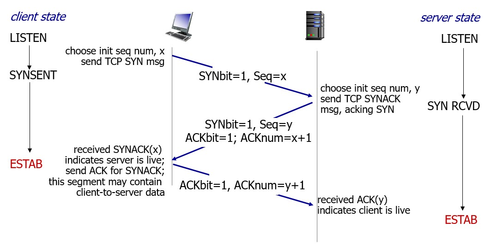

## 3. 데이터를 송, 수신한다

>소켓이 연결되어 메시지를 송신하는 단계이다. 여기에서 프로토콜 스택은 애플리케이션에서 의뢰받은 메시지를 작은 조각(`패킷`)으로 분할하여 서버로 전송한다. 전송후, 서버에 정상적으로 도착했는지 확인하고 전송되지 않았다면 재전송 한다.

### ① 프로토콜 스택에 HTTP 리퀘스트 메시지를 넘긴다

이 동작은 애플리케이션이 `write`를 호출하여 송신 데이터를 프로토콜 스택에 건네 주는 곳 부터 시작된다. 프로토콜 스택은 송신동작을 실행한다.

프로토콜 스택은 받은 메모리를 `송신용버퍼메모리`에 저장한다. 바로 송신하지 않는 이유는 애플리케이션 마다 데이터를 받는 규격이 다르기 때문이다. 그래서 어느정도의 데이터를 저장하고 나서 송수신 동작을 한다. 이 `어느정도`를 판단하는건 OS나 여러 상황에 따라 다르지만, 판단요소는 크게 2가지이다.

첫번째는, 한 패킷에 저장할 수 있는 데이터의 크기이다. 프로토콜 스택은 `MTU(패킷 하나로 운반할 수 있는 데이터의 최대길이, 이더넷에서는 보통 1500바이트)` 라는 매개변수를 바탕으로 판단한다. MTU 에는 헤더 부분도 포함된다. 실제 데이터가 저장되는 길이는`MSS`로 헤더를 제외한 데이터의 최대 길이(TCP데이터의 최대 길이)이다. 데이터가 MSS 이하라면 패킷을 분할할 필요가 없다.

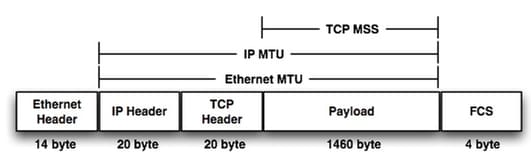

두번째는, 타이밍이다. 애플리케이션의 송신속도가 느려지는 경우 MSS에 가깝게 데이터를 저장하면 시간이 오래걸려서 송신동작이 지연되므로, 버퍼에 데이터가 모이지 않아도 적당한 곳에서 송신동작을 실행해야한다. 따라서 프로토콜 스택은 내부에 타이머가 있어, 이것으로 일정 시간이 경과하면 패킷을 송신한다.

- 전자를 중시하면, 패킷길이가 길어져서 네트워크의 이용 효율이 높아지지만, 버퍼에 머무는 시간만큼 송신 동작이 지연될 우려가 있다. 
- 후자를 중시하면, 지연은 적어지지만 이용 효율이 떨어진다.

그렇기에 양자를 절충해서 적당히 시간을 가늠하여 송신동작을 실행해야한다. 그러나 이에 대한 규정은 없기에 이는 프로토콜 스택을 만드는 개발자 마음이다. 그러므로 OS 종류나 버전에 따라 이와 관련된 동작이 달라진다.

애플리케이션측에서 송신의 타이밍을 제어하는 여지도 남아있다. 데이터 송신 의뢰시 옵션으로 `버퍼에 머물지 않고 바로 송신할 것`이라고 지정할 수 있다. 브라우저는 이 옵션을 채택하는 경우가 많다.

### ② 데이터가 클 때는 분할하여 보낸다.

HTTP 리퀘스트는 데이터 길이가 길지 않지만, `form` 형식으로 글을 쓰는 경우에는 데이터가 길다. 이때는 한개의 패킷에 다 들어가지 않는다.

이 경우 송신버퍼에 저장된 데이터는 MSS를 초과하므로 MSS 크기에 맞게 분할하고, 분할한 조각을 한개씩 패킷에 넣어 송신한다.

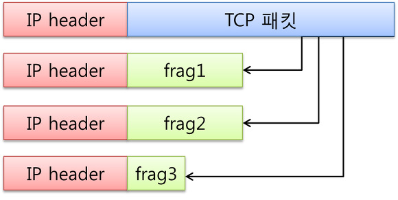

### ③ `ACK` 번호를 사용하여 패킷이 도착했는지 확인한다.

데이터가 입력된 패킷이 서버를 향해 송신된다. 하지만, 제대로 송신이 되었는지 확인이 필요하다. TCP에는 송신한 데이터가 올바르게 도착했는지를 확인하고, 도착하지 않았다면 재송신하는 기능이 있다.

확인 방법은 아래와 같다.

- TCP 헤더에는 데이터를 조각으로 분할할 때 조각이 통신 개시부터 따져서 몇번째 바이트에 해당하는지를 세어둔 `시퀀스 번호`가 저장된다.
- 수신측에서는 패킷 전체 길이에서 헤더 길이를 빼는 방식으로 데이터의 크기를 계산하여 산출한다.

이 두가지 방법으로 송신 데이터가 몇번쨰 바이트에서부터 시작되는 몇바이트 분의 것인지 알 수 있습니다.

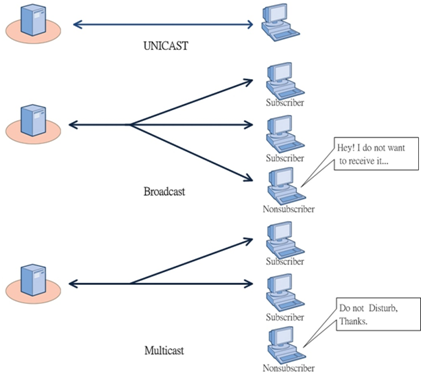

이를 통해 수신측에서 누락된 패킷이 있는지 확인 할 수 있다. 누락된 패킷이 없는 것을 확인하면, 수신측은 이전 데이터까지 합쳐서 어디까지 수신한지를 계산하고, 그 값을 TCP 헤더의 `ACK 번호`에 기록하여 송신측에 알려준다. 이 ACK 번호를 되돌려주는 동작은 `수신확인응답`이라고 부르며, 이것을 통해 상대가 어디까지 수신했는지를 파악한다.

시퀀스 번호는 초기값을 랜덤하게 지정한다. 항상 같은 값으로 시작한다면 악의적인 공격을 할 수 있기 때문이다. 하지만 난수로 생성되고, 이를 수신측에 알리지 않는다면, 데이터를 읽을 수 없다. 그래서 송수신 동작을 시작하기 전에 초기값을 상대에게 알려야한다. 이전에 접속 동작에서 `SYN`을 1로 하여 서버에 보낼때 시퀀스 번호에도 값을 설정하게 되어있어, 번호의 초기값을 나타낸다.

양방향으로 데이터를 통신할 때는 위 그림처럼 서로에게 이것이 `시퀀스번호`와 `ACK 번호`를 송신한다. 먼저 클라이언트에서 서버에 보내는 데이터에 관한 `시퀀스 번호`는 클라이언트 측에서 산출하여 데이터와 함께 서버에 통지하고, 이를 받은 서버측에서 `ACK` 번호를 산출하여 클라이언트에 반송한다. 반대의 동작일때도 위 방식으로 진행된다. `시퀀스번호`는 양쪽에서 모두 산출하기 때문에, 초기값도 양쪽에서 산출하고, 접속동작을 서로에게 통지한다.

TCP는 이방법으로 상대가 데이터를 받은 겻을 확인하는데, 확인할때까지 송신한 패킷을 송신용 버퍼 메모리 영역에 보관해 둔다. 그리고 송신한 데이터에 대응하는 `ACK 번호`가 상대로부터 돌아오지 않으면 패킷을 다시 보낸다. 이는 매우 강력한 구조로 `회복처리`(패킷이 올바르게 도착하지 않은 경우 다시 보내는 것)를 취할 수 있다. 여기서 회복 처리를 하기 때문에, LAN 어댑터, 버퍼, 라우터에서는 회복조치를 취하지 않는다. TCP에 맡겨두면 오류발생을 잘 처리한다. 하지만, 케이블 분리 혹은 서버 다운의 이유로 TCP가 아무리 다시 보내도 데이터가 도착하지 않는 경우가 있다. 이때 TCP는 최대 몇번 다시 보낸 후 송신 동작을 강제 종료하고 애플리케이션에 오류를 통지한다.

### ④ 패킷 평균 왕복 시간으로 ACK 번호의 대기 시간을 조정한다.

`ACK 번호`가 돌아오는 것을 기다리는 대기 시간을 `타임아웃 값`이라고 한다. 

네트워크가 혼잡하면 정체가 일어 날수 있기에, 대기시간을 어느정도 길게 설정해야한다. 그렇지 않으면 `ACK번호`가 돌아오기 전에 다시 보내지기 때문이다. 이 동작이 쌓이면 네트워크는 더 혼잡해지고 상태가 악화된다. 하지만 대기 시간을 너무 길에 설정하면, 송신 동작이 지연되어 속도 저하가 된다.

이 대기시간을 설정하는것은 복잡한데, 이유는 클라이언트-서버의 거리가 가까운지 먼지도 고려해야하기 때문이다. 인트라넷 같은 경우는 수 밀리초 안에도 돌아오지만, 서버가 먼 경우에는 더 걸릴 수도 있기 떄문이다. 이를 해결하기 위해 TCP는 대기시간을 동적으로 변경하는 방법을 취하고 있다. 데이터 송신 동작을 실행하고 있을 때 항상 `ACK 번호`가 돌아오는 시간을 계측해두고, 지연되면 이에 대응하여 대기시간도 늘린다. 반대로 곧바로 돌아오면 대기시간을 짧게 성정한다. 하지만 컴퓨터의 시간계측은 정밀도가 낮으므로, 대기의 최소시간은 일반적으로 0.5초~1초로 설정되어 있다.

### ⑤ 윈도우 제어방식으로 효율적으로 ACK 번호를 관리한다.

한개의 패킷을 보내고 `ACK 번호`가 돌아오기까지 기다리는것은 비효율적이다. 이러한 낭비를 줄이기 위해 TCP는 `윈도우 제어` 라는 방식에 따라 송신과 ACK번호 통지 동작을 한다. 이는 한개의 패킷을 보내고, 그 패킷에 대한 `ACK 번호`가 돌아올 때까지 차례대로 연속해서 복수의 패킷을 보내는 것이다.

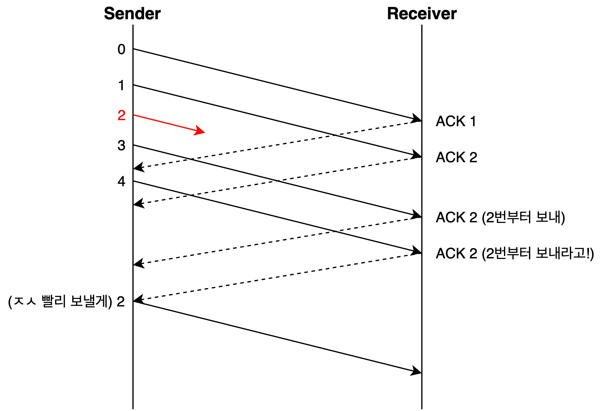

그런데 이렇게 하면, 수신측의 수용 능력을 초과하는 다수의 패킷을 보내는 사태가 있을 수 있다. 수신측의 `TCP` 는 패킷을 수신하면 일단 `수신용 버퍼 메모리`에 데이터를 일시 보관한다. 여기에 쌓인 데이터들은 계산하거나 복원하여 애플리케이션에 넘겨주는 방식이다. 하지만 애플리케이션에 넘겨주는 속도보다 빠르게 패킷이 계속 수신된다면, 버퍼 메모리를 초과할 것이다. 넘친 데이터는 저장되지 않아 없어져버리고, 오류로 인식되어 수신능력을 초과한다는 것을 의미한다. 이는 다음과 같은 방법으로 피할 수 있다. 

먼저 수신측에서 송신측에 수신가능한 데이터 양을 통지하여, 이를 넘지 않게 송신 동작을 한다. 이것이 `윈도우 제어 방식`의 개념이다.  수신측은 버퍼 데이터에 데이터를 임시보관하고, 수신처리 한다. 처리가 끝나면 버퍼가 비고, 그만큼 수신할 수 있는 데이터양을 늘리므로, 이를 TCP 헤더의 `윈도우 필드`에서 알린다. 수신 가능한 데이터양의 최대값을 `윈도우 사이즈`라고 부르며, TCP를 정밀히 조정하는 매개변수의 하나이다.

### ⑥ ACK 번호와 윈도우를 합승한다.

수신측에서 애플리케이션에 데이터를 건네주고 `수신 버퍼의 빈 영역이 늘어났을 때` 이것을 송신측에 통지해야 하는데, 이것이 `원도우 통지의 타이밍`이다. ACK 번호는 수신측에서 데이터를 받았을 때 내용을 조사하여 정상 수신을 확인 할 수 있는 경우에만 송신측에 보낸다. 즉, `데이터를 수신한 후 즉시` 보낸다고 생각하면 된다.

수신측은 `ACK 번호`나 `윈도우`를 통지할 때 소켓을 바로 보내지 않고 잠시기다린 후 한개의 패킷에 합승시켜서 통지하여 패킷 수를 줄일 수 있다. ACK 번호는 데이터의 끝이 어디인지를 송신측에 알리는 것이므로, 복수의 ACK 번호 통지가 연속해서 일어나는 경우에는 최후의 것만 통지하고 도중의 것은 생략해도 좋다. 윈도우도 마찬가지로 도중의 것을 생략하고 최후의 것만을 통지하면 된다.

### ⑦ HTTP 응답 메시지를 수신한다.

브라우저는 리퀘스트 메시지를 송신해 달라고 의뢰하고, 이것이 끝나면 서버에서 돌아오는 응답 메시지를 받기 위해 `read` 프로그램을 호출한다. 그러면 아래와 같은 동작이 진행된다.

1. 프로토콜 스택은 수신 버퍼에서 수신데이터를 추출하여 애플리케이션에 건네준다. (서버에서 응답 메시지의 패킷이 도착한 후)
2. 수신한 패킷과 TCP 헤더의 내용으로 데이터가 정상 수신되었는지 확인하고, 정상 수신되었다고 서버에게 `ACK 번호`를 반송한다.
3. 수신한 패킷들을 버퍼에 일지 보관하고, 이를 묶어 원래 모습으로 복원한 후 애플리케이션에 넘겨준다.
4. 이후, 타이밍을 가늠하여 윈도우를 송신측에 통지한다.

### ⋇  데이터 송수신 기본

 데이터 송수신에 관한 이야기는 굉장히 많습니다(througput 관리, slow start, loss data의 관리 등). 물론 이 책에서도 완전히 다 빼먹지는 않았지만 자세한 설명은 http://www.kocw.net/home/search/kemView.do?kemId=1046412의 7번 강의와 8번 강의를 추천드립니다. 즉 이 내용은 교수님도 2시간에 걸쳐서 설명하셔야 했던 것이죠. 하지만 이 책에 나온 것처럼 간단히 원리에 대해서 설명해보겠습니다.

 아래의 그림은 TCP에서 데이터 수신 중 Slow start를 설명하는 그림입니다. **데이터는 기본적으로 서버에서 하나의 패킷을 보내면 클라이언트가 그 Segment에 해당하는 ACK을 서버로 보내 잘 받았다는 신호를 보내는 방식이 기본적**입니다.  하지만 **하나의 패킷 당 ACK이 돌아올 때까지 기다리는 것은 비효율적이기 때문에 window를 통해 여러개의 파일을 동시에 보내고 여러개의 ACK 동시에 받는 방식을 사용**합니다. 

 근데 이 window는 사실 고정된 상수가 아니며 각 Edge의 Host의 상황에 따라 바뀌는 변수이기 때문에 가장 최적의 window의 크기도 계속해서 달라집니다. 때문에 이 크기를 계속해서 계산해주는 알고리즘이 작동하고 있습니다. 아래에서 오른쪽 그림처럼 window의 크기를 조절하고 있습니다.

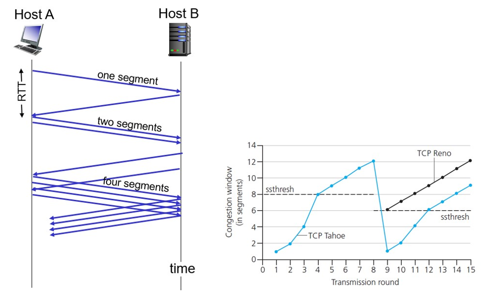

## 4. 서버에서 연결을 끊어 소켓을 말소한다

> 메시지 송수신이 끝나면 서버에서 연결을 끊고 소켓을 말소한다. 연결을 끊는 동작은 송수신이 끝난 것을 클라이언트와 서버가 함께 확인하는 것이다.

### ① 데이터 보내기를 완료했을 때 연결을 끊는다.

데이터 송수신이 완료되면 연결 끊기 단계에 들어간다. 연결을 끊는 동작은 송수신이 먼저 완료된 쪽에서 진행하지만, 지금은 서버에서 먼저 연결끊기 단계에 들어가는 것으로 설명한다. 이 경우 Socket 라이브러리의 `close`를 호출한다. 그러면 서버측의 프로토콜 스택이 TCP 헤더를 만들고, 여기에 연결 끊기에 대한 정보로 `FIN` 비트를 1로 설정한다. 이와 동시에 서버측의 소켓에 연결 끊기 동작에 들어갔다는 정보를 기록한다.

클라이언트측에서 서버에서 `FIN`을 1로 설정한 TCP 헤더가 도착하면, 클라이언트측 프로토콜 스택은 자신의  소켓에 서버측이 연결끊기에 들어갔다는 것을 기록한다. 그리고 `FIN`을 1로 설정한 패킷을 받았다는 의미로 ACK 번호를 서버측에 반송하고, 이것이 끝나면 에플리케이션이 데이터를 가지로 올때까지 기다린다.

잠시후 애플리케이션이 `read`를 호출하면 데이터를 건네지않고, 서버가 보낸 데이터를 전부 수신했다는 사실을 클라이언트측 애플리케이션(브라우저)에게 알린다. 그러면 클라이언트 측 애플리케이션도 `close`를 호출하여 데이터 송수신 동작을 끝낸다. 위에서 서버의 동작과 마찬가지로 FIN을 1로 하여 서버에 송신한후, ACK 번호가 돌아오면 이로써 서버와의 대화가 종료된다.

### ② 소켓을 말소한다.

서버와의 대화가 종료되면 더 이상 소켓을 사용하여 서버와 대화할 수 없다. 소켓을 소멸하기 전에 오동작을 막기 위해 잠시 기다린다. 위 설명이 아닌 클라이언트에서 먼저 연결끊기를 시작한다면 소켓이 제거된 후에 서버에서 보낸 FIN이 도착할 수 있고, 이러면 새로운 소켓이 이를 받아 접속을 시작도 하기전에 끝나버릴 수도 있다. 그래서 소켓 말소 전 잠시 기다린다. 

이때 기다리는 시간은 패킷을 다시 보내는 동작과 관계가 있는데, 패킷이 누락된 경우 다시 보내는 동작은 보통 몇분쯤 지속되고, 이후에는 전망이 없는 것으로보고 재전송을 멈춘다. 그때까지의 시간 동안에는 다시 보낸 패킷이 네트워크에 존재할 가능성이 있으무로, 완전히 끝나는 시간을 기다린다. 이는 일반적으로 몇분정도이므로, 몇분정도 지난 후 소켓을 말소한다.

### ③ 데이터 송수신 동작을 정리한다.

데이터 송수신 동작은 소켓을 말소하는 것으로 끝난다. 전체를 정리하면 다음과 같다. 뭔가를 받으면 ACK 번호를 반송하며, 데이터 송수신 동작에서 얼마나 데이터를 보낼지 알려주기 위한 시퀀스 번호도 있다.

1. 소켓을 작성하고, 접속 대기 상태로 만든다.
2. 접속을 하기 위해 클라이언트 -> 서버로 SYN을 1로 만든 TCP 헤더를 만들어 보낸다. 여기엔 시퀀스 번호 초기값과, 윈도우 값도 기록되어 있다.
3. 서버가 이것을 받은 후 위와 같은 정보를 담은 TCP 헤더를 돌려보낸다. 추가적으로, 여기에는 데이터를 받았다는 것을 의미하는 ACK 번호도 기록되어 있다.
4. 이를 클라이언트가 받으면 마찬가지로 ACK번호를 담은 TCP 헤더를 서버에 보내고, 이것으로 `접속` 동작은 완료되고 데이터 송수신 단계로 넘어간다.
5. TCP는 클라이언트가 보내려는 데이터를 적절히 분할하고, TCP 헤더를 맨앞에 부가하여 서버에 보낸다. 여기엔 `시퀀스번호`도 기록되어있다.
6. 이것이 서버에 도착하면 서버는 ACK번호를 반송한다.
7. 최초의 패킷이라면 서버는 데이터를 받아 수신용 버퍼에 담기만 하지만, 아니라면 이미 처리된 데이터가 버퍼에서 빠져 빈 영역이 생긴다. 이때 윈도우 값도 기록하여 클라이언트에 통지하여, 과도한 데이터 전송을 막는다.
8. 이렇게 해서 전체 데이터를 복원하여 리퀘스트 메시지를 서버가 모두 받으면, 응답 메시지를 생성하여 반송한다. 이는 위 구조를 반대로 보면 된다.
9. 데이터 송수신이 완료되면 연결 끊기에 들어간다. 연결끊기에 들어가는 쪽에서(여기서는 서버) 먼저 `FIN`을 1로 만든 `TCP 헤더`를 보내고
10. 클라이언트 이를 받으면, 받았다는 의미로 `ACK`를 1로 한 TCP 헤더를 서버에 보낸다. 서버가 연결을 끊으려 한다는 것을 클라이언트 소켓에 저장한다.
11. 클라이언트도 연결을 끊기 위해 9번 동작을 한다. (클라이언트 -> 서버)
12. 서버가 이를 받아 10번 동작을 반대방향으로 수행하고, 이를 클라이언트가 받으면 송수신이 종료되고 잠시후 소켓이 말소된다.

### ④ 4-way handshake

 이에 대한 설명은 4-way handshake라고 합니다. 다만 책의 그림 2-12에 보시면 화살표 방향이 반대로 되어있는 것처럼 되어 있어서 약간 혼란스러우실 수 있을 것 같은데요. 그림 2-12는 연결을 close하는 동작입니다. 서버에서 클라이언트로 보내는 마지막 packet에서 header의 FIN이 1로 되어 있기 때문에 마지막 패킷임을 알았고 ACK을 보냅니다. 그 다음 3번부터가 4-way handshake의 첫번째라고 생각하시면 될 것 같습니다. 그리고 책에서의 소켓 말소에서 (1)입니다.

 요약하자면 아래와 같습니다.

1. 클라이언트에서 서버에 더 보낼 데이터 없다고 알려줍니다.(그러니까 request에 따른 모든 데이터를 전송한 겁니다.)
2. 그러면 서버에서 알겠다고 합니다.(더 데이터를 보내지 않아도 되는구나 오키오키)
3. 서버에서 클라이언트에게 나 이제 그럼 연결 끊어도 되지 ? 물어봅니다.
4. 클라이언트가 그래도 된다고 하면 그때 연결이 완벽히 끊깁니다.

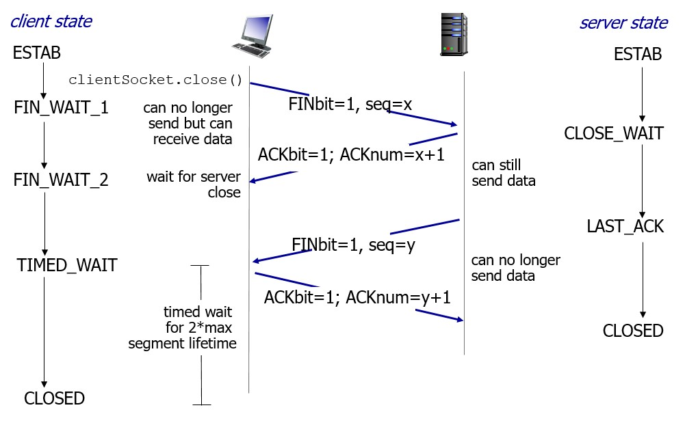

## 5. IP와 이더넷의 패킷 송수신 동작

> TCP 프로토콜의 메시지 송수신 동작의 다음은 실제로 패킷을 송수신하는 동작이다. 프로토콜 스택과 LAN 어댑터가 연대하여 작은 조각으로 분할한 데이터를 패킷형태로 묶고, 그것을 전기나 빛신호로 변환하여 케이블에 송출한다.

### ① 패킷의 기본

TCP 담당 부분은 접속, 송수신, 연결 끊기의 각 단계에서 통신상대와 대화할 때 IP 담당 부분에 의뢰하여 대화하는 데이터를 패킷의 모습으로 만들어 상대에게 도착한다. 이 장에서는 의뢰받은 IP 담당부분이 어떻게 패킷을 송신하는지 살펴본다.

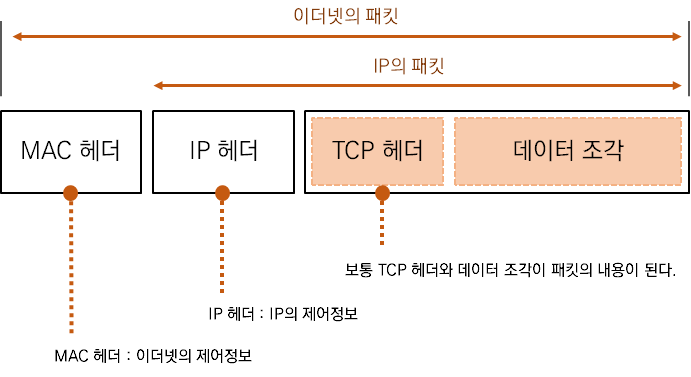

패킷은 앞서 설명한 바와 같이 `헤더` 와 `데이터` 부분으로 구성된다. 헤더는 데이터의 제어정보, 데이터는 실제 보내질 메시지이다. 먼저 패킷의 송신처가 되는 기기가 패킷을 만드는데, 헤더에는 적절한 제어 정보를 기록하고, 데이터 부분에는 얼마간의 데이터를 넣은 후 패킷을 가장 가까운 중계 장치에 송신한다. 중계장치는 패킷의 헤더에 기록된 수신처와, 표(어느 수신처가 어디있는지에 대한 정보를 기록)에 등록된 내용을 결합하여 패킷을 목적지를 판단한다. 이와 같은 방법으로 패킷을 중계하면, 그 다음 중계장치에 패킷이 도착하고, 이 과정을 반복하여 수신처의 기기에 패킷이 도착한다. 보통 수신처에서 패킷을 받으면 송신처로 회답패킷을 보내준다. 이러한 경우 송수신처가 수시로 바뀌기 때문에 송수신처 기기를 묶어서 `엔드노드`라고 부른다.

이 패킷의 기본은 여러가지 패킷 통신에 적합하므로, TCP/UP 네트워크에도 적합하다. 서브넷은 `라우터`와 `허브`라는 두 종류의 패킷 중계 장치에서 다음과 같은 역할을 분담하여 패킷을 운반한다. 허브는 이더넷의 규칙에 따라 패킷을 운반하고, 라우터는 IP의 규칙에 따라 패킷을 운반하기 때문에 아래와 같이 말할 수 있다.

1. 라우터가 목적지를 확인하여 다음 라우터를 나타낸다. = IP가 목적지를 확인하여 다음 IP의 중계 장치를 나타낸다.
2. 허브가 서브넷 안에서 패킷을 운반하여 다음 라우터에 도착한다. = 서브넷 안에있는 이더넷이 중계 장치까지 패킷을 운반한다.

먼저 서버의 IP 주소를 IP 헤더의 수신처에 기록한다. IP는 수신처가 어디있는지 조사하여, 그 방향에 있는 다음 라우터를 조사한다. 다음 라우터에 패킷이 도착하도록 이더넷에 의뢰한다. 이때 다음 라우터에 할당된 이더넷 주소(MAC 주소)를 조사하여, 이를 MAC 헤더에 기록한다. 이렇게 하여 의뢰를 받은 이더넷에게 어느 라우터에 패킷을 보낼지 전달한다.

이렇게 해서 패킷을 송신하면 허브에 도착한다. 허브에는 패킷의 목적지를 판단하기 위한 표(이더넷용 표) 같은 것이 있어서, 이더넷 헤더의 수신처 정보와 표를 결합하여 패킷의 목적지를 판단하고 중계한다.

그러면 패킷은 다음 라우터에 도착한다. 라우터에는 IP용 표가 있으므로, 이것과 IP 헤더의 수신처를 결합하면 다음에 어느 라우터에 패킷을 중계하면 좋을지 결정되고 위 과정을 반복하며 패킷이 전송된다.

위에서 `IP`와 `이더넷`에서 역할을 분담한다고 설명했는데, 이더넷 부분은 무선 LAN, ADSLm FTTH등 으로 대체가 가능하다. 이더넷과 같은 거대한 네트워크를 구축하려면 이와 같은 유연성이 필요하고, 이것이 역할을 분답하는 이유이다.

### ② 패킷 송수신 동작의 개요

프로토콜 스택의 IP 담당 부분의 패킷 송신 동작을 알아보자. IP 담당부분은 패킷을 운반하는 전체에서 입구 부분에 불과하지만, 몇가지 하는 일이 있다. 

패킷 송수신이 출발은 TCP 담당 부분이 IP 담당부분에 패킷 송신을 의뢰하는 것이다. TCP 담당 부분은 데이터 조각에 TCP 헤더를 부가하여 IP 담당 부분에 넘긴다. 이를 받은 IP 담당 부분은 내용물을 한 덩어리의 디지털 데이터로 간주하고, 그 앞에 `IP 헤더`와 `MAC 헤더`를 부가한다. (위 이미지 참고) 

- `IP 헤더`는 IP 프로토콜에 규정된 IP 주소로, 목적지까지 패킷을 전달 할 때 사용되는 제어정보를 기록한 것이다.
-  `MAC 헤더`는 MAC 주소로, 이더넷등의 LAN을 사용하여 가장 가까운 라우터까지 패킷을 운반할 때 사용하는 제어정보를 기록한 것이다.

헤더가 부가된 패킷을 네트워크용 하드웨어(이더넷, 무선 LAN 등)에 넘긴다. 이 부분은 PC인지 노트북인지에 따라 유형이 다양해서, 여기서는 `LAN 어댑터`로 통칭한다. `LAN 어댑터`에 패킷이 넘겨질때는 0 또는 1의 비트가 이어진 형태이고, 이를 LAN 어댑터가 전기나 빛 신호로 바뀌어 케이블에 송출된다.

패킷이 중계되면서 수신처에 도달하면, 수신처의 `LAN 어댑터`가 이를 다시 디지털 데이터의 모습으로 복원하여 IP 담당부 -> TCP 담당부로 넘어간다.

### ③ 수신처 IP 주소를 기록한 IP 헤더를 만든다.

IP 담당 부분은 TCP 담당 부분에서 패킷 송수신 의뢰를 받으면, IP 헤더를 만들어 TCP의 헤더 앞에 붙인다. 헤더에는 아래와 같은 정보들이 저장되며, 자세한 내용은 [여기](http://ktword.co.kr/abbr_view.php?nav=&m_temp1=5185&id=424)에서 확인 할 수 있다.

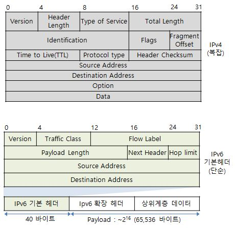

이 항목 중에서 가장 중요한 것은 `수신처 IP 주소`로, 여기에는 TCP 담당부분에서 통지된 상대의 IP 주소를 설정한다. `송신처 IP 주소` 도 설정하는데, 이는 클라이언트(로컬) IP 주소를 성정한다. 

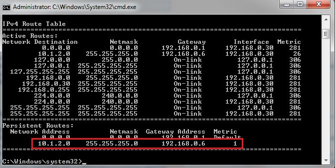

복수의 `LAN 어댑터` 를 장착한 경우에는 한대의 컴퓨터에 할당된 IP 주소가 여러개가 되므로, 어느 IP 주소로 설정할지를 판단해야한다. 판단 방법은 라우터가 IP용 표를 사용하여 다음 라우터를 결정하는 동작과 동일하다. 이 IP용 표를 `경로표` (라우팅 테이블) 라고 부르는데, 이는 Chapter 3에서 상세히 기술하므로, 여기서는 간략하게만 설명한다. 경로표는 `route print` 라는 명령어로 내용을 표시할 수 있다. 소켓에 기록된 IP 주소를 내용들과 비교하여 일치하는 행을 찾는다. 여기에 `Gateway` 항목에는 다음 라우터의 IP 주소를 기록하게 되어 있어서 IP 주소를 가진 라우터에 패킷을 건네주면 라우터가 목적지에 패킷을 중계해준다는 것을 나타낸다. 경로표 맨위 행에는 목적지와 `넷마스크`(IP 주소의 네트워크 번호와 호스트 번호의 경계를 결정하는 값)가 0.0.0.0 으로 등록되어 있다. 이것은 소위 `기본 게이트웨이`이며, 다른 곳에 일치하는 것이 없으면 이 행으로 간주한다.

`프로토콜 번호`라는  필드에 패킷에 들어간 내용물이 어디에서 의뢰받은 것인지 나타내는 값을 설정한다. TCP 에서 의뢰받았다면 06(hex), UDP에서 의뢰받았다면 17(hex)로 기록되며, 이는 규칙이 있다.

### ④ 이더넷용 MAC 헤더를 만든다.

IP 헤더를 만들었으면, IP 담당부분의 앞에 MAC 헤더를 붙인다. 이더넷은 TCP/IP 와는 다른 구조로 수신처를 판단하기 때문에, `이더넷의 수신처 판단 구조로 사용하는 것이 MAC 헤더`이다.

 ![802.11 MAC 프레임 [정보통신기술용어해설]](Chapter 2 요약.assets/Apg3d3lKjtdPKuHDTsbPYzYjt7DE_dFEk38l4d3xIRyG8QDNUvRWWcGTTzei6_OHMNwYNHO0Df6rmqZ3fB1JLUYbGQ)

송수신처 MAC 주소는 데이터 송수신을 위한 주소이다. 3개의 `이더 타입` 이라는 항목은 IP 헤더의 프로토콜 번호와 비슷하다. `이더타입(Ether Type)`은 패킷에서 MAC 헤더 뒤의 내용물 부분이 무엇인지를 나타낸다. 이더넷의 내용물은 IP나, ARP 라는 프로토콜의 소켓이며, 각각에 대응하는 값이 규칙으로 정해져있다.

MAC 헤더를 만들때는 이더타입, 송신처 MAC 주소, 수신처 MAC 주소를 기록한다. 송신처 주소는 자체 `LAN 어댑터`의 MAC 주소를 설정한다. 이는 LAN 어댑터를 제조할 때 그 안에 있는 `ROM`에 기록된다. 수신처 주소는 패킷을 건네 주는 상대의 MAC 주소를 기록한다. 하지만 이 시점에는 누구에게 패킷을 줘야하는지 모른다.(최종 도착지 말고 가장 가까운 라우터에 할당된 이더넷 주소를 모른다.) 이것은 경로표에서 찾은 일치하는 행의 `Gateway` 항목에 기록된 IP주소의 기기가 패킷을 건네줄 상대가 된다. 하지만 여전히 MAC 주소는 모른다

### ⑤ ARP로 수신처 라우터의 MAC 주소를 조사한다.

`ARP`(Adress Resolution Protocol). 이더넷에는 연결되어 있는 전원에게 패킷을 전달하는 `브로드캐스트` 라는 구조가 있으며, 이 구조를 이용하여 특정 IP를 가지는 전원의 MAC 주소를 알 수 있다. 상대가 자신과 같은 네트워크 상에 존재하면 이것으로 MAC 주소를 알수 있다. 그러면 MAC 주소를 MAC 헤더에 담아 설정하여 MAC 헤더를 만든다.

패킷을 보낼때마다 이 동작을 하면 ARP의 패킷이 불어나기 때문에 한번 조사한 결과는 `ARP 캐시`라는 메모리 영역에 보존하여 다시 이용할 수 있다.

ARP 캐시를 사용하여 ARP 패킷을 줄일 수 있지만, ARP에 저장된 MAC주소를 언제까지나 사용할 수는 없다. 데이터 충돌을 방지하기 위해 ARP 캐시에 저장된 값은 일반적으로 몇분 정보 후에 삭제하게 되어 있다.

`MAC 헤더`를 `IP 헤더` 앞에 붙이면 패킷이 완성된다. 이렇게 해서 패킷을 만들기까지가 IP 담당이다. 

### ⑥ 이더넷의 기본

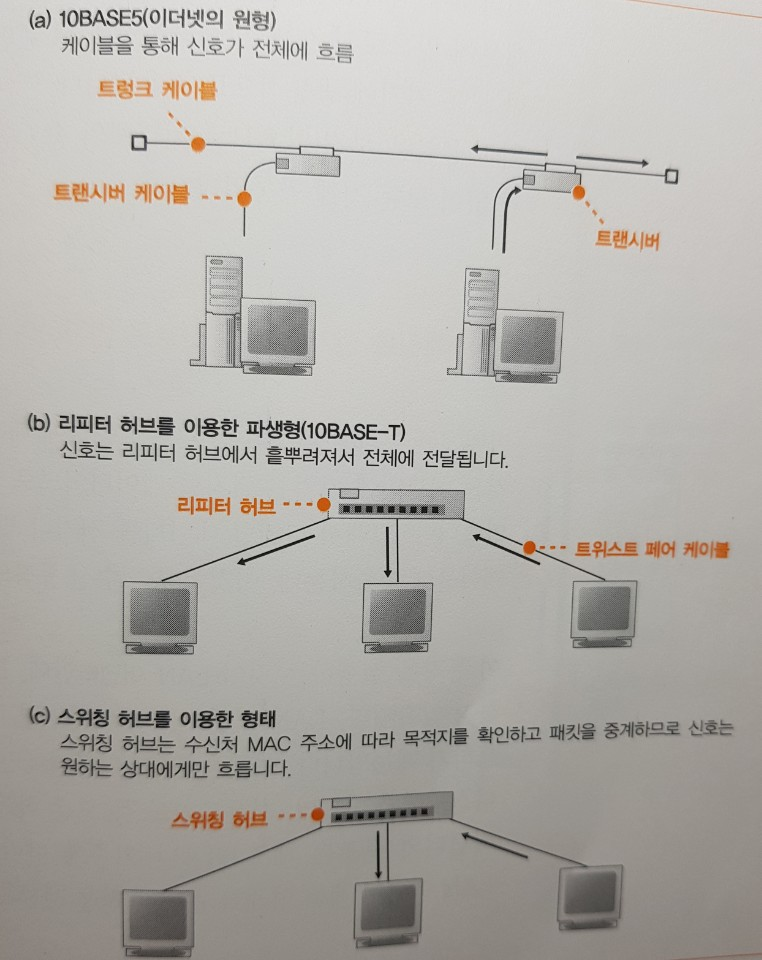

`이더넷`은 다수의 컴퓨터가 여러 상대와 자유롭게 적은 비용으로 통신하기 위해 고안된 통신 기술이다. 원하는 상대에게만 패킷을 잘 전송하기 위해서 MAC 헤더에 있는 MAC 주소를 참고한다. 수신처, 송신처 MAC 주소를 참고하여 어디에서 어디로 보낼지를 확인하고, `이더타입`으로 어떤 데이터를 송수신하는지를 알 수 있다. 이 정보를 바탕으로 패킷을 송수신하는 것이 이더넷의 역할이다.

이더넷의 원형은 트렁크 케이블에 트랜시버가 선형적으로 연결된 형태이다. 트렁크 게이블이 `리피터허브`로 바뀌고, 트랜시버 케이블이 `트위스트 페어 케이블`로 바뀌었다고 생각하면 된다.

이후, 스위칭 허브를 사용한 형태가 현재 이더넷이 택하고 있는 모습이다. 형태는 비슷하지만, 전원에게 신호가 전달된 다는 성질이 변했으며, 수신처 MAC 주소로 나타내는 원하는 기기가 존재하는 부분에만 신호가 흐르고, 다른곳에는 흐르지 않게 되었다.

하지만 MAC 헤더의 송수신처 MAC 주소로 어디서 어디로 패킷을 보내야하는지, `이더타입`으로 패킷의 타입이 무엇인지 판단하여 동작을 수행한다는 것은 변하지 않으며, 이 세가지 성질을 갖는 것이 `이더넷` 이라고 생각하면 된다.

### ⑦ IP 패킷을 전기나 빛 신호로 변환하여 송신한다

여기서는 이더넷 패킷의 송수신 동작에 대해 설명한다. IP가 만든 패킷은 메모리에 기억된 `디지털 데이터` 이므로, 이를 전기나 빛 신호로 변환하여 네트워크 케이블에 송출하는데, 이것이 송수신 동작의 본질이다.

이동작은 `LAN 어댑터`가 실행한다. 하지만 `LAN 어댑터` 는 단독으로 동작하지 않으며, 이를 제어하려면 `LAN 드라이버 소프트웨어`가 필요하다. (~~놋북이나 조립식 PC 사면 드라이버 그 회사꺼 잘 맞게 사야하는 이유~~)

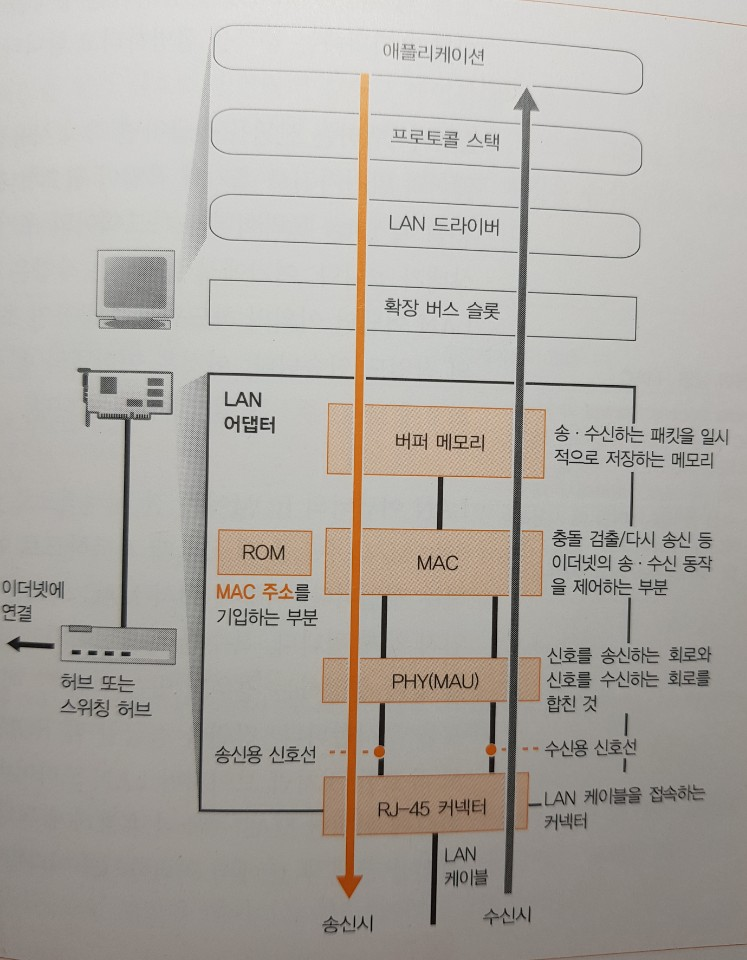

`LAN 어댑터`는 전원을 공급하면 즉시 사용할 수 있는 것이 아니라, 다른 하드웨어와 마찬가지로 `초기화 작업`이 필요하다. 이때 실행하는 작업은 `하드웨어 이상 검사`, `초기 설정` 등 하드웨어 공통 초기화 작업이 있고, `LAN 어댑터` 특유의 작업으로는 송수신 동작을 제어하는 `MAC 회로`에 `MAC 주소`를 설정하는 것이다. `LAN 어댑터`의 `ROM`에는 일원화해서 관리하는 MAC 주소를 제조할 때 기록하므로, 이것을 읽어와서 MAC 회로에 설정한다.

### ⑧ 패킷에 3개의 제어용 데이터를 추가한다.

`LAN 드라이버`는 IP담당 부분에서 패킷을 받으면 그것을 LAN 어댑터 버퍼 메모리에 복사한다. 복사를 마친 후 패킷을 송신하도록 MAC 회로에 명령을 보내면, MAC 회로의 작업이 시작된다.

`MAC 회로`는 먼저 송신 패킷을 버퍼 메모리에서 추출하고 맨앞에는 `프리앰블`과 `스타트 프레임 딜리미터` 라는 두개의 데이터를, 맨끝에는 `프레임 체크 시퀀스(FCS)` 라는 오류 검출용 데이터를 부가한다.

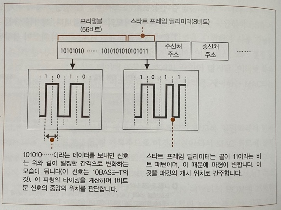

`프리앰블`은 송신하는 패킷을 읽을 때의 타이밍을 잡기 위한 것으로, 101010... 과 같이 1과 0이 번갈아 나타나는 56비트가 이어진 것으로, 이를 신호로 바꾸면 일정한 모습의 파형이 된다. 수신측은 신호를 수신할 떄 이 파형에서 타이밍을 판단한다. 패킷 앞에는 프리앰블과 스타트 프레임 딜리미터가 붙어있다. 프리앰블로 타이밍을 맞추고, SFD로 프레임의 개시 위치를 발견한다.

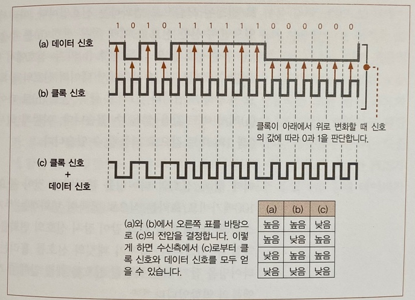

전기신호 <-> 디지털 신호의 변환은 비트값과 전압(or 전류)값에 대응시키는 것으로 변환한다. 그러나 실제 신호에는 각 비트의 구분을 나타내는 보조선이 있으므로 각 비트의 구분이 어디까지인지 판단하면서 전압이나 전류의 값을 읽어야한다. 하지만 1과 0이 이어지면 신호의 변화가 없어져서 비트 구분을 판단할 수 없게 된다는 문제가 생긴다. 

이 문제를 해결하기 위해서 송수신신호와 별도로 비트 구분을 위한 `클록`이라는 신호를 보낸다. 클록신호가 아래에서 위로 변화할때 전압(or 전류)값을 읽고 이것을 0,1로 대응 시킨다. 하지만 이방법도 케이블이 길어지면 신호선의 길이가 달라져서 데이터 신호와 클록 신호가 전달되는 시간에 차이가 생겨, 클록이 틀어져 버리는 문제가 있다.

이를 해결하기 위해 데이터 신호와 클록 신호를 합성하여 한개의 신호로 만들어 사용한다. 이것이 (c)의 신호이며, 이것을 수신측으로 보낸다. `클록 신호`는 일정 주기로 결정된 모습으로 변화하는 신호이다. 따라서 변화의 타이밍까지 알고 있으면 두 신호를 분리하고, 원복하여 원해 신호를 추출할 수 있다. 신호를 합성할 떄는 반대로 생각하면된다. 이렇게 해서 전압이나 전류의 값에서 비트값을 되돌릴 수 있다.

이때 `클록 신호`의 타이밍을 판단하는 것이 중요한데, 10메가비트/초나 100메가비트/초라는 식으로 클록의 변화주기는 결정되어 있으므로 잠시 지켜보면 타이밍을 알 수 있다. 타이밍을 잡기 위해 이를 튀한 특별한 신호를 패킷 앞에 부가하는데, 이것이 `프리앰블`의 역할이다.

이더넷의 속도나 케이블의 종류에 따라 다수의 파생 방식이 있고, 이에 따라 신호의 모습도 달라지므로 위 방식으로 한정되지는 않는다. 그러나 `프리앰블`의 역할과 기본적인 개념은 동일하다.

`스타트 프레임 딜리미터`도 있지만 마지막 비트 패턴이 조금 다르다. 수신측은 이것을 표시하여 신호에서 데이터를 추출하기 시작한다. 즉, 스타트 프레임 딜리미터가 패킷의 시작을 나타내는 표시가 된다.

`FCS`는 패킷 운반도중 파형이 흐트러져 데이터가 변한 경우 이를 검출하기 위해 사용한다. 이것은 32비트의 비트열로, 패킷의 맨앞~맨끝 내용을 어떤 계신식에 기초하여 계산한것이다. 이 계산식은 `CRC(Cyclic Redundancy Check)` 라는 디스크 장치 등에 사용하는 오류 검사 코드와 같은 종류이므로, 1비트라도 내용이 달라지면 달라진 값을 취하도록 되어있다. 결론적으로 `FCS`는 어떤 계산식을 통해 불일치 값을 추출하면, 송신한 데이터가 변화했다고 판단하는 것이다.

### ⑨ 허브를 향해 패킷을 송신한다

 `프리앰블`, `스타트 프레임 딜리미터` , `프레임 체크 시퀀스(FCS)`의 세가지를 부가하면 케이블에 송출하는 패킷이 완성된다. 신호를 송신하는 동작에는 `리피터 허브`를 사용했을 때의 `반이중 모드`와 `스위칭 허브`를 사용한 `전이중` 모드의 두가지가 있다.

`반이중 모드`의 동작은 신호의 충돌을 피하기 위해 다음과 같이 동작한다. 

1. 케이블에 다른 기기가 송신한 신호가 흐르고 있는지 조사, 있다면 끝날때까지 대기
2. 신호가 정지했거나, 흐르지 않고 있다면 송신동작을 시작

이 송신동작은 먼저 MAC 회로가 프리앰블의 맨앞부터 1비트씩 차례로 데이터를 전기신호화 하고, 이것을 `PHY` 또는 `MAU` 라는 송수신 신호 부분에 보낸다. 이때 디지털 데이터를 전기신호화 하는 속도가 `전송속도`이다.

`PHY(MAU)` 회로는 이 신호를 케이블에 송출하는 형식으로 변환하여 송신한다. `PHY(MAU)` 회로는 MAC 회로가 송신한 신호의 형식을 변환하기 위한 `변환회로`라고 생각하면 된다.

`PHY(MAU)` 회로가 MAC 회로에서 받은 신호를 케이블에 송신할 때 단지 송신 동작만 실행하는 것이 아니라,  수신 신호선에서 신호가 흘러들어오는 감시한다. 신호 송신을 완료할 때까지 수신 신호선에 신호가 들어오지 않으면 송수신 동작이 끝난다. `이더넷`이라는 통신 방식은 송신한 신호가 상대에게 완전히 도착했는지를 확인하지 않는다. 이더넷은 사양에 따라 케이블 길이를 100m이내로 정하는데, 길어야 100m이므로 오류가 좀처럼 발생하지 않는다. 오류가 발생하더라도 프로토콜 스택의 TCP가 검출하므로, 오류확인이 필요없다.

신호를 송신하는 동안 수신신호가 들어오지 않아야 하는데, 흘러들어오는 경우도 있다. 드문 확율이지만, 복수의 기기가 송신동작에 들어갈 가능성이 있기 때문이다. `리피터 허브`를 사용한 `반이중 모드`의 경우 이러한 사태가 되면 충돌이 발생한다. 이렇게 되면 송신 동작을 충지하고 다른 기기에 이를 알리기 위해 `재밍 신호`라는 특수한 신호를 잠시동안 흘리고나서 송신동작을 멈추고 잠시 기다렸다 재송신한다. 이때 두 기기가 똑같이 대기했다 송신하면 또 충돌하므로, MAC 주소를 바탕으로 난수를 생성하고 여기서부터 대기시간을 계산한다.

이더넷이 혼잡해져서 충돌이 일어나면 대기시간을 2배로 늘린다. 충돌할때마다 2배씩 늘리고, 10번째까지 보냈는데도 해결되지 않으면 오류로 판단한다. `전이중 모드`는 송수신을 동시에 실행하면서, 충돌이 일어나지 않아 위와 같은 번거로운 일을 생각할 필요가 없다.

### ⑩ 돌아온 패킷을 받는다.

리피터 허브를 이용한 반이중 동작의 이더넷에서는 1대가 송신한 신호가 `리피터 허브`에 접속된 케이블 전부에 흘러간다. 즉, 자신뿐만 아니라 누군가가 신호를 보내면 그것이 전부 수신신호선에 흘러들어오고, 수신동작은 이러한 신호를 전부 받아들이는 것부터 시작한다.

신호의 맨앞 프리앰블, 스타트 프레임 딜리미더 다음으로 실제 패킷이 나온다. 이를 수신하는 것은 송신할때와 반대로 `PHY(MAU)` 회로에서 신호를 공통 형식으로변환하여  MAC회로에 보내고, 이를 디지털 데이터로 변환하여 버퍼 메모리에 저장한다. 그리고 신호의 마지막에 `FCS`를 검사하여 정상인지 확인한다. 계산한 FCS와 실제 FCS가 일치하지 않는다면, 오류 패킷으로 간주하고 폐기한다.

`FCS`에 문제가없으면 MAC헤더의 수신처 MAC 주소를 조사하여 `LAN 어댑터를 초기화 할때 설정한 자체 MAC주소와 비교하고, 이게 나에게 온 데이터가 맞는지 확인하여 맞다면 버퍼 메모리에 저장하고, 아니라면 폐기한다. 이렇게 MAC 회로가 할일이 끝나면 패킷을 수신했다는 사실을 컴퓨터 본체에 알린다.

이 통지는 `인터럽트`라는 구조를 사용한다. `LAN 어댑터`가 송수신하고 있는 동안 본체는 다른 작업을 하는 중이다. 그러므로 `LAN 어댑터`에서 이를 알리지 않으면 본체는 패킷의 존재를 모른다. 이때 본체가 실행중인 작업에 끼어들어(인터럽트) `LAN 어댑터`쪽에 주의시키는 것이 인터럽트다.

먼저 `LAN 어댑터`가 확장 버스 슬론 부분에 있는 인터럽트 신호선에 신호를 보낸다. 이 신호선은 본체의 인터럽트 컨트롤러를 통해 CPU에 연결되어 있어, 이 신호가 들어오면 CPU는 기존에 하던 작업을 일시적으로 보류하고 인터럽트 처리용 프로그램쪽으로 전환한다. 여기서 `LAN 드라이버`가 호출되면 `LAN 어댑터`를 제어하여 송수신 동작을 실행한다. 이 인터럽트에는 번호가 할당되어 있어서 `LAN 어댑터`를 설치할 때 번호를 하드웨어로 설정한다.

이 인터럽트에 의해 `LAN 드라이버`가 동작하고, LAN 어댑터의 버퍼 메모리에서 수신한 데이터를 추출하면, LAN 드라이버는 MAC헤더의 타입 필드의 값으로 부터 프로토콜을 판별한다.

### ⑪ 서버의 응답 패킷을 IP에서 TCP로 넘긴다.

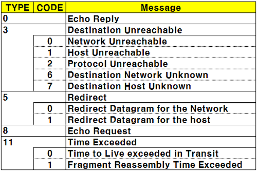

서버에서 반송된 패킷 타입은 0800이므로 LAN드라이버는 TCP/IP의 프로토콜 스택에 패킷을 건넬 것이다. IP담당부분은 IP 헤더 조사하여 문제가 있는지 확인, 수신처 IP 주소확인. 다르다면 `ICMP` 라는 메시지를 사용하여 통신상대에서 오류를 통지한다. ICMP표를 통해 오류 종류를 알 수 있다.

수신처 IP 주소가 올바르다면, IP 프로토콜의 `조각나누기(프래그먼테이션)` 라는 기능이 사용된다. LAN 중에는 짧은 패킷만 다룰 수 있는 것이 있어, 일반적으로 패킷을 짧게 하기 위해 분할하는 경우가 많다. 따라서 전달받은 데이터가 분할된 데이터라면 이를 원래 패킷으로 되돌린다. 분할된 패킷은 IP헤더에 있는 `플래그`라는 할목으로 분할 여부를 알수 있다. 분할된 것이면 IP 담당부분 내의 메모리에 일시보관하고, `패킷 ID`(IP 헤더에 있음)가 같은 모든 패킷이 도착하기를 기다린다. 또한 `프래그먼트 오프셋` 이라는 항목에는 패킷이 원해 패킷의 어느 위치에 있었는지를 나타내는 정보가 들어있다. 이들을 바탕으로 패킷을 원해 모습으로 되돌리는 `리어셈블링(reassembling)`을 한다.

IP 담당부분이 리어셈블링을 끝내면 패킷을 TCP담당부분에 넘긴다. 그러면 TCP 담당부분은 IP 헤더에 기록된 송수신처의 IP 주소, 포트번호의 네가지 항목을 조사하여 해당하는 소켓을 찾느다. 소켓을 찾으면 이는 `접속` 상태이므로, 이에 맞는 적절한 동작을 수행한다. (폼을 작성하고 엔터 누른 경우 돌아와서 저장된 폼을 보여준다든가) 

### ⋇ 캡슐화

 이 부분은 사실 네트워크 레이어와 링크 레이어에 관한 내용입니다. 확실히 내용이 휙휙 점프하는 경향이 있어서 이해하기 어려울 것 같습니다. 심지어 일단 IP는 네트워크 레이어 이더넷은 링크 레이어입니다. 둘이 나뉘기 때문에 이 두개를 나누어서 정리할 계획입니다. 사실 링크 레이어에 관해서는 아직 제가 깊게 공부를 안해봐서 일단 제가 이해한 내용을 가능한 만큼 적어보도록 하겠습니다.

 이에 앞서 패킷에 대한 설명을 먼저 해야할 필요가 있을 것 같습니다. 이 책에서 설명하는 헤더 붙이기(MAC 헤더, IP헤더, TCP헤더)는 **캡슐화(Encapsulation)**라고 하고 위로 올라가면서 하나씩 떼지는 것은 **역캡슐화(Decapsulation)**라고 합니다. 각 계층에서 만들어지는 데이터는 message, segment, datagram, frame 으로 각각 부르는 이름이 있습니다. 

 네트워크의 기본 대원칙은 **모든 것을 저장하지 않는다는 것**입니다.(이것을 마음에 새기면 앞으로 공부할 때 조금 편합니다.) 그래서 각 헤더들은 바로 다음 경로만을 저장합니다. 그렇게 바로 다음, 바로 다음만 보고 움직입니다.

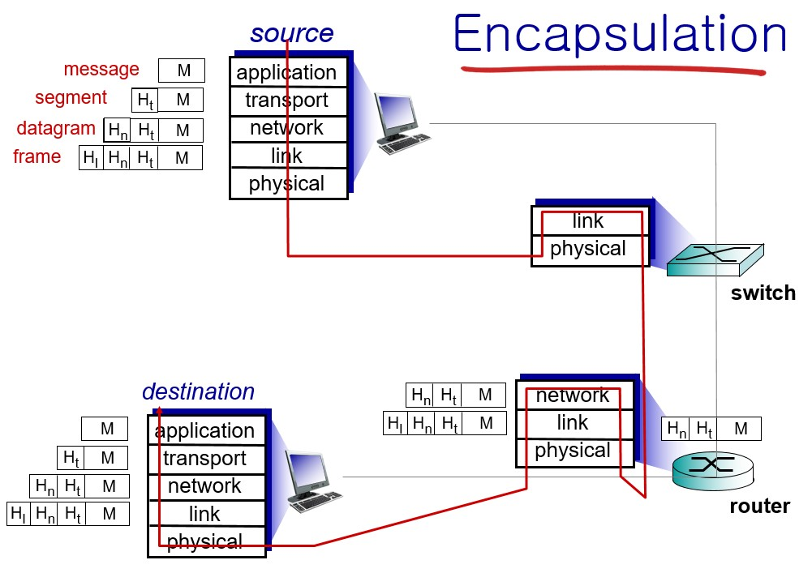

## 6. UDP 프로토콜을 이용한 송수신 동작

> TCP 프로토콜에는 오류때문에 패킷이 없어졌을 때 다시 보내는 기능을 비롯하여 편리한 기능이 많다. 따라서 보통의 애플리케이션은 TCP 프로토콜을 이용하여 송수신동작을 수행하지만, 경우에 따라 편리한 기능이 문제가 될 수도 있다. 이 경우를 대비하여 `UDP` 라는 프로토콜이 준비되어 있는데, 여기서 UDP의 필요성과 TCP와의 차이점을 기술한다.

### ① 수정 송신이 필요없는 데이터의 송신은 UDP가 효율적이다.

대부분의 애플리케이션은 위에서 설명한 TCP 프로토콜을 사용하여 데이터 송수신을 실행하지만, 모두 그런것은 아니다.

TCP 동작은 복잡한 이유는 데이터를 확실하면서도 효율적으로 전달하기 때문이다. 데이터를 확실하게 송수신 하려면 중간중간 잘 보내졌는지 도착했는지 확인해야하고, 그렇지 않다면 재전송해야한다.

이것을 간단히 하기 위해서는 일단 전체 데이터는 `전부` 보내고, 수신확인 응답을 받는 것이다. 전부보낸후 확인하기 때문에, TCP가 하는 것처럼 어디까지 보냈는지 확인할 필요가 없어서 간결해진다. 그러나 이는 패킷이 하나만 없어도 전체를 다시 보내므로 비효율적이다. 이를 잘 생각해보면, 보내야하는 데이터가 많아서 일부가 누락된 경우 전체를 보내는게 비효율적이라면, TCP 방식으로 하나 씩 보내면 된다. 하지만 그게 아니라 짧은 데이터, 소량의 패킷을 보내는 경우는 굳이 이 복잡한 과정을 거칠 이유가 없다. 이것이 TCP가 아닌 `UDP`를 사용하는 경우이다. 특히, 수신확인 응답을 받을 필요가 없는 경우 UDP를 사용한다.

### ② 제어용 짧은 데이터

DNS 서버에 대한 조회등 제어용으로 실행하는 정보 교환은 한개의 패킷으로 끝나는 경우가 많으므로 UDP를 사용한다. UDP는 TCP와 같은 수신확인이나 윈도우가 없어서, 제어정보를 주고받을 필요가 없고, 접속이나 연결끊기 등의 과정이 없다. 애플리케이션에서 송신데이터를 받으면 여기에 UDP 헤더를 부가하고 IP에 의뢰하여 송신하기만 한다.

수신도 간단하다. IP 헤더에 기록된 송수신처 IP 주소와 포트번호 4항목과 소켓에 기록된 정보를 결합하여 데이터를 건네줄 대상 애플리케이션을 판단하고 여기에 데이터를 건네주기만 한다. 만약 오류가 발생해도 문제가 없다. 오류가 있다면 애플리케이션이 수신을 못하니, 재요청을 보낸다.

### ③ 음성 및 동영상

음성이나 영상 데이터는 결정된 시간안에 데이터를 건네주어야한다. 데이터 도착이 지연되면 타이밍이 맞지 않아서 미디어가 끊긴다. TCP 처럼 중간중간 송수신확인이나 오류에 의한 재전송이 있으면 미디어가 끊길 수밖에 없다. 그래서 UDP를 사용한다. 그리고 영상이나 음성은 중간에 누락된 패킷이 있다고 해도 잠시 `치직` 하는 정도 or 영상이 잠깐 멈추는 정도라서 굳이 다시 보낼 필요가 없다.

