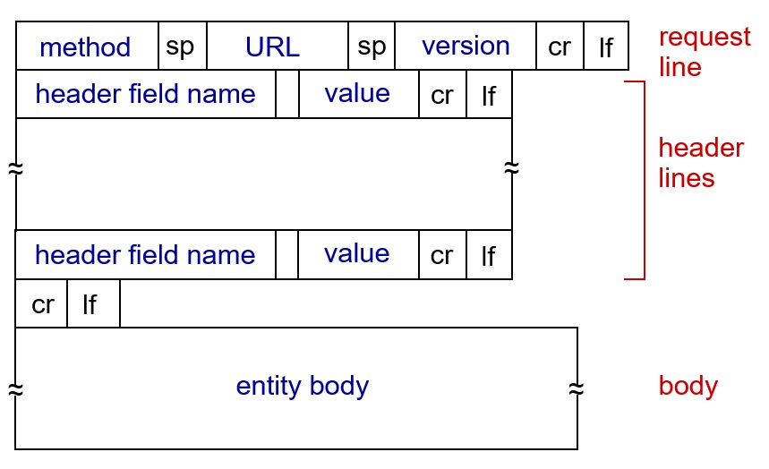
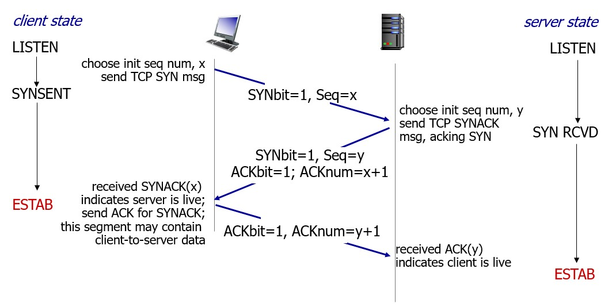
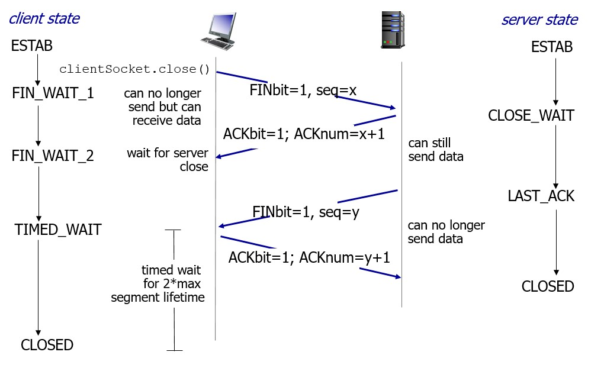
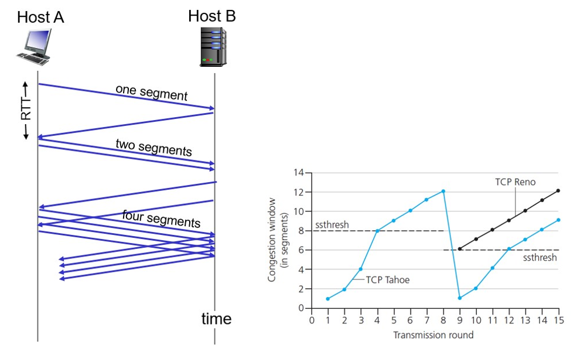
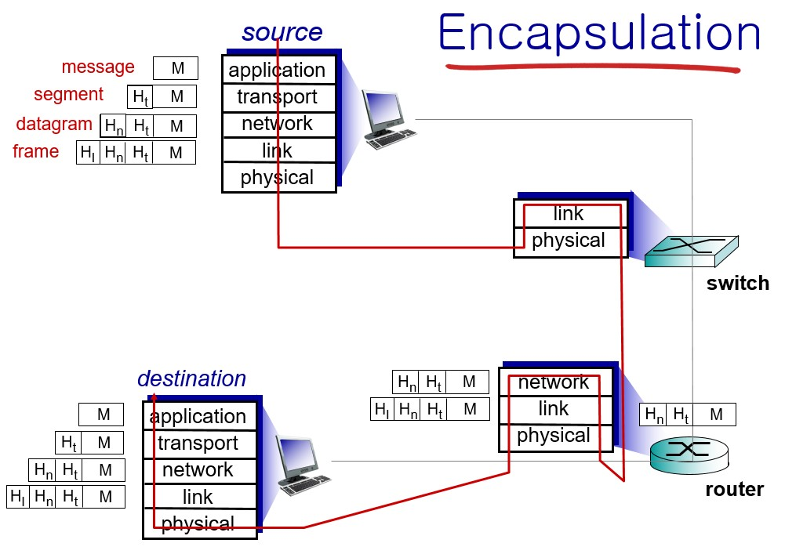
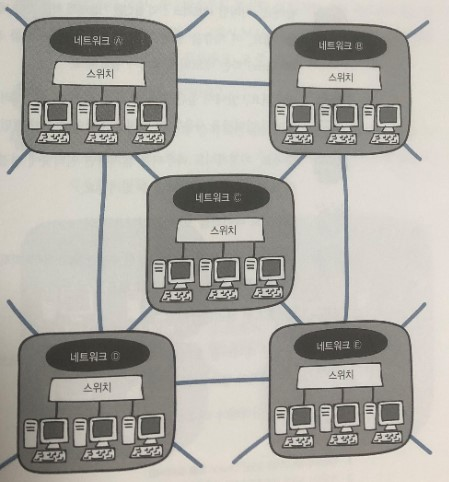

# Chapter02. TCP/IP

 TCP/IP 부분은 운영체제에서 자동으로 관리하는 부분입니다. 사실 이 부분은 흔히들 합쳐서 부르긴 하는데 사실 엄밀히 따지면 TCP와 UDP는 OSI 계층에서 트랜스포트 레이어에 해당하는 부분이고 IP는 OSI 계층에서 네트워크 레이어에 해당합니다. 

 **컴퓨터와 컴퓨터 사이에서 정보를 트랜스포트 하기 위해 연결하는 출입구를 만드는 역할**을 담당하고 있다고 생각하시면 좋을 것 같습니다. 앞서 어플리케이션 레이어에서는 소켓을 만드는 것까지였다면 여기서는 연결에 더 중점을 맞추고 있습니다.

 

## 1. 소켓을 작성한다.

 소켓은 흔히 출입구라고 비유가 되지만 실제 물리적인 실체가 있는 것은 아닙니다. 이 소켓은  통신 상대의 IP주소, 사용하고자 하는 어플리케이션 프로토콜의 포트 번호, 통신 동작의 상태 정보 등을 담고 있습니다. 출입구라고 비유하는 것은 위의 정보들을 비교하여 그 데이터를 받을지 안받을지를 정하기 때문입니다.

 이 소켓은 하나만 열리는 것이 아니고 (물론 초반에는 하나만 열렸습니다. 그래서 TCP와 IP를 같이 붙여서 부르게 된 것이라고 하는데요. 이것에 대해서는 나중에 또 설명할 기회가 있겠죠...?) 인터넷에 연결되고자 하는 모든 어플리케이션 레이어마다 각각 컴퓨터의 리소스가 허락하는 양 만큼의 소켓을 만들 수 있습니다. 이러한 것의 스케쥴링은 다시 OS에 대한 공부가 필요합니다. (세상 CS 공부가 쉽지 않네요... OS에서 나왔던 내용 ...! 이라는 생각만 나고 내용이 기억이 나지 않습니다. 어쨌든 여기선 별로 안 중요한 것이고 OS에서 또 보지 않을까요 ?)

 그래서 이 소켓을 작성한다는 것은 출입구를 만드는 것입니다. 연결하고자 하는 서버의 URL 포트 번호, IP 번호 등이 저장되어 있어서 아래의 그림처럼 데이터가 오면 맞는지 비교를 할 수 있습니다.

(이런 정보들은 보통 아래의 그림에서 header field에 담깁니다. 그리고 각 계층에서 붙는 헤더 데이터 들에 따라 이름이 다릅니다.)

 

## 2. 서버에 접속한다.

 접속은 간단히 말해 **클라이언트가 서버에 요청을 보내서 데이터의 송수신을 준비하는 과정**입니다. 위의 request 정보에 있는 header에 포트 번호와 IP 번호, 현재 상태(연결이 되어 있다던가) 등을 담아서 **저는 정상 요청을 하고 있습니다.** 하는 어필을 하는 것이죠. 

 사실 여기서 **TCP 3-way handshake**와 **4-way handshake**에 대한 내용이 나와야하는데 책에서는 나오지 않아서 간단히 아래에 설명하고 넘어가겠습니다. 그리고 UDP에서는 6번에서 설명할 것 같습니다만 UDP얘기가 계속 나오는 것이 가독성을 떨어트릴 수 있기 때문에 간단히 설명 드리면 TCP는 데이터 전송을 하기 위한 파이프 연결을 유지시키는 반면 UDP는 한번 받고 연결을 끊어버린다 정도로 생각하시면 됩니다. 해킹 쪽에서 공부하게 되는 TCP/IP 기술에서는 이 파이프 연결을 중간에 훔쳐올 수 있도록 응용하기도 합니다.

 

### 2-1. TCP 3-way handshake

 

  위에서 설명한 것처럼 TCP는 서버와 클라이언트 사이의 연결을 유지시키는 방식으로 작동한다. 이때 연결하는 방식을 3-way handshake라고 한다. 아래의 그림처럼 클라이언트가 먼저 서버에 '연결하고 싶다.' 하면 그에 해당하는 정보를 서버가 다시 클라이언트에 보내고 그 다음 클라이언트에서도 허가하면 연결이 완성되는 형식입니다.

 간단히 요약하자면 아래와 같은데 정확한 구동 원리는 위의 request 메세지에서 header field의 컨트롤 비트를 사용합니다. 궁금하시면 설명은 가능한데 118p의 내용이 바로 이 내용입니다..!

1. 서버 측에서 요청 신청

2. 서버에서 이 요청을 보낸 클라이언트에게 연결을 허락하는 메세지를 보내면서 동시에 클라이언트에 정보를 보내도 되는지 신청(정말 나한테 보낸 요청 맞아 ? 라고 물어보는 느낌)

3. 보내도 된다고 허락 

### 2-2. TCP 4-way handshake

 사실 4-way handshake는 연결을 끊을 때 사용하는 방법입니다. 구동하는 방식도 같기 때문에 이걸 따로 구분하지 않는 사람들도 많습니다.

 위 처럼 간단히 요약 하자면

1. 클라이언트에서 서버에 더 보낼 데이터 없다고 알려줍니다.(그러니까 request에 따른 모든 데이터를 전송한 겁니다.)
2. 그러면 서버에서 알겠다고 합니다.(더 데이터를 보내지 않아도 되는구나 오키오키)
3. 서버에서 클라이언트에게 나 이제 그럼 연결 끊어도 되지 ? 물어봅니다.
4. 클라이언트가 그래도 된다고 하면 그때 연결이 완벽히 끊깁니다.

이에 대한 자세한 설명은

https://hanaldo.tistory.com/50 에 자세히 정리해두셨습니다.

## 3. 데이터를 송수신한다.

 데이터 송수신에 관한 이야기는 굉장히 많습니다(througput 관리, slow start, loss data의 관리 등). 물론 이 책에서도 완전히 다 빼먹지는 않았지만 자세한 설명은 http://www.kocw.net/home/search/kemView.do?kemId=1046412의 7번 강의와 8번 강의를 추천드립니다. 즉 이 내용은 교수님도 2시간에 걸쳐서 설명하셔야 했던 것이죠. 하지만 이 책에 나온 것처럼 간단히 원리에 대해서 설명해보겠습니다.

 아래의 그림은 TCP에서 데이터 수신 중 Slow start를 설명하는 그림입니다. **데이터는 기본적으로 서버에서 하나의 패킷을 보내면 클라이언트가 그 Segment에 해당하는 ACK을 서버로 보내 잘 받았다는 신호를 보내는 방식이 기본적**입니다.  하지만 **하나의 패킷 당 ACK이 돌아올 때까지 기다리는 것은 비효율적이기 때문에 window를 통해 여러개의 파일을 동시에 보내고 여러개의 ACK 동시에 받는 방식을 사용**합니다. 

 근데 이 window는 사실 고정된 상수가 아니며 각 Edge의 Host의 상황에 따라 바뀌는 변수이기 때문에 가장 최적의 window의 크기도 계속해서 달라집니다. 때문에 이 크기를 계속해서 계산해주는 알고리즘이 작동하고 있습니다. 아래에서 오른쪽 그림처럼 window의 크기를 조절하고 있습니다.

## 4. 서버에서 연결을 끊어 소켓을 말소한다.

 이에 대한 설명은 4-way handshake에서 설명했습니다. 다만 그림 2-12에 보시면 화살표 방향이 반대로 되어있는 것처럼 되어 있어서 약간 혼란스러우실 수 있을 것 같은데요. 그림 2-12는 연결을 close하는 동작입니다. 서버에서 클라이언트로 보내는 마지막 packet에서 header의 FIN이 1로 되어 있기 때문에 마지막 패킷임을 알았고 ACK을 보냅니다. 그 다음 3번부터가 4-way handshake의 첫번째라고 생각하시면 될 것 같습니다. 그리고 책에서의 소켓 말소에서 (1)입니다.

 

## 5. IP와 이더넷의 패킷 송수신 동작

 

 이 부분이 사실 네트워크 레이어와 링크 레이어에 관한 내용입니다. 확실히 내용이 휙휙 점프하는 경향이 있어서 이해하기 어려울 것 같습니다. 심지어 일단 IP는 네트워크 레이어 이더넷은 링크 레이어입니다. 둘이 나뉘기 때문에 이 두개를 나누어서 정리할 계획입니다. 사실 링크 레이어에 관해서는 아직 제가 깊게 공부를 안해봐서 일단 제가 이해한 내용을 가능한 만큼 적어보도록 하겠습니다.

 이에 앞서 패킷에 대한 설명을 먼저 해야할 필요가 있을 것 같습니다. 이 책에서 설명하는 헤더 붙이기(MAC 헤더, IP헤더, TCP헤더)는 **캡슐화(Encapsulation)**라고 하고 위로 올라가면서 하나씩 떼지는 것은 **역캡슐화(Decapsulation)**라고 합니다. 각 계층에서 만들어지는 데이터는 message, segment, datagram, frame 으로 각각 부르는 이름이 있습니다. 

 네트워크의 기본 대원칙은 **모든 것을 저장하지 않는다는 것**입니다.(이것을 마음에 새기면 앞으로 공부할 때 조금 편합니다.) 그래서 각 헤더들은 바로 다음 경로만을 저장합니다. 그렇게 바로 다음, 바로 다음만 보고 움직입니다.

### 5-1. IP 패킷(datagram) 만들기

 IP 패킷 송수신에 대해 이해하기 위해서는 먼저 네트워크가 어떻게 생겼는지를 이해할 필요가 있습니다. 네트워크는 모두가 하나로 묶여있는 것이 아닙니다. 아래의 그림처럼 인터넷이라는 큰 범위 안에 각각의 네트워크가 또 여러 개로 나뉘고 또 나뉘어 있어서 이 네트워크가 서로 연결되어 또 하나의 더 큰 네트워크를 만드는 것입니다. 

 IP는 이러한 큰 네트워크의 주소이고 IP 패킷은 이러한 네트워크에서 경로를 찾아서 전송하기 위한 IP 헤더 데이터가 저장되어 있는 패킷입니다. 이 IP 주소를 구성하는 방법에도 다양한 내용이 있습니다만 이 책에서는 153p의 표로 간단히 설명하고 있습니다. 별 건 아니지만 IPv4, IPv6의 차이 같은 것도 문제로 내려면 낼 수 있겠네요...!

### 5-2. 이더넷 패킷(frame) 만들기

 링크 레이어에서 붙이는 헤더의 이름은 frame이라고도 하고 이더넷 헤더와 함께 트레일러를 합쳐서 frame이라고 부릅니다. 먼저 송수신자의 MAC주소가 먼저 붙습니다. MAC 주소는 이더넷에서 사용하는 주소라고 생각하시면 편할 것 같습니다. 이더넷은 옛날에 스타크래프트 많이 해보신 분은 친숙한 용어실텐데 그 이더넷이 맞습니다. 이에 대한 이해를 돕기 위해 옛 기억을 잠깐 꺼내봅시다. 친구랑 PC방에 가서 이더넷으로 스타크래프트를 하기 위해 접속했는데 어떤 컴퓨터는 이더넷에 뜨고 어떤 컴퓨터는 이더넷에 뜨지 않아서 자리를 옮겨 다닌 경험을 해보셨을런지 모르겠습니다. 

 이처럼 컴퓨터가 많이 모여있는 PC방의 경우에는 여러개의 이더넷이 있었기 때문입니다. 그 이유는 위의 그림에 스위치가 한번에 가질 수 있는 주소 데이터에 한계가 있기 때문입니다. PC방에 가본지 오래 돼서 요즘에는 어떤지 모르겠지만 ...! 어차피 요즘에 이더넷으로 게임하는 경우는 없으니 상관 없겠죠 ?

 이 MAC 주소는 이 책에서는 LAN 어댑터 라고 부르는 LAN 카드에 있는 주소로 제조할 때 새겨져서 물리 주소라고도 불립니다. 이제 이더넷 패킷에 송신하는 MAC주소와 수신하는 MAC주소까지 붙이고 나면 마지막으로 트레일러를 붙입니다. 여기서는 프리앰블, 스타트 프레임 딜리미터, 프레임 체크 시퀀스(FCS)라고 상세히 적어놓았습니다만... 사실 여기는 잘 모르겠습니다. 앞의 **프리앰블**과 **스타트프레임 딜리미터**는 **패킷을 전송하기 위한 타이밍을 맞추기 위한 것**이고 **프레임 체크 시퀀스**는 **파형이 흐트러질 경우를 체크해서 바로 잡는 역할**을 한다고 하네요. 여기까지 마치고 나면 드디어 패킷을 보낼 준비가 끝난 겁니다.

### 5-3. 허브로 내보내기

 완성된 패킷을 드디어 허브로 내보냅니다. 이 책에서는 리피터 허브와 스위칭 허브 두가지에 대해 설명하고 있지만 리피터 허브의 치명적인 단점 때문에 현재는 스위칭 허브를 지배적으로 사용하고 있습니다. 리피터 허브는 스위칭 허브에 비해 얼마나 불편한 것이였나 ! 정도만 생각하시면 좋겠네요.  심지어 일반적으로 허브 하면 리피터 허브를 뜻하고 스위칭 허브는 스위치라고 부르고 있습니다. 

 책은 너무 어렵네요... 저는 이 부분을 **PHY(MAU) 회로로 전기신호가 송수신된다**... 정도로만 이해했습니다. 책을 읽을 수 록 이 책은 네트워크 관리에 초점을 맞추고 있는 것이 아닌가 싶습니다... 사실 저희가 네트워크를 만들일은 없는데 말이죠.

 사실 이 부분에서 중요한 것은 리피터 허브와 스위칭 허브의 차이라고 생각하는데 다른 책의 내용을 덧붙여 설명하겠습니다.

#### 5-3-1. 리피터 허브(AKA 허브)

 리피터 허브는 **반이중 모드**라고 하여 한쪽이 송신할 때는 송신이 끝날때까지 기다려야 합니다. 리피터 허브는 허브와 연결된 모든 컴퓨터에 데이터를 전송합니다.  즉 대상 컴퓨터 뿐 아니라 다른 컴퓨터에도 모두 데이터를 보내는데 이때 LAN 카드에서 이 데이터를 받아야하는지 아니여야하는지를 판별해서 위로 올리는 구조 입니다. 그렇기 때문에 모든 회로에 데이터를 보내서 충돌이 이루어집니다.

 이것을 방지하기 위해 회로에 데이터가 다니고 있으면 잠깐 멈추는 방법(CSMA/CD)을 사용했습니다.

#### 5-3-2. 스위칭 허브(AKA 스위치)

 스위칭 허브는 **전이중 모드**라고 하여 양방향에서 송수신을 할 수 있습니다. 스위칭 허브에서는 리피터 허브와 다르게 스위치에서 각 컴퓨터의 MAC 주소를 저장하고 있기 때문에 목표 대상으로 정확하게 데이터를 주고 받을 수 있어 훨씬 효율적입니다.

### 5-4. 패킷을 받는다.

1. PHY(MAU) 회로에서 신호를 변환하여 MAC회로로 보낸다.
2. MAC회로에서 신호를 디지털 데이터로 변환하여 버퍼 메모리에 저장한다.
3. 신호 끝의 FCS를 검사하여 일치하지 않으면 폐기한다.
4. MAC주소를 비교해서 자신에게 오는 것인지 판단한다.
5. 맞을 경우 패킷을 받는다.

### 5-5. 리어셈블링

1. IP 헤더를 검사하여 수신처 IP가 맞는지 확인한다. 아닐 경우 송신처에 ICMP를 보낸다.

2. 분할된 패킷의 Flag 정보를 확인하여 순서에 맞게 리어셈블링한다.

   

## 6. UDP 프로토콜을 이용한 송수신 동작

 

1. 수정 송신이 필요없는 데이터는 UDP가 효율적이다.

   사실 TCP에 대해 자세한 설명이 없었기 때문에 조금 이해가 안될 수 있지만 TCP는 굉장히 복잡합니다. 단적으로 말해 UDP는 연결하고 요청한 후 받고 바로 끊습니다. ACK을 주고받는 일이 없습니다. 때문에 송신 과정에서 loss된 packet을 다시 필요가 없는 경우에는 필요가 없습니다.

2. 제어용 짧은 데이터.

   위와 같은 맥락입니다. 그냥 명령만 짧게 내보내는 경우(리모컨 같은 주로 하드웨어)에는 UDP로 통신합니다.

3. 음성 및 동영상 데이터

    음성혹은 동영상 스트리밍의 경우 정확한 데이터보다 빨리빨리 받아야하는 경우에는 UDP가 좋을 수 있습니다. 다만 요즘에는 하드웨어가 발전하고 다양한 서비스가 있어서(유튜브의 경우 실시간 라이브에서 뒤로 가기가 가능하듯이 데이터를 저장할 필요가 있어서) UDP와 TCP를 섞어서 사용하는 경우도 있다고 합니다. 더 효율적인 프로토콜을 사용합시다.

