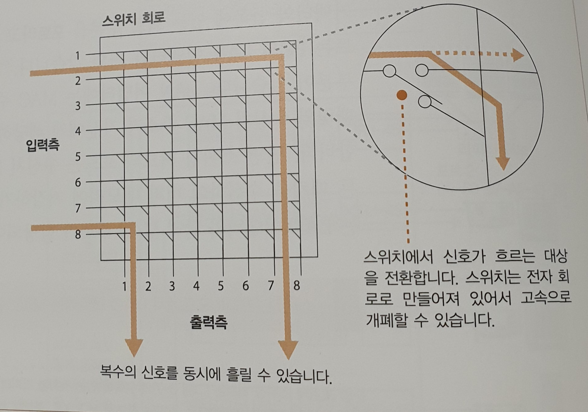
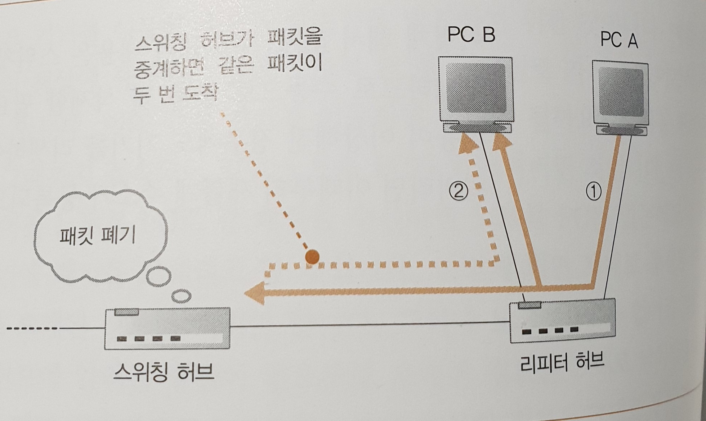

# CHAPTER3

## 워밍업 문제

1. 현재 사용하고 있는 이더넷의 케이블(트위스트 페어 케이블)은 미국에서 전화의 옥내 배선용으로 사용했던 케이블을 진화시킨 것입니다. (O)

   해설: 최초의 이더넷은 전용 동축 케이블이었느넫, 전화 배선용 기구나 부재를 사용할 수 있어서 편리하다는 이유 때문에 나중에 미국의 전화용 옥내 배선을 개량한 케이블로 변했습니다.

2. 라우터가 등장했던 시기보다 스위칭 허브가 더 늦게 등장했습니다. (O)

   해설: 라우터보다 스위칭 허브가 단순하므로 스위칭 허브쪽이 먼저 나왔을 것이라고 생각할 수 있지만, **라우터가 먼저** 나왔습니다.

3. 라우터나 스위칭 허브는 패킷을 운반하는 도중에 **오류가 발생**하면 **문제가 된 패킷을 복구하지 않고 폐기**합니다. (O)

   해설: **OS에 내장된** 네트워크 제어용 소프트웨어(프로토콜 스택)가 폐기된 패킷을 다시 송신하므로 패킷이 누락되지 않습니다.

프로토콜 스택: OS 내부에 내장된 **네트워크 제어용 소프트웨어**. 프로토콜 드라이버, TCP/IP 소프트웨어 등으로도 부른다.

## 지금까지의 과정(추후 수정)

HTTP메시지 만들기 -> 패킷을 전기 신호로 변환하여 케이블에 송출하는 곳까지 확인

## CHAPTER3 순서

1. 케이블과 리피터, 허브 속을 신호가 흘러간다.
2. 스위칭 허브의 패킷 중계 동작
3. 라우터의 패킷 중계 동작
4. 라우터의 부가 기능

## 3.1 케이블과 리피터, 허브 속을 신호가 흘러간다.

패킷(package + bucket) - 통신망을 통해 전송하기 쉽도록 자른 데이터의 전송 단위

**1) 하나하나의 패킷이 독립된 것으로 동작한다.**

**중계 동작**

패킷의 헤더에 기록된 제어정보와 중계 장치의 내부에 있는 중계 대상을 등록한 표로 목적지를 판단하고 목적지에 가까워지도록 패킷을 중계한다.

=> 중계 동작을 할 때 우편배달부가 편지의 내용을 보지 않고 배달하듯, 중계 장치도 데이터 부분을 보지 않고 패킷을 중계한다.

HTTP의 메시지, TCP의 수신 확인이나 시퀀스 번호, 클라이언트와 서버라는 관계는 모두 무시되고, **모든 패킷은 아무 관련도 없는 별개의 것으로 간주**하고 목적지를 향해 중계된다.

이 장에서는 클라이언트 PC가 송신산 패킷이 `리피터 허브 => 스위칭 허브 => 라우터` 와 같이 경유하여 인터넷에 나가는 것으로 간주한다. 실제로 리피터 허브나 스위칭 허브는 라우터에 내장된 경우가 많지만 각각의 기기들을 연결해서 사용하는 것으로 가정하고 탐험해 보자.

PHY(Physical Layer Device) - 이더넷의 파생 방식의 일종, 100메가비트/초 이상의 이더넷을 일컫는 말

MAU(Medium Attachment Unit) - PHY 이전의 저속 방식 이더넷

**2) LAN 케이블은 신호를 약화시키지 않는 것이 핵심이다.**

리피터 허브와 LAN 어댑터의 내부에는 PHY(혹은 MAU) 회로가 있고, 패킷은 LAN 어댑터의 PHY 회로에서 전기 신호로 형태를 바꾸어 RJ-45 커넥터(랜선)를 통해 **트위스트 페어 케이블**에 들어가게 된다. 이 때의 전기 신호는 플러스와 마이너스의 전압이므로,  곧 LAN 어댑터의 PHY 회로단자에서 플러스와 마이너스 신호가 나오는 것과 같다.

*노트북으로 생각해 보면 LAN어댑터가 노트북의 랜선 연결부분, RJ-45가 랜선, 랜선을 연결한 기기가 허브가 되는 듯

PHY회로의 전기 신호(LAN어댑터) => RJ-45(랜선)를 통해 전달 => 리피터 허브의 커넥터 부분에 도착(전기 신호의 전달)

이렇게 전기 신호가 전달될 때, 케이블의 길이가 길수록 신호가 약해지고, 왜곡된다. (각이 둥글어지고, 진폭이 낮아짐) 여기에 잡음까지 더해지면 약해진 신호가 더욱 변형되어 0과 1을 잘못 판독하는 원인이 되고, 통신 오류가 발생할 수 있다.

**3) '꼼'은 잡음을 방지하기 위한 방법이다.**

LAN 케이블인 **트위스트 페어 케이블**은 이러한 잡음의 영향을 억제하기 위해 두 가닥의 신호선을 나선형으로 꼬는 '꼼'을 사용한다.

- 잡음은 전자파(전자기기나 인접 신호선에서 발생)에 의해 생기는 전류가 신호에 영향을 미치는 것이다.
- 신호선을 꼬아 서로 마주보게 하면, 잡음에 의해 전류가 발생하는 방향이 두 신호선에서 반대가 되고, 서로 상쇄효과를 가진다.

- 케이블 안의 인접 신호선에서 누설되는 전자파에 의한 영향(크로스토크, cross talk)은 약하지만, 거리가 가까워 문제가 된다. 이 문제도 두 신호선을 꼼으로써 해결할 수 있다. 꼬는 간격을 미세하게 변화시키면 어떤 부분에서는 플러스 신호가, 어떤 부분에서는 마이너스 신호의 잡음이 영향을 끼쳐 서로 상쇄되게 된다. (그렇다고 알아두자.)

이외에도 신호선 사이의 간격을 유지하기 위해 구분판을 넣거나, 금속 성분의 실드라는 피복을 입히는 등의 대책이 있다.

**4) 리피터 허브는 연결되어 있는 전체 케이블에 신호를 송신한다.**

신호가 리피터 허브에 도달하면 LAN 전체에 신호가 흩어진다. 패킷의 신호를 이더넷 전체에 뿌리고, 수신처 MAC 주소에 해당하는 기기만 패킷을 수신하고, 나머지는 패킷을 폐기한다는 원리를 그대로 실현한 것이 리피터 허브다.

*무슨 말인지 잘 모르겠음

- 리피터 허브 커넥터의 안쪽에는 PHY 회로와 역할이 같은 회로가 있다.

- LAN 어댑터측과 같이 RJ-45커넥터에 직접 접속하면 신호를 제대로 수신할 수 없다.
- 제대로 수신하기 위해서는 송신 단자에서 보낸 신호를 수신 단자로 받도록 해야 하고, 이를 위해 허브 안의 PHY 회로와 커넥터 사이의 신호선을 교차시켜 접속한다.
- 이렇게 **한쪽의 송신이 상대의 수신에 연결**되어 신호를 제대로 송수신할 수 있게 된다.

MDI: Media Dependent Interface

MDI: MDI-Crossover

리피터 허브 끝의 커넥터에는 MDI/MDI-X와 같이 쓰여있는 전환 스위치가 붙어 있는데, MDI는 RJ-45 커넥터와 신호 송 수신 회로를 직접 결선한 것이고, MDI-X는 교차하여 결선하는 것을 나타낸다. 

- 허브끼리 접속할 때는 한쪽을 MDI로 설정해야 한다.
- MDI로 전환하는 스위치가 없고 모든 커넥터가 MDI-X인 경우에는 크로스 케이블로 허브들을 접속한다.

**LAN 어댑터 => RJ-45 커넥터 => 트위스트 페어 케이블 => RJ-45 커넥터 => RJ-45 => 리피터 허브의 PHY => 리피터 회로 => 리피터 허브의 커넥터에 신호를 뿌림**

- 리피터 허브에서 PHY 회로의 수신부에 도달한 신호는 리피터 회로에 들어간다. 리피터 회로는 들어오는 신호를 리피터 허브의 커넥터 부분에 뿌린다.

- 이후 신호는 모든 커넥터에서 나가면서 리피터 허브에 접속한 전체 기기에 도달
- 신호를 수신한 기기는 신호의 맨 앞에 있는 MAC 헤더에 쓰여있는 수신처 MAC 주소를 조사하여 자신이 수신처라면 수신하고, 아니라면 신호를 무시한다.

리피터 회로는 변형된 신호도 그대로 커넥터로 뿌리게 되는데, 이 경우 신호가 다음 기기(스위칭 허브, 라우터, 서버 등)에 도달하면 디지털 데이터로 변환되어 FCS(Frame Check Sequence)를 검사하는 곳에서 데이터 변화가 판명된 후 **변화된 패킷은 폐기**된다. 패킷이 폐기되면 **프로토콜 스택의 TCP 담당 부분이 패킷을 다시 보낸다.**

## 3.2 스위칭 허브의 패킷 중계 동작

**1) 스위칭 허브는 주소 테이블로 중계한다**

리피터 허브에서 뿌린 신호는 스위칭 허브를 지나게 된다. 스위칭 허브는 이더넷의 패킷을 그대로 목적지를 향해 중계하도록 만들어져 있다. 

우선 신호는 커넥터에 도달하여 PHY 회로에서 수신된다. 커넥터와 PHY 회로는 MDI-X로 접속되어 있고, 트위스트 페어 케이블에서 신호가 들어오면 이것이 PHY 회로의 수신 부분에 들어간다.

PHY 회로에서 케이블을 흐르는 신호의 형식부터 공통의 신호 형식으로 변환한 후 신호는 MAC 회로로 들어간다. LAN 어댑터에서와 비슷하게, 여기에서 디지털 데이터로 변환 후 패킷 맨 끝에 있는 FCS(Frame Check Sequence)를 대조하여 오류 유무를 검사하고, 이상이 없으면 버퍼 메모리에 저장한다.

=> 스위칭 허브의 커넥터 안쪽에는 LAN 어댑터와 거의 같은 회로가 있다.

=> 커넥터와 안쪽에 있는 회로 부분을 **포트**라고 부르므로 스위칭 허브의 각 포트는 PC의 LAN 어댑터와 거의 같다.

**LAN 어댑터와의 차이점**

- LAN 어댑터에는 MAC 주소가 할당되어 있어 수신한 패킷의 수신처 MAC 주소가 자신에게 해당하지 않는 경우 패킷을 폐기

- 스위칭 허브의 포트는 수신처 MAC 주소를 검사하지 않고 모든 패킷을 수신하여 버퍼 메모리에 저장 

  => **스위칭 허브의 포트에는 LAN 어댑터와 달리 MAC회로에 MAC 주소가 할당되어 있지 않음**

스위칭 허브에서 패킷을 버퍼 메모리에 저장하면 그 다음 수신처 MAC 주소와 일치하는 것이 MAC 주소표에 등록되어 있는지 조사한다. MAC 주소표에는 **기기의 MAC 주소와 그 기기가 어느 포트에 존재하는지에 대한 정보**가 있다. 주소표는 다음과 같이 구성된다.

| MAC주소           | 포트 | 제어 정보 |
| ----------------- | ---- | --------- |
| 00-60-97-A5-43-3C | 2    | ...       |
| 00-00-C0-16-AE-FD | 7    | ...       |
| 00-02-B3-1C-9C-F9 | 8    | ...       |
| ...               | ...  | ...       |

패킷의 MAC주소에 해당하는 기기가 연결되어 있는 포트가 송신측 포트가 된다. (해당 포트로 패킷을 보내게 되는 듯)

**스위치 회로의 구조**

스위치 회로는 입력 포트와 출력 포트를 연결하는 회로로, 포트 사이에 패킷을 운반할 때 이 회로에 패킷의 신호를 흘리게 된다. 수신측과 송신측 포트 사이의 전자 회로는 스위치를 개폐함에 따라 방향이 바뀐다고 할 수 있고, 이를 통해 i번 포트에서 j번 포트로 신호를 흘릴 수가 있다. 신호가 중복되지 않으면 복수의 신호를 동시에 흘릴 수도 있다.

예를 들어 2번에서 7번 포트로 가는 경우에는, 2번 입력 포트에서 출발한 신호가 가로로 되어 있는 스위치 6개를 지나 방향을 바꾸는 스위치를 만나게 되고, 방향이 바뀌어 7번 포트로 향하게 된다.

이렇게 스위치 회로를 경유하여 송신측의 포트에 패킷을 운반하면 MAC 회로나 PHY 회로가 송신 동작을 실행하고 케이블에 신호가 흘러간다. 이때 송신 동작도 **LAN 어댑터의 송신 동작**과 같다. *LAN 어댑터의 송수신 동작이 매우 중요한듯?

**MAC 회로나 PHY 회로의 송신 동작**

- 이더넷의 규칙에 따라 먼저 아무도 송신중이지 않다는 것을 확인한다. (누군가 송신중이면 끝날 때까지 기다림)
- 아무도 송신하지 않으면 소켓을 디지털 데이터에서 신호로 변환하여 송신
- 송신 동작을 하고 있는 사이에 수신 신호를 감시
  - 송신 동작중 다른 기기가 보낸 신호가 수신측에 들어오면 패킷이 충돌하므로 **재밍 신호**를 보낸 후 송신 동작을 중지, 잠시 기다렸다가 다시 보냄. (LAN 어댑터와 동일) => 반이중 모드의 동작(스위칭 허브에 리피터 허브가 접속된 경우)
  - 현재는 리피터 허브르 사용하지 않고 PC나 라우터를 직접 스위칭 허브에 연결하는 전이중 모드로 송수신을 실행한다. (추후 설명)

**=> 스위칭 허브는 MAC 주소표에서 MAC 주소를 조사하고 해당하는 포트에서 신호를 송신**

**2) MAC 주소 테이블을 등록 및 갱신한다.**

스위칭 허브는 패킷을 중계할 때 MAC 주소표의 내용을 갱신하는 동작도 실행한다. 갱신 동작은 두 종류이다.

-  패킷을 수신했을 때 송신처 MAC 주소를 조사하고, 이것을 수신한 입력 포트 번호와 하나의 세트로 MAC 주소표에 등록하는 동작
  - 송신처 주소를 등록해 두면 MAC 주소로 갈 패킷을 수신했을 때 이것이 존재하는 포트에 중계할 수 있다. (무슨 말이지?)
  - 스위칭 허브는 패킷을 수신할 때마다 이러한 등록 동작을 실행한 후 한 번이라도 패킷을 송신하면 해당 기기의 MAC 주소가 MAC 주소표에 등록된다.
- MAC 주소표에 등록되어 있는 내용을 지우는 동작
  - 사용하지 않고 일정 시간이 경과하면  MAC 주소표에 등록한 정보를 삭제한다. (몇 분 정도 지나면 삭제)
  - PC가 이동한 경우 스위칭 허브에 이 사실을 알리는 방법이 없기 때문에 PC가 없는데도 불구하고 스위칭 허브가 패킷을 보내려고 할 수 있다. 이를 해결하기 위해 MAC 주소표에 등록한 정보를 삭제하는 것이다.

=> MAC 주소표의 내용은 스위칭 허브 자체가 스스로 등록하거나 삭제하므로 수동으로 등록 및 삭제할 필요가 없다. MAC 주소표의 내용이 이상해진 경우에도 (PC가 이동했는데 신호를 보내오는 경우 등) 기기를 리셋하여 MAC 주소표의 내용을 전부 지워버리면 된다.

**3) 예외적인 동작**

- 리피터 허브에 PC A와 PC B가 연결되어 있고, 스위칭 허브 역시 연결되어 있다고 하자. PC A에서 PC B로 패킷을 보내려고 할 때, 리피터 허브가 처음 패킷을 받아 모든 포트로 뿌린다. (리피터 허브는 구분 없이 모든 경로로 신호를 보냄) 그러면 PC B와 스위칭 허브에 패킷이 전달되고, 스위칭 허브는 패킷의 목적지가 B 이므로 리피터 허브에 패킷을 반송해야 할 것이다.

  그러나 패킷을 반송하게 되면 PC B에는 두 개의 같은 패킷이 도착하게 되므로(리피터 허브가 다시 모든 경로에 뿌릴 것) 통신이 제대로 이루어지지 않게 된다. 따라서, **스위칭 허브는 수신한 포트와 송신할 포트가 같을 경우 패킷을 중계하지 않고 폐기**한다.

- MAC 주소표에 수신처 MAC 주소와 일치하는 주소가 등록되어 있지 않은 경우(주소가 삭제되었거나 해서) **스위칭 허브에서 패킷을 수신한 포트 이외의 전체 포트에 패킷을 송신**한다. 이렇게 하면 어딘가에 존재하는 MAC 주소를 찾아 패킷이 도착하게 되고, 기기가 존재하지 않는 포트나 MAC주소에 해당하지 않는 포트는 이러한 패킷을 무시하게 되어 문제가 없다.

**4) 전이중 모드에서 송신과 수신을 동시에 실행한다.**

전이중 모드: 송신과 수신을 동시에 실행할 수 있는 성질, 스위칭 허브의 특징(리피터 허브에서는 불가) ex) 전화

####번역이 이상한 부분####

여러 대의 컴퓨터가 동시에 송신 동작을 개시하면 리피터 허브 내부에서 신호가 뒤섞여서 신호가 파괴된다. (충돌)

이는 이더넷의 중요한 성질인데, 리피터 허브를 사용하면 이러한 사태가 일어나지 않는다?? => 스위칭 허브 아닐까?

트위스트 페어 케이블의 신호선은 송신용과 수신용으로 나뉘어져 있고, 케이블이 연결되어 있는 스위칭 허브의 포트 부분이나 LAN 어댑터에 있는 PHY 회로와 MAC 회로의 내부 모두 송신과 수신이 나뉘어져 있기 때문에 **송수신 신호가 따로 흐른다**. 스위칭 허브를 사용하면 신호는 충돌하지 않는 것.

이렇게 충돌이 일어나지 않으면 송신과 수신을 동시에 실행해도 상관없지만, 이더넷에 신호가 흐를 때는 이더넷의 규칙에 의해 이 신호가 끝나기를 기다렸다가 송신 동작을 실행하므로 송신과 수신을 동시에 실행할 수 없다. 그래서 이더넷의 규칙을 개정하여 신호가 흐르고 있어도 상관하지 않고 송신해도 좋다는 동작 모드를 새로 추가하였고, 이 동작 모드로 동작할 때는 신호의 충돌을 검출하는 회로를 무효화하기로 하였다. 이것이 '전이중'이라는 동작 모드이다. 

=> 스위칭 허브의 전이중 모드는 송신과 수신을 동시에 실행한다.

**5) 최적의 전송 속도로 보내는 자동 조정**

자동 조정(auto negotiation): 접속한 상대가 전이중 모드를 지원하는지 검출하고 동작 모드를 자동으로 전환하는 기능 + 상대의 전송 속도를 검출하여 전송 속도도 자동으로 전환하는 기능

이더넷은 데이터가 흐르고 있지 않을 때 **링크 펄스**라는 펄스형 신호를 흘린다. 이를 통해 데이터가 흐르지 않을 때에도 상대가 올바르게 작동하는지, 케이블이 단선되지 않았는지 등의 사항을 확인 할 수 있다.

트위스트 페어 케이블을 사용하는 이더넷이 처음 만들어졌을 때에는 펄스 신호를 일정 간격으로 보낸다는 규정밖에 없었으나, 특정 패턴으로 펄스 신호를 송신하여 자신의 상황을 상대에게 전하는 방법이 고안되었다. => 자동 조정 기능이 사용하는 방법

이러한 특정 패턴을 통해 지원 가능한 모드(반이중, 전이중)와 전송 속도를 서로 통지하고, 그 중에서 최적의 조합을 선택하여 각각 자기 자신을 설정한다. 구체적으로 예를 들어보자.

**표: 자동 조정의 예, 어댑터와 스위칭 허브에서 100메가비트/초의 전이중 모드가 선택됨**

| 전송 속도, 동작 모드    | LAN 어댑터 | 스위칭 허브 |
| ----------------------- | ---------- | ----------- |
| 1기가비트/초의 전이중   | O          | X           |
| 1기가비트/초의 반이중   | O          | X           |
| 100메가비트/초의 전이중 | O          | O           |
| 100메가비트/초의 반이중 | O          | O           |
| 10메가비트/초의 전이중  | O          | O           |
| 10메가비트/초의 반이중  | O          | O           |

위 표는 우선 순위에 따라 적혀있는 것으로, LAN 어댑터와 스위칭 허브가 서로에게 펄스 신호로 지원하는 동작 모드와 속도를 보내면 우선순위에 따라 위에서 아래로 내려오며 확인을 하고, 둘 다 해당하는 조합을 찾아 양쪽 모두 해당 속도로 동작하기 시작한다.

**6) 스위칭 허브는 복수의 중계 동작을 동시에 실행한다**

스위칭 허브는 수신처 MAC 주소의 기기가 존재하는 포트 이외에는 송신 동작을 실행하지 않으므로 다른 포트는 빈 상태가 된다. 빈 상태의 포트에는 별도의 패킷을 흘릴 수 있기 때문에 동시에 여러 개의 패킷을 중계할 수 있다.

리피터 허브는 들어온 신호를 모든 포트에서 뿌리므로 동시에 두 개 이상의 신호가 들어오면 패킷이 충돌하여 복수의 신호를 동시에 흘릴 수 없다.

**중계할 수 있는 패킷의 수**

스위칭 허브 > 리피터 허브

지금까지 알아본 것: 리피터 허브 => 스위칭 허브로 신호 전달 => 스위칭 허브에서 MAC 주소에 알맞은 포트로 신호 송신 => 이제 라우터가 등장!

## 3.3 라우터의 패킷 중계 동작

**1) 라우터의 기본**

리피터 허브나 스위칭 허브를 경유한 패킷은 라우터에 도착하고, 라우터에서 다음 라우터로 중계된다.  중계 대상을 등록한 표를 보고 패킷을 어디로 중계해야 할지 판단하는 부분이 공통이기 때문에 기본적인 원리는 스위칭 허브와 비슷하다. 그러나 구체적인 동작에서 차이가 있다.

라우터의 바탕이 되는 IP는 허브의 바탕이 되는 이더넷과 다르기 때문이다. IP와 이더넷의 차이점에 대해 알아보기 전에 라우터의 개요부터 알아보자.

**라우터의 내부 구조**

라우터는 중계 부분과 포트 부분의 두 부분으로 구성된다. 

- 중계 부분: 패킷의 중계 대상을 판단하는 동작을 담당

- 포트 부분: 패킷을 송수신하는 동작을 담당한다. 

이러한 역할 분담은 프로토콜 스택의 IP 담당 부분과 LAN 어댑터의 역할 분담과 같다. (아직 모름) 그러므로 라우터의 중계 부분은 IP 담당 부분과 같고, 포트 부분은 LAN 어댑터와 같다고 생각할 수 있다.

컴퓨터는 LAN 어댑터를 교환해서 이더넷뿐만 아니라 무선 LAN도 지원할 수 있는데, 라우터 역시 포트 부분에 무선 LAN 용 하드웨어를 장착한 기종이라면 무선 LAN도 지원할 수 있다. 또한 ADSL이나 FTTH 등의 '광대역 회선'과 같은 통신 기술을 지원하는 포트도 있다.

=> 라우터는 포트 부분에 하드웨어를 장착함으로써 다양한 통신 기술을 지원

**대략적인 동작**

1. 포트 부분에서 패킷 수신(포트 부분의 통신 기술의 규칙을 따름)

   - 라우터의 각 포트에는 MAC 주소와 IP 주소가 할당되어 있습니다.

   - 포트가 이더넷인 경우 라우터의 포트에는 MAC 주소가 할당되어 이더넷의 송신처나 수신처가 됨
   - 스위칭 허브와 다른 점은, 라우터는 자신이 송신처나 수신처의 두 가지 역할을 모두 한 다는 점!

2. 패킷의 IP 패킷에 기록되어 있는 수신처 IP 주소와 중계 대상을 등록한 표를 대조하여 중계 대상 판단
3. 중계 대상측의 포트로 패킷을 옮기고 포트 부분의 하드웨어 규칙에 따라 패킷 송신 동작을 실행

**2) 경로표에 등록된 정보**

수신처(destination)

> IP주소가 들어 있다. 이 때 네트워크 번호 부분의 비트에만 값이 있고, 호스트 번호 부분의 비트 값은 모두 0으로 되어 있다고 할 수 있다. 라우터는 이 항목에 등록되어 있는 IP주소와 수신한 패킷의 수신처 IP주소를 비교하여 일치하는지 판단한다. 이 때 전체를 확인하는게 아니라 **네트워크 번호 부분만 조사**한다.

넷마스크(Netmast)

>주소 비교 동작을 실행할 때 네트워크 번호의 비트 수를 판단해야 하므로 마련된 항목. IP주소의 네트워크 번호와 호스트 번호를 구분할 수 있도록 표시해 놓은 것.
>
>ex)
>
>IP주소:     00001010.00000001.00000010.00000011
>
>넷마스크: 11111111.11111111.11111111.00000000
>
>​				<-------------------------------------------  -------------->
>
>​				네트워크 번호									호스트 번호
>
>**넷마스크는 수신처와 패킷의 수신처 주소를 대조할 때 대조할 비트 수를 나타낸다**

게이트웨이(Gateway)

>패킷의 중계 대상. 수신처/넷마스크 항목에서 해당 행을 찾아내면 인터페이스 항목의 인터페이스(포트)에서 게이트웨이 항목에 등록되어 있는 IP 주소를 가진 라우터에 대해 패킷을 중계한다.

인터페이스(Interface)

>포트와 같은 의미

메트릭(Metric)

>수신처 IP 주소에 기록되어 있는 목적지가 가까운지, 먼지를 나타낸다. 메트릭이 크면 먼 것이다. 

**스위칭 허브는 패킷을 중계할 때 MAC 주소 테이블에 정보를 등록하거나 갱신하지만, 라우터는 패킷을 중계할 때 경로표의 내용에 손대지 않는다.**

라우터가 경로표에 경로 정보를 등록하는 방법은 크게 두 가지로, 

(a) 사람이 수동으로 경로 정보를 등록/갱신

(b) 라우팅 프로토콜이라는 구조를 사용하여 라우터들끼리 경로 정보를 교환하고 라우터가 자체에서 경로표에 등록 (**RIP, OSPF, BGP** 등의 라우팅 프로토콜이 있음)

**3) 라우터의 패킷 수신 동작**

- 신호가 커넥터 부분에 도착
- 커넥터 안쪽에 있는 PHY(MAU) 회로와 MAC 회로에서 신호를 디지털 데이터로 변환
- 패킷 끝부분의 FCS(Frame Check Sequence)를 대조하여 오류의 유무 점검
  - 정상이면 MAC 헤더의 수신처 MAC주소가 자신에게 해당하는지 조사
    - 해당하면 패킷을 **수신 버퍼 메모리에 저장**
    - 해당하지 않으면 패킷을 폐기

**라우터의 포트에는 MAC 주소와 IP주소가 할당되어 있으며, 라우터는 자신의 MAC 주소에 해당하는 패킷만 수신하고 해당하지 않는 패킷을 폐기한다.**

**4) 경로표를 검색하여 출력 포트를 발견한다**

라우터의 패킷 수신 동작이 끝나면 맨 앞의 MAC 헤더를 폐기한다. 

- MAC 헤더의 역할: 라우터에 패킷을 건네주는 것에서 끝남

MAC 헤더의 뒤에 있는 IP 헤더의 내용을 보고 패킷 중계 동작에 들어간다.

- 경로표에서 중계 대상 조사
- 네트워크 번호가 일치하는 행들 중(네트워크와 호스트 번호는 넷마스크로 구분했었음)에서 네트워크 번호의 비트 수가 가장 긴 것(=호스트 번호가 가장 짧은 것)을 찾는다. => 서브넷이 작은 쪽을 찾아감
- 네트워크 번호의 비트 수가 가장 긴 것이 여러 행 존재하는 경우, 메트릭 값이 작은 쪽이 가까이 있으므로, 메트릭 값이 작은 쪽을 중계 대상으로 선택한다.

- 해당하는 행이 하나도 발견되지 않는 경우에는 라우터가 패킷을 폐기하고, ICMP(Internet Control Message Protocol) 메시지로 송신처에 이 사실을 통지한다. 스위칭 허브에서는 중계 대상이 발견되지 않으면 모든 포트에 패킷을 뿌리는 거친 방법으로 중계 대상을 찾아나가지만, 이는 스위칭 허브가 상정하는 규모가 수천 대 정도에 불과하기 때문에 가능한 것이고, 라우터의 경우에는 전 세계에 퍼져 있는 인터넷이 대상이므로 전체에 패킷을 뿌리면 네트워크가 혼잡해지는 문제가 발생한다. 따라서 **라우터는 중계 대상이 분명하지 않은 패킷을 폐기**한다. (기본 게이트웨이도 없는 경우를 말하는 것 같음)

**5) 해당하는 경로가 없는 경우에 선택하는 기본 경로**

넷마스크 항목을 0.0.0.0 으로 설정한 경우 비교 동작을 하지 않으므로 해당 행은 일치하는 행이 된다. 이 행의 **게이트웨이 항목에 인터넷으로 나가는 라우터를 등록**해 두면 다른 행에 해당하는 것이 없는 경우(네트워크 번호가 긴 것을 우선 확인하기 때문에 0.0.0.0의 경우는 가장 마지막으로 우선순위가 밀림)에는 패킷을 게이트웨이의 주소로 중계한다.

=> 중계 대상이 분명하지 않은 경우가 발생하지 않는다.

**라우터의 경로표에서 넷마스크 항목이 0.0.0.0인 행은 '기본 경로'를 나타낸다.**

**6) 패킷은 유효 기한이 있다**

IP 헤더의 필드에는 TTL(Time To Live, 생존 기간)이라는 필드가 있는데, 이 값은 초기에 64 혹은 128로 설정하고, 라우터를 경유할 때마다 1씩 값을 줄여나가게 된다. 이렇게 하면 경로표에 등록된 정보에 오류가 있거나 기기의 고장 등으로 경로가 혼란에 빠지더라도 패킷이 같은 장소를 뱅글뱅글 순환하지 않게 된다.

=> 현재 지구 반대편까지 액세스 해도 경유하는 라우터 수가 많아야 수십 개 정도로, 128 이하의 TTL로도 충분하다.

**7) 큰 패킷은 조각 나누기 기능으로 분할한다.**

라우터의 포트 부분은 이더넷, LAN이나 통신 회선 등 다양한 경우가 있고, 이 회선이나 LAN의 종류에 따라 패킷의 최대 길이가 달라져 **출력 포트측의 패킷 최대 길이가 입력측보다 작은 경우**도 있다. 이 상태 그대로는 패킷을 송신할 수 없다.

이 경우 IP 프로토콜에 규정된 **조각 나누기(fragmentation)**라는 방법을 사용하여 패킷을 분할하고, 패킷의 길이를 짧게 만든 후 중계한다.

*주의: 조각 나누기는 패킷이 만들어진 후에 패킷을 분할하는 것을 말한다.

**조각 나누기의 순서**

MTU: 한 개의 패킷으로 운반할 수 있는 데이터의 최대 길이(120p)

- 출력측 MTU를 조사하여 중계하는 패킷을 그대로 출력측에서 송신할 수 있는지 확인
  - 출력측의 MTU가 작은 경우에는 IP 헤더의 플래그 필드를 조사하여 분할해도 좋은지 확인하고, 가능하다면 출력 측에 저장 가능한 크기로 패킷을 분할한다.
  - 플래그 필드가 분할 불가로 되어 있으면 패킷을 폐기하고 ICMP 메시지로 송신처에 통지한다.
- 출력측의 MTU에 맞춰 TCP 헤더 이후의 데이터 부분을 맨 앞부분부터 차례대로 잘라낸다.
- 데이터 분할을 마침녀 여기에 IP 헤더를 덧붙인다.

**8) 라우터의 송신 동작은 컴퓨터와 같다**

패킷 송신 동작은 출력측의 포트가 어떤 것이냐에 따라 다르다. 이더넷이라면 이더넷의 규칙을, ADSL이라면 ADSL의 규칙을 따르게 된다. 여기서는 회사 등의 LAN에 사용하는 라우터를 가정하여 **출력측의 포트가 이더넷인 경우의 송신 동작을 설명**한다.

- MAC 헤더의 맨 앞에 있는 수신처 MAC 주소 필드에 값을 설정하기 위해 경로표의 '게이트웨이' 항목에서 패킷을 건네줄 상대를 판단한다.
  - 게이트웨이 항목에 IP 주소가 쓰여있으면 이 IP 주소가 건네줄 대상이고, 이 곳이 비어있으면 IP 헤더의 수신처 IP 주소가 건네줄 대상이 된다.
  - IP 주소가 결정되면 ARP(160p)로 IP 주소에서 MAC 주소를 조사하고, 결과를 수신처 MAC 주소로 설정한다. (그 전에 라우터의 ARP 캐시를 확인)
- 송신처 MAC 주소 필드를 출력측 포트에 할당된 MAC 주소로 설정한다. 그리고 타입 필드에 0800(16진수)을 설정한다.

==> 송신 패킷이 만들어짐

- 송신 패킷을 전기 신호로 변환하여 포트에서 송신, 컴퓨터와 같은 동작임.
  - 이더넷의 반이중 모드라면 케이블에 신호가 흐르지 않는 것을 확인한 후 신호를 송출
  - 전이중 모드라면 케이블의 신호를 확인하지 않고 그대로 신호를 송신하기만 함
- 출력측 포트가 이더넷이면 송신한 패킷은 스위칭 허브를 경유하여 다음 라우터에 도달한다. 수신처 MAC 주소에 다음 라우터의 주소가 쓰여 있으므로 스윛이 허브가 이것을 보고 다음 라우터까지 패킷을 운반해 오기 때문이다. 그러면 그 라우터가 다시 그 다음의 라우터에 패킷을 중계하고,... 이렇게 해서 패킷은 최종 목적지에 도달한다.

**9) 라우터와 스위칭 허브의 관계**

라우터는 IP의 개념에 기초하여 만들어졌고, 스위칭 허브는 이더넷에 기초하여 만들어졌다. 따라서 IP와 이더넷의 관계가 라우터와 스위칭 허브의 관계와 같다.

- 라우터는 패킷을 운반하는 일을 스위칭 허브에 의뢰한다.
- IP가 이더넷에 의뢰하는 것은 최종 목적지까지 패킷을 운반하는 것이 아니라 **다음 라우터에 패킷을 운반**하는 것이다. MAC 헤더를 만들 때 IP 경로표에서 다음 라우터의 IP 주소를 조사하고, 여기에서 ARP로 조사한 MAC 주소를 수신처 MAC 주소에 기록했는데, 이것이 다음 라우터까지 패킷을 운반하도록 이더넷에 의뢰하는 것을 나타낸다.
- 다음 라우터에 패킷이 도착하면 또 다시 다음 라우터에 패킷을 운반하도록 고쳐서 이더넷에 의뢰한다.

 ==> 반복하여 상대에게 도달

**통신 상대까지 패킷을 전달하는 전체의 동작은 IP(라우터)가 담당하고, 이 동작을 할 때 다음 라우터까지 패킷을 운반하는 부분은 이더넷(스위칭 허브)이 담당한다.**

이더넷은 LAN이나 통신 회선과 치환하여 생각해도 된다. 다음 라우터까지 어떤 것으로 연결되어 있느냐에 따라 패킷을 운반하는 일을 하는 녀석이 스위칭 허브(이더넷)가 될 수도, LAN이 될 수도, 통신 회선이 될 수도 있다.

## 3.4 라우터의 부가 기능

### 주소 변환

네트워크가 독립되어 있다면 각 네트워크에서 같은 주소를 해도 서로 영향을 끼치지 않는다. 그러나 인터넷의 경우에는 같은 주소를 사용해선 안된다. 따라서 회사와 같이 독자적인 네트워크를 사용하는 경우에는 사내용 주소를 따로 두게 되는데, 이를 프라이비트 주소(private address)라고 한다.

- 프라이비트 주소(private address)
  - 프라이비트 주소의 규칙을 만드는 시점에서 어디에도 할당하지 않았던 미사용의 글로벌 주소 중에서 선택한 주소
  - 10.0.0.0 ~ 10.255.255.255
  - 172.16.0.0 ~ 172.31.255.255
  - 192.168.0.0 ~ 192.168.255.255
  - 글로벌 주소에 포함되어 있던 주소 중에서 범위를 정하고, 사내에서 사용한다고 약속한 것에 불과하다. 다른 회사와 중복해도 좋으므로 따로 신청할 필요 없고 누구나 자유롭게 사용 가능하다.

- 글로벌 주소(global address)
  - 각 기기를 식별하는 고유한 주소, 인터넷 초창기에는 글로벌 주소를 취득하여 사내의 모든 기기에 이를 설정해야 했고, 근시일 내에 이 주소가 고갈될 것이라고 예상했다. 이에 의해 등장한 것이 프라이비트 주소!

사내 네트워크를 인터넷에 공개하였을 때, 이러한 프라이비트 주소가 다른 회사와 겹칠 수 있다. 이를 해결하기 위한 방법이 바로 **주소 변환**이다. 공개용 서버쪽에는 글로벌 주소가 할당되어 있고, 인터넷과 직접 통신을 하는데, 사내 네트워크는 **인터넷과 직접 패킷을 주고받지 않도록 만든다.**

**주소와 포트 번호를 바꿔 써서 사내와 인터넷을 서로 연결!**

=> 자세한 것은 그냥 책을 보자.

### 패킷 필터링 

- 패킷을 중계할 때 MAC 헤더, IP 헤더, TCP 헤더에 기록되어 있는 내용을 조사하여 그것이 사전에 설정한 조건에 합치되면 패킷을 중계하거나 폐기하는 동작을 실행