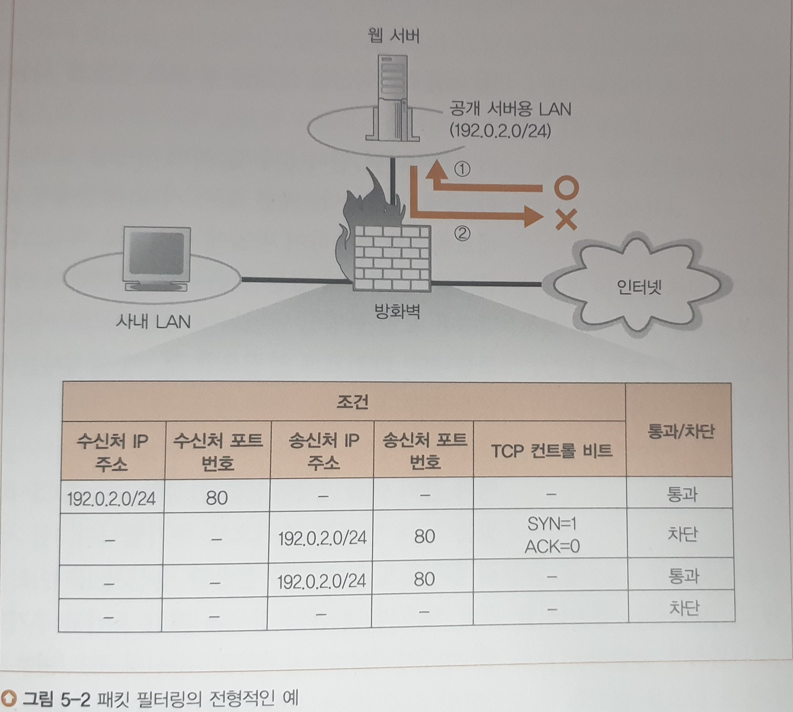
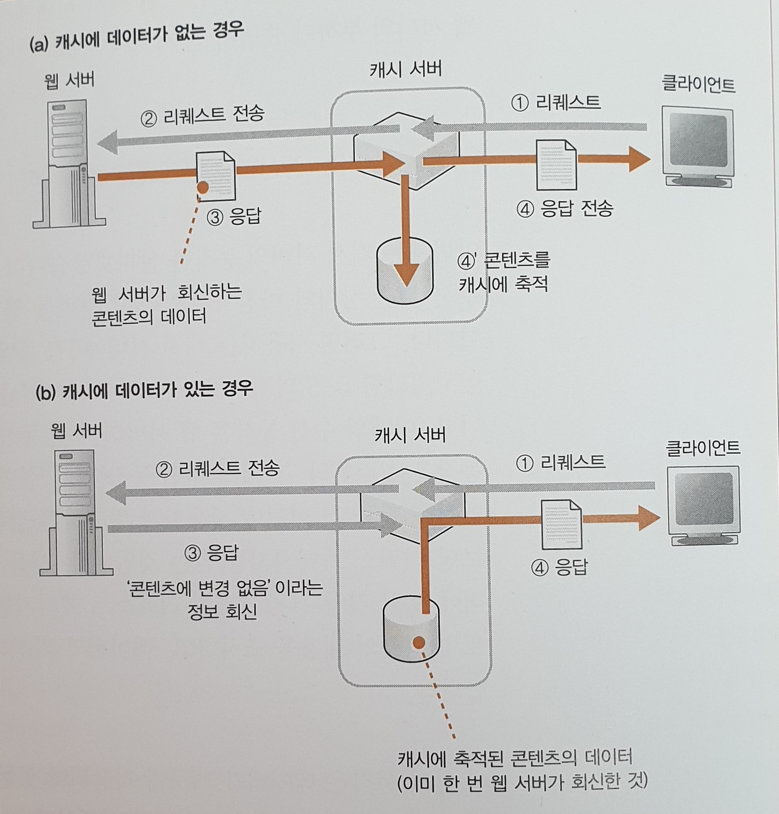
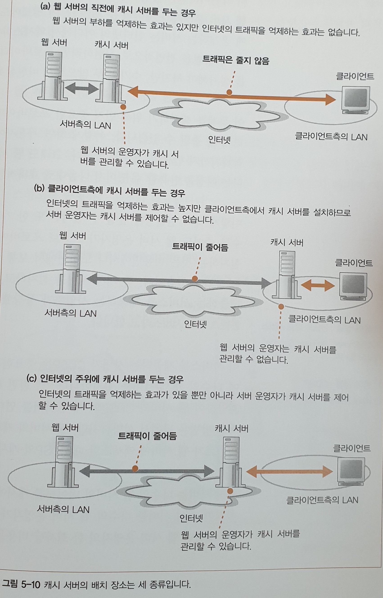

# Chapter5

[TOC]

- 서버에 들어가기 직전의 과정을 다룬다.
  - 방화벽, 캐시 서버, 부하 분산 장치

##### 1. 웹 서버의 설치 장소

- 서버는 어디에 있는가?

##### 2. 방화벽의 원리와 동작

- 웹 서버 앞의 방화벽은 어떤 개념과 구조로 웹 서버를 지키는 것일까?

##### 3. 복수 서버에 리퀘스트를 분배한

- 웹 서버에 대한 엑세스 증가시 대처 방안 - 웹 서버의 개수 늘리기

##### 4. 캐시 서버를 이용한 서버의 부하 분산

- 캐시 서버를 서버측에 두거나 

##### 5. 콘텐츠 배포 서비스

- 캐시 서버의 발전 버전
- 인터넷 전체에 다수의 캐시 서버 배치, 사용자로부터 가장 가까운 캐시 서버에 액세스

## 1. 웹 서버의 설치 장소

### 1-1. 사내 LAN에 서버 설치

사내 LAN에 서버를 설치하고 인터넷에서 직접 액세스 ⇒ 문제 발생

- IP 주소의 부족 문제
  - 사내 LAN에 설치한 기기에는 서버뿐만 아니라 클라이언트에도 글로벌 주소를 할당해야 함
- 보안상 문제
  - 인터넷에서 도착한 패킷을 차단하는 장치가 없었음
  - 보안상 문제는 **방화벽을 설치**하여 보완(지금의 구조)
    - 방화벽이 관문의 역할을 하여 필요한 패킷만 통과시킴
    - 현재는 방화벽을 우회하는 방법이 출현하여 방화벽 + 바이러스 검사 + 부정 침입 검사 + 검역 네트워크 등의 구조를 함께 사용

### 1-2. 데이터센터에 서버 설치

프로바이더가 운영하는 데이터센터라는 시설에 서버를 가지고 들어가서 설치하거나, 프로바이더 소유의 서버를 빌려쓰는 형태도 있다. 

- 데이터센터는 인터넷의 중심 부분에 고속 회선으로 접속되어있어 여기에 서버를 설치하면 액세스 속도가 빠르다. (액세스가 증가했을 때 효과적)
- 서버를 전문적으로 관리하기 때문에 회사 안보다는 안전하다. (내진 구조, 자가 발전 장치, 24시간 입퇴실 등)

## 2. 방화벽의 원리와 동작

### 2-1. 패킷 필터링형 방화벽(주류)

방화벽에서 통과시킬 패킷과 차단할 패킷을 선별하는 방법은 다양하다. 여기서는 __패킷  필터링형__에 초점을 맞춘다.

### 2-2. 패킷 필터링의 조건 설정 개념

패킷의 **헤더**에는 **제어 정보**가 들어있어 패킷 필터링의 조건 설정에 사용할 수 있다. 

**헤더의 구성**

- MAC 헤더
  - 송신처 MAC 주소

- IP 헤더
  - 송신처 IP 주소: 패킷을 최초로 송신한 기기의 IP 주소
  - 수신처 IP 주소: 패킷을 건네둘 대상의 IP 주소
  - 프로토콜 번호

- TCP 헤더 또는 UDP 헤더
  - 송신처 포트 번호
  - 수신처 포트 번호
  - TCP 컨트롤 비트
  - 프래그먼트
- 헤더가 아니라 ICMP 메시지의 내용
  - ICMP 메시지는 패킷 배송 도중 이상이 발생했음을 알리거나 통신 상대의 동작을 확인할 때 사용

위 그림과 같이 공개 서버용 LAN과 사내 LAN이 분리되어 있고, 웹 서버는 공개 서버용 LAN에 접속되어 있다고 할 때, 보안상의 이유로 웹 서버에서는 인터넷측에 액세스(패킷을 보내는게 아니라 접근하는 것)하는 것을 금지하고 있다.

패킷은 수신처 IP 주소와 송신처 IP 주소를 가지고, 이 두 주소에 따라 시점과 종점을 판단할 수 있다. 인터넷에서 웹 서버로 패킷이 흐를 때,  흘러들어오는 패킷은 시점은 지정할 수 없지만 **종점은 웹 서버**가 되므로 이것을 **필터링의 조건**으로 설정하고 **조건에 해당하는 패킷만 통과**시킨다.

- 인터넷에서 웹 서버로 들어오는 패킷의 종점이 웹 서버의 IP 주소와 일치하면 패킷을 통과시킨다.
- 송신처 IP 주소에 따라 시점을 지정할 수 있으면 이것도 조건에 추가한다. (시점을 지정할 수 없으면 조건으로 사용하지 않아도 됨)

이렇게 인터넷에서 웹 서버로 흘러가는 패킷은 방화벽을 통과하지만, 이것만으로 액세스 동작이 작동하지는 않는다. 수신 확인 응답의 추가 구조가 필요하다.

- 패킷을 받으면 정확하게 도착했는지 송신측에 알려야 함(웹 서버에서 인터넷측으로 패킷이 흐름)
- 웹 서버에서 클라이언트 측으로 보내는 데이터도 있다.
- 이때 송신처의 주소가 웹 서버의 주소와 일치하는 패킷만 (방화벽을?) 통과한다.

결국 수신처나 송신처 주소에 따라 패킷이 어디서, 어디로 흘러가는지 판단하여 통과시킬지 말지를 결정하게 된다.

### 2-3. 애플리케이션 한정: 포트 번호 사용

인터넷과 웹 사이를 흐르는 패킷을 송신처와 수신처 주소만 가지고 필터링을 하면 특정 애플리케이션이 부정한 목적으로 이를 악용할 수 있으므로, 예를 들어 지금의 경우에는 웹 이외의 애플리케이션이 보내는 패킷은 전부 차단할 필요가 있다. (애플리케이션을 한정시킴)

- TCP 헤더나 UDP 헤더에 기록되어 있는 포트 번호를 이용하면 애플리케이션을 한정할 수 있다.
- 수신처 및 송신처 IP 주소에 수신처 포트 번호와 송신처 포트 번호가 웹 서버의 포트 번호와 일치하는 경우(기본 번호 80) 패킷이 통과할 수 있도록 설정
- 결국 IP 주소와 포트 번호가 일치해야 통과

### 2-4. 컨트롤 비트로 접속 방향 판단

웹의 동작은 TCP 프로토콜을 사용하여 **양방향으로 패킷이 흐른다**. 따라서 웹 서버에서 인터넷으로 흐르는 패킷을 정지시키면 인터넷에서 웹 서버에 액세스하는 동작도 정지된다. 패킷이 흐르는 방향이 아니라 액세스 방향을 판단하여 정지시켜야 하는데, 여기에 도움이 되는 것이 TCP 헤더에 있는 컨트롤 비트이다.

**웹 서버에서 인터넷에 직접 액세스하는 동작을 정지시키는 방법**

- 최초 접속 단계 동작에서 TCP 컨트롤 비트의 SYN이라는 비트는 1, ACK라는 비트는 0이 된다. 
  - SYN: connection 하고 싶을 때 보내는 비트
  - ACK: connection 요청에 대한 응답 비트
- 최초의 패킷만 위 상태를 가지므로, 웹 서버측에서 인터넷으로 흘러가는 패킷이 이 상태를 가지면 이것을 차단하도록 설정한다.
- 그렇게 하면 TCP의 접속 동작은 실패로 돌아가고, 웹 서버를 기점으로 한 인터넷 액세스는 실패한다.

**그 외**

- 인터넷에서 웹 서버에 액세스할 때(최초)에는 수신처가 웹 서버를 나타내므로 위 과정에서 필터링 되지 않는다.
- 웹 서버에서 응답으로 돌아오는 패킷(?)은 첫 번째 패킷이 아니므로 SYN은 1, ACK도 1이 되어 필터링되지 않는다.
- DNS서버에 조회하는 동작은 UDP를 사용하는데, UDP는 TCP와 달리 컨트롤 비트에 의해 액세스 방향을 판별할 수 없고, 위험을 감수하고 애플리케이션의 패킷을 전부 통과시키거나, 불편을 감수하고 애플리케이션을 전면적으로 차단하는 방법을 선택해야 한다.
  - 패킷 필터링 이외의 방법으로 액세스 방향을 판단할 수 있는 경우도 있다.

### 2-5. 사내  LAN에서 공개 서버용 LAN으로 조건을 설정

위의 그림과 같은 구성의 경우 (인터넷-공개 서버용 LAN) + (사내 LAN-인터넷) + (사내 LAN-공개 서버용 LAN) 을 왕래하는 패킷의 조건을 설정해야 한다. 

- 인터넷에서 흘러 들어온 패킷이 공개 서버용 LAN에 유입되는 것을 막기 위해 송신측 IP 주소를 확실하게 필터링 해야한다.

### ??? 2-6. 밖에서 사내 LAN으로 액세스할 수 없음

- **인터넷**에 있는 **라우터**의 경로표에는 프라이빗 주소를 등록하지 않게 되어 있다.
- 그래서 인터넷의 라우터는 프라이빗 주소로 갈 패킷을 중계하지 않고 버린다. ==> 주소 변환이 필요!
- **방화벽(웹 서버)의 라우터 기능**은 사용자가 스스로 설정할 수 있으므로 경로표에 프라이빗 주소를 등록하면 공개 서버용 LAN과 사내 LAN 사이에서 패킷 중계가 가능하다

그니까 인터넷에서 사내 LAN의 주소를 몰라서 패킷을 중계하지 않으므로 주소 변환을 해야 웹 서버를 통해 사내 LAN에서 인터넷을 사용할 수 있다는 말인 것 같은데 여기서 하고싶은 말이 뭔지 모르겠다.

### 2-7. 방화벽을 통과한다

패킷 필터링형 방화벽은 수신처 IP 주소, 송신처 IP 주소, 수신처 포트 번호, 송신처 포트 번호, 컨트롤 비트 등으로 패킷을 통과시킬지 판단한다. 

패킷을 통과시키는 것 자체는 특별한 구조를 가진게 아니라 **라우터의 패킷 중계 기능과 동일**하고, 단지 패킷을 차단하고 버린 기록을 남기는 것이 라우터에 부담이 가기 때문에 전용 하드웨어와 소프트웨어를 사용하는 것이다.

### 2-8. 방화벽으로 막을 수 없는 공격

방화벽은 패킷의 시점과 종점만을 보고 통과, 차단을 판단하기 때문에 만약 웹 서버의 상태가 좋지 않아 특수한 데이터를 포함한 패킷을 받으면 웹 서버가 다운된다면, 이를 막을 수가 없다.

이에 대한 대처법으로 두 가지가 있다.

- 웹 서버 상태가 좋지 않은 원인인 웹 서버 소프트웨어의 버그를 고친다.
  - 유지보수를 위해 버그에 대한 수집은 항상 해야 한다.
- 버그의 내용을 아는 경우 패킷의 내용을 조사하여 위험한 데이터가 포함되어 있는 패킷을 차단하도록 별도의 장치나 소프트웨어를 준비한다. (방화벽의 부가기능으로 제공되는 경우도 있음)

## 3. 복수 서버에 리퀘스트를 분배한 서버의 부하 분산

### 3-1. 처리 능력이 부족하면 복수 서버로 부하 분산된다

서버에 액세스가 증가할 때 대처 방법

- 회선을 고속화한다.
  - 대량의 패킷을 서버의 처리 능력이 따라잡지 못할 수 있다.
- 서버 머신을 고성능 기종으로 교체한다.
  - 다수의 사용자가 집중적으로 액세스하면 고성능 기종 한 대로는 따라잡지 못할 수 있다.

- 복수의 서버를 사용하여 처리를 분담한다.(분산 처리)

복수의 서버를 사용하는 방법에 대해 알아보자.

#### 가장 간단한 방법

- 여러 대의 웹 서버를 설치하고 한 대가 담당하는 사용자 수를 줄이는 방법

- 이 방법은 클라이언트가 보내는 리퀘스트를 웹 서버에 분배하는 구조가 필요함

  - DNS 서버에서 분배하는 방법이 가장 간단하다.
  - 서버에 액세스할 때 DNS 서버에 조회하여 IP주소를 조사하고, DNS 서버에 같은 이름으로 여러 대의 웹 서버를 등록해놓으면 DNS 서버는 조회가 있을 때마다 차례대로 IP 주소를 되돌려준다.

  ex)

  www.lab.cyber.co.kr라는 서버명에 세 개의 아이피 주소(분산 서버들)

  192.0.2.60

  192.0.2.70

  192.0.2.80

  을 대응시킨다고 해 보자.

  조회 시에는 이 세 개의 아이피 주소의 순서를 바꿔가며 IP주소를 회답해준다. (라운드 로빈)

  - 이 방법은 고장난 웹 서버가 있을 경우 이를 파악하지 못하는 문제가 있다.
  - 또한 응답해주는 웹 서버가 변하면 하던 작업이 도중에 끊길 수가 있다.

#### 부하 분산 장치(로드 밸런서)

위 방법의 문제를 해결하기 위해 고안된 기기로, 부하 분산 장치가 있다.

DNS 서버에 부하 분산 장치의 IP를 웹 서버 대신 등록하면, 부하 분산 장치에서 어느 웹 서버에 리퀘스트를 전송해야 할지 판단한다.

판단은 다음과 같이 이루어진다.

- 여러 페이지에 걸쳐 대화가 이루어지는 경우에는, 같은 웹 서버로 요청을 보내야 한다.
  - 이를 위해 대화가 복수 페이지에 걸쳐있는지 판단해야 한다.
  - HTTP 프로토콜은 요청에 대한 응답을 받고 나면 연결을 끊는데, 따라서 복수 페이지에 걸쳐 있는지 판단하려면 특정 정보가 필요하다.
  - 이 정보는 HTTP 헤더 필드에 '쿠키'라는 이름으로 부가한다.
  - 일련의 동작이라면 이전과 같은 웹 서버에 요청을 전송한다.
- 복수 페이지에 걸쳐있지 않은 단순 액세스이면 웹 서버의 부하 정도에 따라 요청을 분배한다.

## 4. 캐시 서버를 이용한 서버의 부하 분산

### 4-1. 캐시 서버의 이용

여러 대의 웹 서버를 이용하는 방법이 아닌, 다른 방법으로 부하 분산을 하기도 한다.

- 웹 서버, 데이터베이스 서버 등으로 역할에 따라 서버를 나누는 방법!
  - 캐시 사용

캐시 서버는 **프록시**라는 구조를 사용하여 데이터를 캐시에 저장하는 서버로, **프록시는 웹 서버와 클라이언트 사이에 들어가서 웹 서버에 대한 액세스 동작을 중개**하는 역할을 하는데, 액세스 동작을 중개할 때 웹 서버에서 받은 데이터를 디스크에 저장해 두고 웹 서버를 대신하여 데이터를 클라이언트에 반송하는 기능을 가지고 있다.

프록시: 웹 서버에서 받은 데이터를 저장하여 클라이언트에 웹 서버 대신 반송

- 이렇게 하면 웹 서버에서 여러 절차를 통해 받아오던 데이터를 캐시 서버에서는 처음에 데이터를 받아 그냥 전송만 하면 되므로 웹 서버보다 빨리 데이터를 송신할 수 있다.

그런데 캐시에 데이터를 저장하고 나서 웹 서버측에서 데이터가 변경되면 캐시의 데이터는 더 이상 사용할 수 없는 정보가 된다. 따라서 캐시의 데이터를 모든 상황에 쓸 수 있는 것은 아니고, 액세스 동작의 일정 부분에서만 가능하다. (로그인? 토큰?)

그럼에도 불구하고 캐시를 사용하면 웹 서버의 부하가 그만큼 줄어들어 웹 서버의 처리 시간을 단축할 수 있다.

### 4-2. 캐시 서버는 갱신일로 콘텐츠를 관리함

부하 분산 장치와 마찬가지로, 캐시 서버를 사용할 때는 캐시 서버를 웹 서버 대신에 DNS 서버에 등록한다. 그러면 클라이언트는 캐시 서버에 HTTP의 리퀘스트 메시지를 보낼 것이고, 캐시 서버는 **웹 서버의 수신 동작**과 같은 수신 동작을 통해 메시지를 받는다. 그 과정은 다음과 같다.

- 접속을 기다리는 패킷을 만든다

- 사용자가 접속하면 접속 동작을 실행하여 사용자가 보낸 리퀘스트 메시지를 받는다.

- 캐시 서버는 리퀘스트 메시지의 내용을 조사하여 자신에게 해당 데이터가 저장되어있는지 조사한다.

  

  - 데이터가 캐시에 저장되어 있는 경우
    - `If-Modified-Since: Wed, 21 Sep 2020 10:25: 52 GMT` 와 같은 메시지를 헤더 필드로 추가하여 **웹 서버**에 전송한다. (데이터가 변경되었냐고 물어봄!)
    - 변경이 없으면 `304 Not Modified` 처럼 데이터에 변경이 없다는 것을 알리는 메시지를 웹 서버에서 캐시 서버에 되돌려준다.
      - **웹 서버 입장에서는 데이터의 갱신 날짜만 조사하면 되기 때문에 부담이 적다.**
      - 응답 메시지 또한 데이터 반송시보다 짧다.
    - 데이터가 변경된 경우에는 웹 서버가 최신 데이터를 반송하므로, 데이터가 캐시에 저장되어 있지 않은 경우와 같아진다. (Via 헤더를 붙여서 응답)
    - 캐시 서버는 캐시에서 데이터를 추출하여 사용자에게 보낸다.
  - 데이터가 캐시에 저장되어 있지 않은 경우
    - 캐시 서버는 리퀘스트 메시지에 캐시 서버를 경유한 것을 나타내는 'Via' 라는 헤더 필드를 추가하여 웹 서버에 리퀘스트를 전송한다. (안 붙이는 경우도 있음. 중요한 정보는 아님!)
    - 이 때 웹 서버가 여러 개인 경우 리퀘스트 메시지의 URI에 쓰여있는 디렉토리를 보고 어떤 웹 서버로 메시지를 전송해야 하는지 판단한다. (다른 방법도 있을 수 있음)
      - 미리 디렉토리에 따른 전송 대상은 설정해놓음
      - ex) dir1이면 www1.lab.cyber.co.kr
      - ex) dir2이면 www2.lab.cyber.co.kr
    - 클라이언트(캐시 서버) - 서버(웹 서버) 관계가 되며, 캐시 서버가 소켓을 만들고 웹 서버의 소켓에 접속하여 리퀘스트 메시지를 보내는 것과 같다.
    - 웹 서버에서 보낸 응답도 마찬가지로 캐시를 거치며, 이 때 캐시에 응답이 저장된다. 그 후 클라이언트에게 응답이 돌아간다.
    - 클라이언트(요청) - 캐시 서버 - 웹 서버(응답) - 캐시 서버(응답 저장 및 전송) - 클라이언트

  

### 4-3. 프록시의 원형은 포워드 프록시이다.

**포워드 프록시**는 원래 서버가 아니라 클라이언트측에 있었고, 이름도 그냥 **프록시**였다. 나중에 포워드 프록시로 바뀐 것이다. 그 목적은 지금의 캐시 서버와 같지만, 한 가지 더, 방화벽을 실현한다는 목적이 있었다.

- 필요한 패킷만 통과(방화벽의 기능)시키기 위해 고안된 구조가 '프록시'
- 이전에 액세스한 페이지의 경우 사내 LAN에서 프록시에 액세스 하기만 하면(인터넷까지 가지 않고) 데이터를 손에 넣을 수 있으므로 속도가 느린 회선에서 인터넷에 액세스 하는 것보다 매우 빨라진다.

**특징**

- 포워드 프록시를 사용할 때에는 브라우저 설정 화면에 있는 **프록시 서버**라는 항목에 포워드 프록시의 IP 주소를 설정해야 한다.
- **포워드 프록시는 캐시 서버에서 전송 대상을 판단하는 것과 달리 URI 부분에 전송 대상 URL이 그대로 쓰여 있어 URL이 전송 대상이 되고, 사전에 어떤 웹 서버로 보낼 것인지 등록할 필요가 없다.**

### 4-4. 포워드 프록시를 개량한 리버스 프록시(서버 측)

포워드 프록시의 특징에서, 브라우저에서의 설정이 필요함을 알 수 있었다. 그런데 이 설정을 잘못하면 브라우저가 제대로 작동하지 않는 장애의 원인이 되고, 웹 서버측에서는 누가 액세스 하는지를 알 수 없다는 단점이 있다. 이를 개선하여 사용하는 것이 지금까지 서술한 내용인 **리버스 프록시**이다.

- 인터넷에 찾아보니 리버스 프록시는 결국 여러 개의 웹 서버에서 하나의 리버스 프록시에 연결이 되어 웹 서버 자체의 주소는 숨기고, 리버스 프록시를 통한 요청만 받아내는 것이라고 보면 될 것 같다. 이렇게 하면 보안과 속도 개선에 도움이 된다.

### 4-5. 트랜스페런트 프록시

요청의 URI에 적혀있는 디렉토리가 아니라 IP 헤더를 통해 전송 대상을 판단하는 프록시를 트랜스페런트 프록시라고 한다. 

이 경우 브라우저에서 프록시를 설정할 필요도 없고, 전송 대상을 캐시 서버에 설정할 필요도 없다. 좋은 점만 모아놓은 것이지만, 브라우저 측이나 서버 측에서 아무런 접점이 없다. 따라서 트랜스페런트 프록시 구조를 거치기 위해서는 편법이 필요하다.

이 편법은 리퀘스트 메시지가 흘러가는 길에 트랜스페런트 프록시를 설치하는 것으로, 트랜스페런트 프록시는 메시지가 통과할 때 그것을 가로채어 프록시의 역할을 하게 된다. 이를 위해 네트워크는 길이 한 개로 수렴하는 형태로 만들고, 수렴되는 곳에 트랜스페런트 프록시를 설치하는 것이 보통이다.

=> 비중이 높아지고 있는 방법

## 5. 컨텐츠 배포 서비스

### 5-1. 컨텐츠 배포 서비스를 이용한 부하 분산

- 서버 측의 LAN에 캐시 서버가 있는 경우 일단 모든 요청이 캐시 서버로 향하므로 트래픽 자체는 줄지 않는다.
- 클라이언트측의 LAN에 캐시 서버가 있는 경우 트래픽은 줄어들지만 서버 운영자가 캐시 서버를 제어할 수 없다.
- 위 두 경우의 절충안은 웹 서버 운영자가 제어할 수 있는 캐시 서버를 클라이언트측의 프로바이더(통신사)에 두는 방법이다.
- 다만 이렇게 하면 다수의 웹 서버 관리자가 제각기 다수의 프로바이더와 계약해야 하는 수고 + 비용이 필요하다.

위에서 제시한 문제를 해결하는 서비스 사업자(CDSP, Content Delivery Service Provider)가 등장했고, 이런 종류의 서비스를 컨텐츠 배포 서비스라고 한다. 

CDSP는 중요한 프로바이더와 계약하고, 그곳에 다수의 캐시 서버를 설치하는 한 편, 웹 서버 운영자와도 계약하여 웹 서버와 CDSP의 캐시 서버를 연대시킨다.

CDSP가 설치한 캐시 서버를 다수의 웹 서버 운영자가 공동으로 이용하게 되므로, 웹 서버 운영자의 한 회사당 비용을 절감할 수 있고, 프로바이더와의 계약도 따로 필요하지 않기 때문에 노력면에서도 웹 서버 운영자에게 부담이 되지 않는다.

### 5-2. 가장 가까운 캐시 서버의 관점

컨텐츠 배포 서비스를 사용하는 경우 인터넷 전체에 설치된 다수의 캐시 서버를 이용한다. 이러한 상황에서는 다수의 캐시 서버 중에서 가장 클라이언트에 가까운 캐시 서버를 찾아내고, 클라이언트가 여기에 액세스하도록 중재하는 구조가 필요하다.

그 방법은 크게 두 가지로, 하나는 DNS 서버를 이용하는 방법, 다른 하나는 리다이렉트용 서버를 이용하는 방법이다.

#### DNS 서버 이용

- DNS 서버의 동작
  - 클라이언트가 조회 메시지를 자신의 LAN에 있는 DNS 서버, 혹은 프로바이더의 DNS 서버에 보낸다.
  - 그러면 DNS 서버는 웹 서버의 이름을 조사하여 이름이 등록되어 있는 DNS 서버, 즉 웹 서버측의 DNS 서버로 조회 메시지를 보낸다.
  - 웹의 DNS 서버는 해당하는 IP 주소를 대응표에서 찾아 IP 주소를 회답한다.
  - 그러면 클라이언트 측 DNS 서버로 IP 주소가 전달되고, 이것이 다시 클라이언트에게 전달된다.
  - 한 개의 이름에 IP 주소가 여러 개인 경우(분산시킨 경우)에는 라운드 로빈에 의해 차례로 IP 주소를 회답
- 위처럼 동작하면 캐시 서버와 클라이언트 사이의 거리 관계는 전혀 판단하지 않고 라운드 로빈에 의해 IP 주소를 회답하게 된다. 그러나 우리는 가장 가까운 캐시 서버를 찾아내야 한다.

그렇다면 **클라이언트와 캐시 서버의 거리를 판단하는 방법**은 무엇일까?

- 웹 서버측의 DNS 서버는 캐시 서버의 설치 장소(아마 보통은 프로바이더가 제공할 듯)에 있는 라우터에서 **경로표**를 입수한다. 
- 경로표를 이용하면 캐시 서버의 라우터에서 클라이언트측 DNS 서버까지의 경로 정보를 알 수 있다.
- 웹 서버측에서는 모든 캐시 서버의 라우터에 대해 클라이언트측 DNS 서버까지의 경로를 조사하여 가장 거리가 가까운(캐시 서버-클라이언트 사이의 거리) 캐시 서버를 찾는다.
- DNS 서버의 위치가 클라이언트 위치와 같진 않지만 대략 비슷하므로 넘어간다.

### 5-3. 리다이렉트용 서버로 액세스 대상을 분배한다.

#### 리다이렉트 서버 이용

HTTP의 Location 헤더 필드는 웹 서버의 데이터를 다른 서버로 옮기는 경우에 사용하는 것으로, '그 데이터는 이쪽 서버에 있으므로 이쪽으로 다시 액세스하세요.' 라는 의미이다. 이렇게 다른 웹 서버에 액세스하도록 처리하는 것을 리다이렉트(redirect)라고 하며, 이것을 사용하여 액세스 대상을 가장 가까운 캐시 서버로 돌리는 것이 하나의 방법이다.

리다이렉트에 의해 가장 가까운 캐시 서버를 클라이언트에 통지할 때는 리다이렉트용 서버를 웹 서버측의 DNS 서버에 등록한다. 리다이렉트용 서버에는 DNS 서버와 같이 라우터에서 모은 경로 정보가 있으며, 여기에서 가장 가까운 캐시 서버를 찾아 Location 헤더를 붙여 응답을 돌려보낸다. 클라이언트는 응답을 바탕으로 캐시 서버에 다시 액세스한다.

이 방법은 DNS 서버를 이용하는 직전의 방법에 비해 HTTP 메시지간 대화가 증가하므로 오버헤드가 많지만, DNS 서버가 아니라 IP 주소를 바탕으로 거리를 판단하여 정밀도가 높아진다.

여기에 하나 더해, 패킷의 왕복 시간을 통해 캐시 서버까지의 거리를 계산하여 최적의 캐시 서버에 액세스하도록 하는 방법도 있다.

### 5-4. 캐시 내용의 갱신 방법에서 성능 차이가 난다.

캐시는 한 번 액세스한 데이터를 저장해 두고, 이것을 두 번째 이후의 액세스 동작에 이용하므로 두 가지 문제가 있다.

- 최초의 액세스 동작에는 도움이 되지 않는다.
- 두 번째 이후의 액세스에서는 갱신할 내용이 있는지 확인하는 동작이 필요하다.

이 문제를 개선하려면 웹 서버에서 데이터를 수정하면 즉시 캐시 서버에 이를 반영해야 한다. 컨텐츠 배포 서비스에는 이러한 대책이 내장되어 있다. (설명하지 않고 있음)

웹 페이지에서 캐시에 저장해야 할 내용은 페이지에서 매번 요청에 따라 달라지는 부분이 아니라, 요청과 상관없이 달라지지 않는 부분이어야 한다.

다음 장에서 알아볼 내용은 방화벽, 프록시 서버, 캐시 서버 등 웹 서버 앞의 다양한 서버를 통과한 리퀘스트가 웹 서버에서 어떻게 조사되고, 어떻게 웹 서버에서 응답 메시지를 만들어가는지에 대해서이다.

## 확인 퀴즈

1. 현재 주류가 되어 있는 방화벽의 유형은?
2. 방화벽에서 애플리케이션의 종류를 지정할 때 점검하는 정보는?
3. 웹 서버의 부하를 분산하기 위해 액세스를 여러 대의 서버에 분배하는 장치를 무엇이라고 하는지?
4. 서버측에 설치하는 것은 포워드 프록시와 리버스 프록시 중 어느 것인지?
5. 인터넷에 다수의 캐시 서버를 설치하고, 웹 서버 운영자에게 이를 대출하는 서비스를 무엇이라고 하는지?

**정답**

1. 패킷 필터링형
2. 포트 번호
3. 부하 분산 장치(로드 밸런서)
4. 리버스 프록시
5. 컨텐츠 배포 서비스(CDS)

