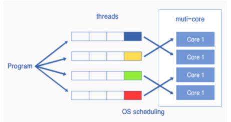

# Chapter 06

## 01. 서버의 개요

### 1. 클라이언트와 서버의 차이점

클라이언트와 서버의 네트워크 부분, 즉 LAN어댑터, 프로토콜 스택, Socket 라이브러리 등의 본래 기능은 완전히 동일하다. 그렇다면 둘의 차이는 무엇인가?

(1) 개념적 차이

- 클라이언트: 서버에게 서비스를 요청하고, 받은 응답을 사용자에게 표현하는 시스템
- 서버 : 클라이언트의 요청에대한 서비스(응답)을 제공하는 컴퓨터 시스템

(2) 구조적 차이

- 클라이언트 : 한 번에 하나의 서버에 요청을 보낸다.

- 서버 : 동시에 다수의 클라이언트 PC에 응답하는 구조

- 이러한 차이로 인해 소켓의 접속 동작에서 차이를 보인다.

  - 클라이언트는 소켓 접속동작을 하고, 서버는 접속대기 역할을 한다.
  - 더 구체적으로는 Socket 라이브러리를 호출하는 과정에 차이가 있다.
  - `bind` : 소켓에 포트번호 기록(클라이언트에서 지정한 서버측 소켓에 할당할 포트번호)
  - `listen`: 접속 대기상태라는 제어 정보를 기록하는 용도
  - `accept`: 접속 접수(실제 접속 기다리는 상태)
  
  

### 2. 서버 애플리케이션의 구조

- 서버 애플리케이션과 클라이언트의 1:1 매칭

  하나의 프로그램으로 여러 클라이언트와 대화 할 경우, 어느 클라이언트와 어디까지 대화가 진행되고 있는지 파악하기 어려우므로, 클라이언트가 접속할 때마다 새로 서버 프로그램을 작동. 서버 애플리케이션이 클라이언트와 1:1로 매칭되게 한다.

- 서버 프로그램을 만드는 방법

  - 서버 프로그램 → 접속을 기다리는 부분 + 클라이언트와 대화하는 부분
  - 서버 프로그램 작동 후 초기화 동작을 마쳤을 때 접속을 기다리는 부분을 실행.
    - 접속을 기다리는 부분이 소켓을 작성하고, 소켓을 '클라이언트에서의 접속 동작을 기다리는 상태'로 만든 뒤 쉬는 상태가 됨
    - 이후 클라이언트가 접속하면 다시 작동해서 접속을 기다림.
  - 클라이언트와 대화하는 부분을 작동시켜 그곳에 접속이 끝난 소켓을 건네주고, 동작을 계속하면 클라이언트와 대화하는 부분은 접속이 끝난 소켓을 사용하여 클라이언트와 대화하기 시작
  - 대화가 끝나면 연결을 끊고 이 부분을 종료

- 클라이언트와 대화하는 부분은 새 클라이언트가 접속할 때마다 기동 → 1:1로 대응

- 서버 OS는 **멀티태스크** 나 **멀티스레드** 라는 기능을 이용해 다수의 프로그램을 동시에 작동하는데, 이를 이용한 것.

- 클라이언트가 접속했을 때 새로 프로그램을 기동하는 부분에서 시간이 걸리고 응답 시간이 추가 소요된다는 단점이 있다.

  - 해결: 미리 클라이언트와 대화하는 몇 개의 부분을 작동시켜두고, 클라이언트가 접속했을 때 비어있는 것을 찾아 접속한 소켓을 건네주는 방법도 있다.

#### 멀티태스크 & 멀티쓰레드

- 접속 패킷이 동작했을 때 새 소켓을 복사하여 접속한다.
- 원래 소켓은 계속 접속 대기상태로 두어 동시에 다수의 클라이언트와 접속할 수 있게 된다.

- 멀티태스크와 멀티쓰레드는 동시에 복수의 액세스를 병행하여 처리하는 OS의 기능을 말한다.
- 태스크는 하나하나 별도의 프로그램을 의미하며, 쓰레드는 한 개의 프로그램을 몇 개의 부분으로 나눈 것으로 취급된다.

**좌우 대칭의 통신 프로토콜**

- 클라리언트와 서버를 고정시켜 나누기보다는 좌우 대칭으로 어디서나 자유롭게 데이터를 송신할 수 있도록 하는 것이 좋다. (TCP의 배경에 이 개념이 있다.)
- 하지만 어떻게 해도 좌우 대칭이 되지 않는 부분 → `접속 동작`
- 접속하는 측이 클라이언트, 기다리는 측이 서버

:question: 새 소켓을 만들 때의 포트 번호를 어떻게 해야 할까

1. 복사하는 포트번호를 다르게 한다면?

   - 클라이언트에서 지정한 포트 번호로 소켓을 보냈을 때 돌아오는 소켓의 포트 번호는 다르게 된다. -> 회답이 올바른 상대로부터 왔는지, 다른 상대로부터 왔는 지 알 수 없게 된다.

2. 복사하는 포트번호를 같게 한다면?

   - 같은 포트번호를 가진 소켓이 여러 개 존재해서 포트번호로 소켓을 식별할 수 없게 된다.
   - 이 문제를 해결하기 위해 추가로 네 가지의 정보를 더 사용하여 소켓을 식별한다.
     1. 클라이언트측 IP주소
     2. 클라이언트측 포트 번호
     3. 서버측 IP주소
     4. 서버측 포트 번호

   :question: 그럼 디스크립터는 왜 필요하지?

   - 접속 대기 상태의 소켓에는 아직 클라이언트 측의 IP주소와 포트번호가 기록되어 있지 않기 때문이다.
   - 따라서 접속 대기 이전 상태에서는 디스크립터가 필요하며 한 가지 정보만으로 식별할 수 있다는 간편함도 있다.

## 02. 서버의 수신 동작

### (1). LAN 어댑터의 동작

>  LAN 어댑터의 MAC 부분이 패킷을 신호로부터 디지털 데이터로 되돌리고 FCS를 점검한 후 버퍼 메모리에 저장

1. LAN어댑터의 MAC 부분이 패킷을 신호에서 디지털데이터로 변환
2. FCS(프레임 체크 시퀀스)를 통해 패킷 오류 검사
3. LAN어댑터의 버퍼메모리에 저장하고 CPU에 패킷도착 알림(**인터럽트**)
4. CPU -> LAN 드라이버 실행 -> MAC 헤더로부터 프로토콜을 판단하여 프로토콜 스택을 호출하여 패킷을 건네줌

- 인터럽트
  - 서버의 CPU는 일을 실행하고 있으므로 패킷을 알아차리지 못한다. 따라서 수신처리를 위해 인터럽트라는 방법을 사용하여 LAN어댑터에서 CPU로 패킷의 도착을 알린다.
  - 그러면 CPU가 작업을 중단하고 LAN드라이버로 실행을 전환, LAN드라이버가 동작하면 LAN 어댑터의 버퍼 메모리에서 수신한 패킷을 추춘. MAC 헤더의 탕비 필드 값에 따라 프로토콜을 판별, 프로토콜 스택에 패킷을 건넨다.

### (2) IP 담당 부분의 동작

> 프로토콜 스택에 패킷이 전달 된 이후의 동작

1. 자신을 대상으로 한 것인지 판단
2. 조각 나누기에 의한 패킷의 분할이 있는 지 조사
3. TCP(UDP) 담당 부분에 패킷을 건네줌

### (3) TCP 담당 부분의 접속 대기상태에서의 동작

> IP 담당 부분의 동작이 끝난 후 TCP 담당 부분의 동작(**접속 패킷**)

1. TCP 헤더의 SYN의 컨트롤 비트를 확인
2. 수신처 포트 번호 조사
3. 해당 접속 대기 소켓을 복사
4. 송신처의 IP주소나 포트 번호를 기록

### (4) TCP 담당 부분의 데이터 패킷 수신 시 동작

> IP 담당 부분의 동작이 끝난 후 TCP 담당 부분의 동작(**데이터 패킷**)

1. 도착한 패킷의 소켓 식별을 위한 4가지 요소를 통한 소켓 판단
   - 클라이언트측 IP주소, 클라이언트측 포트 번호, 서버측 IP주소, 서버측 포트 번호
2. 데이터 조각을 연결하여 수신 버퍼에 보관
3. 클라이언트에게 ACK 회답

### (5) TCP 담당 부분의 연결 끊기 동작

> 연결 끊기는 클라이언트와 서버 중 어느 쪽이 먼저 실행해도 상관 없다

- 클라이언트 측과 동일

## 03. 서버가 요청에 응답하는 과정

> 패킷 수신 후 요청의 리퀘스트 내용을 처리하는 과정

### 1. 조회의 URI를 실제 파일명으로 변환한다

>  **웹서버의 경우 리퀘스트 메시지에 기록되어있는 내용에 따라 응답 메시지를 만들고 `write`를 통해 이것을 클라이언트에 반송한다.**

**1. 조회의 URI를 실제 파일명으로 변환한다.**

- 웹 서버의 경우, HTTP request를 받는다 == 리퀘스트 메시지의 의뢰 내용을 처리함
- HTTP method나, URI에 따라 웹 서버가 요청한 대로 동작한다.
- 리퀘스트 메시지에는 메소드와 URI 등이 적혀있고, 이 내용에 따라 데이터를 클라이언트에 반송

**웹에서의 가상 디렉토리**

- 단순히 URI에 기록된 경로명의 파일을 읽어오면 웹 서버의 디스크가 무방비 상태로 노출된다
- 따라서 웹 서버에서 공개하는 디렉토리는 가상의 디렉토리고, 이 경로명을 URI에 적는다
- 실제로 파일을 읽어올 때는 가상의 디렉토리와 실제 디렉토리의 대응 관계를 조사하고, 실제 디렉토리의 경로명으로 변환한 후 파일을 읽어 데이터를 반송한다

**2. CGI 프로그램을 작동한다.**

- URI에 쓴 파일의 내용이 HTML문서나 화상 데이터의 경우엔 파일의 내용을 그대로 응답 메시지를 클라이언트에 반송하지만, **프로그램 파일의 이름**이 적혀있을 경우에는 CGI **프로그램을 작동**시켜 프로그램이 출력하는 데이터를 클라이언트에 반송한다.

**CGI**

- Common Gateway Interface
- 웹 서버상에서 사용자요청 프로그램을 동작시키기 위한 인터페이스

**3. 웹서버로 수행하는 액세스 제어**

웹서버에서는 주로 세 가지 조건을 통해 클라이언트의 접근을 제한한다.

1. 클라이언트의 IP주소
   - 소켓 접속 접수시 클라이언트 IP주소를  알 수 있으므로 점검한다.
2. 클라이언트의 도메인
   - 클라이언트 IP주소에 대응하는 도메인을 찾기위해 가장 가까운 DNS서버에 메시지를 보낸다.
   - DNS서버는 IP주소가 등록된 DNS서버를 찾아 대응하는 도메인 명을 회답받는다.
   - 웹 서버는 IP주소를 통해 얻은 도메인명과 도메인명에서 조사한 IP주소와 클라이언트 IP주소를 비교하여 이중으로 점검한다.
   - DNS 서버 조회 메시지가 왕래하는 만큼 웹 서버의 응답시간이 오래 걸린다.
3. 사용자명과 패스워드
   - 

**4. 응답 메시지를 되돌려 보낸다**

클라이언트가 웹 서버에 리퀘스트 메시지를 보내는 동작과 같다

1. 웹 서버가 응답 메시지를 프로토콜 스택에 건넴
2. 디스크립터를 사용하여 통신 상대를 지정, 이를 프로토콜 스택에 알려줌
   - 소켓에는 통신 상태가 전부 기록되어 있고, 여기에 통신 상대의 정보도 있으므로 디스크립터만 통지하면 됨
3. 프로코톨 스택이 데이터를 한 개의 패킷에 들어갈 길이로 분할, 헤더를 붙여서 패킷 송출
4. 패킷이 스위치나 라우터를 경유하여 클라이언트에게 도착

## 04. 웹 브라우저가 응답을 받아 렌더하는 과정

### 클라이언트에서 응답 데이터의 종류를 판단하는 방법

1. 응답 메시지의 헤더필드 `Content-Type`을 통해 판단(데이터 종류를 판단하는 근거)

   - ex) text/html      (주타입, 분류)/(서브타입, 실제 데이터 타입)
   - 만약 서버에서 Content-Type을 정확하게 설정하지 않은 경우 문제가 생길 수 있다.

2. 요청 파일의 확장자나 포맷 등에서 종합적으로 판단
   - 예를 들어 조사한 파일의 확장자가 html인 경우 데이터 내용을 조사하여 <html> 태그가 앞에 있으면 HTML문서로 간주하는 형식

