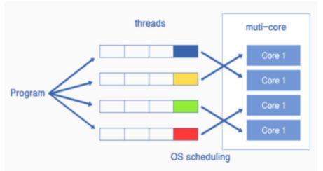

# chap 6

[toc]

## 1. 서버의 개요

- 서버를 기동한 후 여러가지 준비 작업을 한 후에 클라이언트에서의 엑세스에 응하는 상태가 됨

**서버와 클라이언트의 차이점**

- 서버 머신은 용도에 따라 다양한 종류가 있음
- 하드웨어나 OS부분은 클라이언트와 다른 것도 있음
- 애플리케이션이 호출하는 Socket라이브러리의 프로그램 부품이 다름
- 서버의 애플리케이션은 동시에 다수의 클라이언트 pc와 대화함

**but**

- 네트워크에 관한 부분(LAN어뎁터, 프로토콜 스택, Socket 라이브러리등의 기능들은 클라이언트와 조금도 다르지 않음)
- TCP나 IP의 기능은 하드웨어가 무엇이든지 달라지지 않기 때문에 기능이 통일되었다고 해도 됨
  - 그러나 접속동작에서 클라이언트에서 접속 동작을 수행하고, 서버는 그것을 기다리는 형태가 되는듯이 원래 가지고 있는 기능은 같아도 사용하는 방법은 약간 다를 수 있음

> 즉, 프로토콜에 참여하는 부분들은 같으나 그 이외에 부분들은 다를 수 있음

**서버 애플리케이션의 구조**

- 서버는 동시에 복수의 클라이언트와 통신 동작을 실행하지만, 하나의 프로그램으로 여러 클라이언트들의 상대를 처리하기는 어려움

  -> 따라서 클라이언트가 접속할떄마다 새로 서버 프로그램을 작동하여 서버 애플리케이션이 클라이언트와 1대1로 대화하는게 일반적임

- 서버 프로그램 = 접속을 기다리는 부분 + 클라이언트와 대화하는 부분

**서버 어플리케이션의 동작**

1. 접속을 기다리는 부분과 클라이언트 대화하는 부분을 생성
2. 설정파일등을 통한 서버 어플리케이션 설정 초기화 
3. 접속을 기다리는 부분이 소켓을 생성 후 클라이언트가 접속을 시도하기 전까지 휴식
4. 클라이언트가 접속 시도
5. 클라이언트가 접속을 하면 해당 소켓을 대화하는 부분으로 전달
   - 새 클라이언트가 접속할 때마다 대화하는 부분이 생성되므로 대화하는 부분은 다른 클라이언트 상관하지 않고 자신의 클라이언트만 1대1로 상대
6. 클라이언트와 대화 시작
7. 대화가 끝나면 연결을 끊음

--> 매번 클라이언트가 접속할때마다 새롭게 대화하는 부분을 생성하면 그건 시간이 오래걸리기 때문에,

미리 대화하는 부분을 몇개 만들어놓고 클라이언트가 접속하면 비어있는 대화하는 부분에 소켓을 건내주는 방법도 있음

**프로그램(Program)**: 저장소에 존재하는 코드의 뭉치, 실행상태가 아닌 실행하기 전에 저장소에 저장된 코드들

**프로세스(Process)**: 저장소에 있던 프로그램이 실행을 위해 컴퓨터의 cpu에서 연산될 수 있도록 메모리에 올라와있는 상태, 실행될 때 OS로부터 자원(메모리 공간, 연산시간 등)을 할당받아 실행되는 시스템

-> OS 관점에서의 최소 작업 단위

**쓰레드(Thread)**: 프로세스 안에 있는 작은 실행단위, OS 내부에서는 하나의 프로그램 속 부품으로 취급됨, 프로세스의 코드에 정의된 절차에 따라 실행되는 특정한 수행 경로

-> CPU 관점에서의 최소 작업 단위

> 즉, 프로그램(하드디스크) == 실행을 위해 프로세스 단위로 쪼개져서 메모리로 올라옴 ==> OS가 CPU에게 프로세스 실행 명령을 내림 ==> CPU는 프로세스를 쓰레드 단위로 쪼개서 실행

**멀티태스크(Multi Task)** : 

- 여러개의 프로세스(task)를 동시에 실행시키는것 처럼 보이는 시스템
- 프로그램이 실행되어 메모리에 상주된 형태
- OS의 스케쥴링에 의해 빠른 속도로 CPU가 처리하고 있는 프로세스에 대한 스위칭이 일어남
- 이러면 사용자 입장에서는 한번에 여러가지 일을 처리하는것처럼 보이고 이를 멀티태스킹(멀티 프로세싱)이라 부름
- 각각의 프로세스는 메모리상에서 독립된 공간을 차지하며, 어떤 프로세스를 다른 프로세스가 참조하는건 안됨
- 하나 작업을 하나의 코어가 처리 -> switching이 자주 일어남

**멀티스레드(Multi Thread) :** 

- 하나의 작업을 위해서 하나의 프로세스에서 여러 스레드를 생성하여 여러 CPU를 사용
- 하나의 작업을 여러 코어가 처리
- 쓰레드들 간에는 메모리 공유가 일어나서 변수나 객체의 교환이 가능

**TCP의 배경**:

​	다양한 형태로 데이터를 송.수신하는 구조를 지원하기 위해서는 클라이언트와 서버라는 역할을 정하지 않고 양쪽에서 좌우 대칭으로 데이터를 송신할 수 있도록 해 두는 방법이 좋음

그러나 어떻게 해도 좌우대칭을 만들 수 없는 부분은 접속동작

따라서 이 접속동작이 클라이언트와 서버의 차이. 그러나 항상 한쪽이 클라이언트, 다른쪽이 서버가 아닌, 접속을 요청하는 쪽이 클라이언트, 접속을 기다리는 쪽이 서버

|               서버               | 방향  |            클라이언트            |
| :------------------------------: | :---: | :------------------------------: |
|           1.소켓 생성            |       |           1. 소켓 생성           |
| 2-1 소켓을 접속 대기 상태로 만듬 | <---  | 2. 서버측의 소켓과 파이프로 연결 |
|         2-2 접속을 접수          |       |                                  |
|       3. 데이터를 송 수신        | <---> |       3. 데이터를 송 수신        |
| 4. 데이터를 분리하고 소켓을 말소 |       | 4. 데이터를 분리하고 소켓을 말소 |

**서버 어플리케이션의 동작**

1. socket을 호출하여 소켓을 만듬
2. bind를 호출하여 소켓에 포트 번호를 할당
3. listen을 호출하여 접속하기를 기다리는 상태라는 제어정보를 기록
4. 그 후 accept를 호출하여 접속을 접수할 상태로 기다림
5. 클라이언트의 접속 패킷이 도착하면 접속 접수 동작을 실행
   1. 응답패킷을 클라이언트에게 반송
   2. 접속 대기의 소켓을 복사하여 새로운 소켓을 생성(대화하는 부분)
   3. 접속 상대의 정보등의 제어 정보를 새 소켓이 기록
   4. 여기까지가 accpet를 호출했을 때의 동작
6. 클라이언트 측의 소켓과 연결 완료

--> 새 소켓을 복사하여 만들고 해당 소켓을 클라이언트와 연결해주는게 포인트

**소캣을 복사해서 만들면 포트번호가 겹치지 않을까??**

소켓을 지정할때 

1. 클라이언트측의 IP 
2. 클라이언트측의 포트 번호
3. 서버측의 IP
4. 서버측의 포트번호

이 4가지를 사용하여 수신측에게 IP헤데와 TCP헤더에 넣어서 보냄 

서버측에서 여러개의 같은 포트번호로 생성된 소켓을 구분

왜냐면 클라이언트 측의 포트번호는 1개이기 때문에

## 2. 서버의 수신 동작

**수신 동작**

1. 패킷의 신호(0110 1001 1010 0001 + 타이밍을 나타내는 클록 신호)를 LAN 어댑터에서 수신하여 디지털 데이터로 바꿈
2. 여기서 클록 신호추출하여 클록 신호에서 타이밍을 계산하면서 신호를 읽어옴

3. 이를 통해 패킷을 신호의 형태에서 디지털 데이터로 변환
4. 패킷에 맨 마지막에 있는 프레인 체크 시퀀스(FCS)를 이용하여 오류 유무를 검사
5. 만약 FCS가 일치하지 않아 오류가 있는것으로 판명되면 해당 패킷을 버리고 오류가 없으면 MAC 주소를 조사하여 패킷이 자신을 수신처로 보낸 패킷이 맞는지 확인
   - 이더넷의 기본 동작이 신호를 LAN 전체로 흘리고 해당자만 신호를 수신하는 방법을 채택하기 때문에
6. 디지털 데이터로 되돌린 정보를 LAN 어뎁터 내부의 버퍼 메모리에 저장
7. LAN 어뎁터에서 인터럽트를 사용하여 LAN 어댑터에서 CPU로 패킷의 도착을 알림
8. CPU는 실행하던 작업을 중단하고 LAN 드라이버로 실행을 전환
9. LAN 어댑터의 버퍼 메모리에서 수신한 패킷을 추출

그 이후 각각의 담당 부분에서의 동작

**IP담당 부분의 수신 동작**

1. IP 헤더의 내용이 규칙에 따라 올바르게 만들어졌는지 점검
2. 수신처 IP 주소가 자신을 대상으로 하는지 조사 -> 서버에서 라우터같은 중계기능을 할 수도 있음
3. 자신이 대상이 아니면 패킷을 중계 자신이 대상이면 조각 나누기를 통해 패킷이 분할 되었는지 조사
   - 분할된 패킷이면 분할된 부분을 일시적으로 메모리에 저장 후 패킷 조각이 다 모이면 조립하여 원래대로 복원
4. IP 헤더의 프로토콜 번호 항목을 조사하여 해당하는 담당 부분에 패킷을 건내줌

**TCP 담당 부분의 접속패킷! 수신 동작**

1. SYN 비트가 1이면 패킷의 수신처 포트번호를 조사하여 이 번호와 같은 번호를 할당한 접속 대기 상태의 소켓이 있는지 확인
   - 만약 수신처 포트번호와 같은 포트번호의 접속 대기 소켓이 없으면 오류 통지 패킷을 클라이언트에 반송
2. 해당하는 접속 대기 소켓이 있으면 패킷을 복사하여 새 소켓을 만들고, (송신처의 IP 주소, 포트 번호, 시퀸스 번호의 초기값, 윈도우의 값 등 필요한 정보를 기록)
3. (패킷을 받았음을 나타내는 ACK번호, 시퀸스 번호의 초기값, 윈도우 값) 등을 항목을 기록한 TCP 헤더를 만듬
4. IP 담당부분에게 의뢰하여 3에서 만든 부분을 넣어 클라이언트에게 반송

**TCP 담당 부분이 데이터 패킷! 수신 동작**

1. 데이터 패킷은 <IP헤더의 송신처 IP주소와 수신처 IP 주소> , ( TCP헤더의 수신처 포트번호와 송신처 포트번호)가 모두 일치하는 4개의 정보가 모두 합치되는 소켓을 찾음
2. 패킷에 기록되어 있는 데이터 송.수신 동작이 올바르게 진행되고 있는지 점검
3. 패키에서 데이터 조각을 추출하여 수신 버퍼에 저장
4. 수신 확인 응답용 TCP 헤더를 만들어서(ACK 비트) IP 담당 부분에 의뢰하여 클라이언트에게 반송

**TCP 담당 부분의 연결 끊기 동작**

1. socket 라이브러리의 close를 호출
2. TCP담당 부분이 FIN비트를 1로 설정한 TCP 헤더를 IP 담당 부분에게 전달
3. 클라이언트에게 이것을 보내면 클라이언트는 ACK 번호를 반송
4. 소켓 말소

## 3. 웹 서버 소프트웨어가 리퀘스트 메시지의 의미를 해석하여 요구에 응한다.

웹 서버의 경우 read에서 받은 데이터의 내용이 HTTP 리퀘스트 메시지가 됨

URI나 메소드에 따라 웹 서버 내부 동작이 달라짐

단순히 URI에 기록된 경로명의 파일을 읽어오면 디스크의 파일에 전부 엑세스 할 수 있기 때문에 웹 서버가 무방비 상태로 노출될 위험이 있음

-> 따라서 웹 서버에서 공개하는 디렉토리는 디스크의 실제 디렉토리가 아니라 가상으로 만든 디렉토리이고, 실제 디렉토리와 대응관계를 엮어줌

CGI 프로그램 ??

**웹 서버의 엑세스 제어**

1. 클라이언트의 주소 - 소켓 접속 시
2. 클라이언트의 도메인 명 - IP 주소를 DNS 서버에 보내서 도메인명을 가져온 후 해당 도메인명을 비교
   - DNS서버까지 갔다와야하기때문에 조금 느릴 수 있음
3. 사용자명과 패스워드

이 세가지를 이용해서 엑세스 동작 여부를 설정(Authentication?)

서버가 응답을 보내는것은 클라이언트가 리퀘스트 메세지를 보내는것과 같음

## 4. 브라우저가 응답 메시지를 받아 화면에 표시한다

클라이언트는 웹 서버에서 받은 응답 데이터에 저장된 데이터가 어떤 종류인지를 조사

메세지의 헤더에 content-type을 통해 판단

`content-type: text/html; charset = utf-8`

